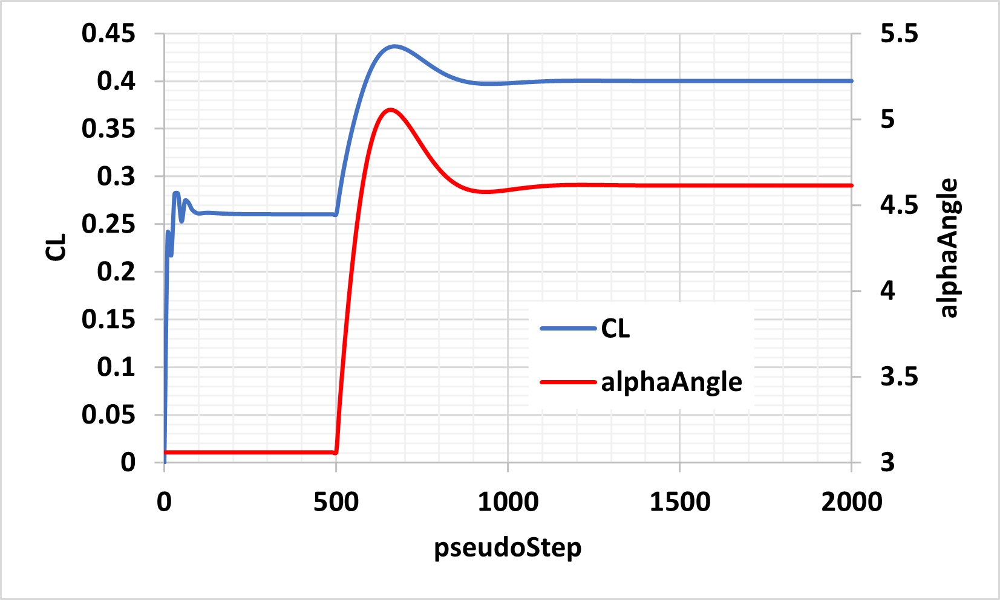

.. _userDefinedDynamics:

User Defined Dynamics
=============================

In Flow360, users are now able to specify arbitrary dynamics. In what follows, an example for a Proportional-Integral (PI) controller is given.

PI controller for angle of attack to control lift coefficient
--------------------------------------------------------------------------
In this example, we add a controller to :ref:`om6Wing case study <om6_caseStudy>`. Based on the entries of the configuration file in this case study, the resulting value of the lift coefficient, *CL*, obtained from the simulation is ~0.26. Our objective is to add a controller to this case study such that for a given target value of *CL* (e.g., 0.4), the required angle of attack, :code:`alphaAngle` , is estimated. To this end, a PI controller is defined under *userDefinedDynamics* in the configuration file as:

.. literalinclude:: alphaController.json
   :linenos:

The complete case configuration file can be downloaded here: `Flow360.json <https://simcloud-public-1.s3.amazonaws.com/alphaController/Flow360.json>`_.

Some of the parameters are dicussed in more detail here:

1. **dynamicsName**: This is an arbitrary name selected by the user for the dynamics. The results of each user-defined dynamics are saved to *udd_dynamicsName_v2.csv*.

2. **constants**: This includes a list of all the constants related to this dynamics. These constants will be used in the equations for :code:`updateLaw` and :code:`inputLaw`. In the above-mentioned example, :code:`CLTarget`, :code:`Kp`, and :code:`Ki` are the target value of the lift coefficient, the proportional gain of the controller, and the integral gain of the controller, respectively.

3. **stateVarsInitialValue**: There are two state variables for this controller. The first one, :code:`state[0]`, is the angle of attack computed by the controller, and the second one, :code:`state[1]`, is the summation of error :code:`(CLTarget - CL)` over iterations. The initial values of :code:`state[0]` and :code:`state[1]` are set to :code:`alphaAngle` and :code:`0`, respectively. 

4. **updateLaw**: The related equations for the state variables are specified here. The first and the second equations correspond to equations for :code:`state[0]` and :code:`state[1]`, respectively. The conditional statement forces the controller not to be run for the first 500 pseudoSteps. This ensures that the flow field is established to some extent before the controller is initialized.

5. **outputLaw**: The relations between :code:`outputVars` and the state variables are specified. For this example, we set the output variable equal to the angle of attack calculated by the controller (i.e., :code:`state[0]`).

6. **inputBoundaryPatches**: The related boundary conditions for the inputs of the user-defined dynamics are specified here. In this example, the noSlipWall boundary conditions are where :code:`CL` is calcualted. As seen in the configuration file, the boundary name for the No-Slip boundary condition is :code:`"1"`.

The following figure shows the values of lift coefficient, :code:`CL`, and angle of attack, :code:`alphaAngle`, versus the steps, :code:`pseudoStep`. As specified in the configuration file, the initial value of angle of attack is :code:`3.06`. With the specified user-defined dynamics, :code:`alphaAngle` is adjusted to a final value of :code:`4.61` so that :code:`CL = 0.4` is achieved.

.. _fig1_alphaController:

   Results of alphaController for om6Wing case study.
