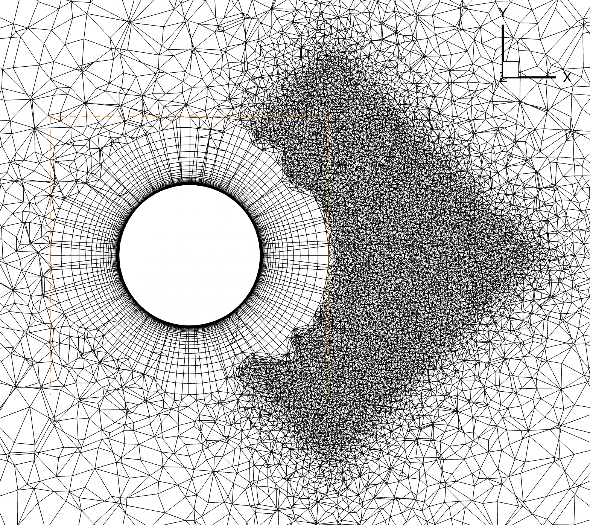

.. _automatedMeshing:

Automated Meshing
=============================

Overview
--------

Flow360 offers automated meshing, from CAD geometry through a surface mesh to volume mesh. The supported CAD format is \*.csm file which is Engineering Sketch Pad (EPS) format. The generated volume format is CGNS.

Geometry
--------

The Engineering Sketch Pad is a solid-modeling, feature-based, web-enabled system for building parametric geometry. It can be downloaded from `ESP's website <https://acdl.mit.edu/ESP/>`_.
The geometry in ESP is described in text \*.csm file containing all CAD instructions. See csm example\:

.. code-block::

    # Branches:
    sphere    0   0   0   1

    attribute groupName $mysphere

    end

which will create a sphere of radius = 1 at (0, 0, 0). The face of the sphere will be labelled as `mysphere`.

.. _fig1_geometry:
.. figure:: ../figures/autoMeshing/sphere_csm.png
   :width: 50%
   :align: center

   Engineering Sketch Pad view of the geometry.

Surface Meshing
---------------

The surface mesher takes geometry file and configuration JSON file as input parameters and generates surface mesh. The meshing configuration file (or dict in python), also called surfaceMesh.json, contains information such as maximum element edge length, curvature resolution angle or growth rate of 2D layers. See JSON example:

.. literalinclude:: surfaceMesh.example.json
    :language: JSON

The surface mesh is created by submitting a geometry file and JSON file using :code:`NewSurfaceMeshFromGeometry()` function. See the example below\:

.. code-block:: python

    import flow360client
    surfaceMeshId = flow360client.NewSurfaceMeshFromGeometry("path/to/geometry.csm", "surfaceMesh.json", surfaceMeshName="my_surface_mesh")

The above code will create a surface mesh of geometry using :code:`"maxEdgeLength": 0.05` on a surface labelled as `mysphere`, see line 4 of the \*.csm file.

.. _fig1_surfMesh:
.. figure:: ../figures/autoMeshing/sphere_surfMesh.png
   :width: 50%
   :align: center

   Auto-generated surface mesh.

Inputs\:

- geometry.csm file
- surface mesh config.json or python dict

Outputs\:

- surface mesh
- :code:`surfaceMeshId`

For a full description of config.json for surface mesher see :ref:`here.<JSON surface mesher>`

Volume Meshing
--------------

The volume mesher takes :code:`surfaceMeshId` and config JSON as arguments and generates CGNS mesh suitable for Flow360 solver. The JSON configuration file (or dict in python) specifies first layer thickness, growth rate, sizes and location of refinement zones (sources) and actuator disks. All geometry from ESP is treated as a no-slip wall therefore prism layers will be grown of geometry surfaces. 

Farfield will be created automatically\: 

- semi-spherical if the geometry is bounded by :code:`y=0` plane. The :code:`y=0` plane will be set as a symmetry plane boundary condition.  
- spherical otherwise.

Below is an example of a JSON configuration file:

.. literalinclude:: volumeMesh.example.json
    :language: JSON

The volume mesh is created by :code:`NewMeshFromSurface()` function using :code:`surfaceMeshId` and config.json. See the example below\:

.. code-block:: python

    volumeMeshId = flow360client.NewMeshFromSurface(surfaceMeshId, "volumeMesh.json", meshName="my_volume_mesh")

The above code will create a volume mesh out of the surface mesh. The refinement zone (source) of size=4x3x2 will be placed with its centre at (2,0,0). Additionally, it will be rotated by 45 degrees around the [0,0,1] axis. Spacing of 0.05 will be applied in this zone.

.. _fig1_volMesh:

   Auto-generated volume mesh.

Inputs\:

- :code:`surfaceMeshId`
- volume mesh config.json or python dict

Outputs\:

- volume CGNS mesh
- Flow360Mesh.json
- :code:`volumeMeshId`

For a full description of config.json for volume mesher see :ref:`here.<JSON volume mesher>`

.. _JSON surface mesher:

JSON surface mesher
-------------------

.. only:: comment

    Table created using https://www.tablesgenerator.com/text_tables

.. table::

    +--------------------------+---------+----------+---------+---------------------------------------------------------------------------------------------------------------------------------------------------------------------------------------------------------------------------------------------------------------------------------+
    | Option                   | Type    | Default  | Example | Description                                                                                                                                                                                                                                                                     |
    +==========================+=========+==========+=========+=================================================================================================================================================================================================================================================================================+
    | maxEdgeLength            | float   | REQUIRED | 0.1     |                             Maximum length of element edge.                                                                                                                                                                                                                     |
    +--------------------------+---------+----------+---------+---------------------------------------------------------------------------------------------------------------------------------------------------------------------------------------------------------------------------------------------------------------------------------+
    | curvatureResolutionAngle | float   | REQUIRED | 15      |                             Maximum angular deviation in degrees. If the angle between the normal line segment and the normal to the underlying geometry curve at a grid point is larger than the specified angle, a new grid point will be added in the middle of the segment. |
    +--------------------------+---------+----------+---------+---------------------------------------------------------------------------------------------------------------------------------------------------------------------------------------------------------------------------------------------------------------------------------+
    | growthRate               | float   | REQUIRED |         |                            Growth rate of layers being grown from edges                                                                                                                                                                                                         |
    +--------------------------+---------+----------+---------+---------------------------+-----------------------------------------------------------------------------------------------------------------------------------------------------------------------------------------------------------------------------------------------------+
    | edges                    | dict    | {}       | .. code-block:: json                | <edgeName>: {...} sets parameters for the edge named <edgeName>. The edge must be labelled in ESP (\*.csm file).                                                                                                                                    |
    |                          |         |          |                                     |                                                                                                                                                                                                                                                     |
    |                          |         |          |     {                               |                                                                                                                                                                                                                                                     |
    |                          |         |          |      "leadingEdge":  {              |                                                                                                                                                                                                                                                     |
    |                          |         |          |       "firstLayerThickness": 1e-3   |                                                                                                                                                                                                                                                     |
    |                          |         |          |      },                             |                                                                                                                                                                                                                                                     |
    |                          |         |          |      "trailingEdge":  {             |                                                                                                                                                                                                                                                     |
    |                          |         |          |       "firstLayerThickness": 1e-3   |                                                                                                                                                                                                                                                     |
    |                          |         |          |      }                              |                                                                                                                                                                                                                                                     |
    |                          |         |          |     }                               |                                                                                                                                                                                                                                                     |
    +--------------------------+---------+----------+---------+---------------------------+-----------------------------------------------------------------------------------------------------------------------------------------------------------------------------------------------------------------------------------------------------+
    | edges->                  | float   | REQUIRED | 1e-3    | First layer thickness of the anisotropic surface cells growing along the orthogonal direction to the edge named <edgeName>. See :numref:`fig1_surfMesh_edges`.                                                                                                                  |
    |                          |         |          |         |                                                                                                                                                                                                                                                                                 |
    | <edgeName>->             |         |          |         |                                                                                                                                                                                                                                                                                 |
    |                          |         |          |         |                                                                                                                                                                                                                                                                                 |
    | firstLayerThickness      |         |          |         |                                                                                                                                                                                                                                                                                 |
    +--------------------------+---------+----------+---------+---------------------+-----------------------------------------------------------------------------------------------------------------------------------------------------------------------------------------------------------------------------------------------------------+
    | faces                    | dict    | {}       | .. code-block:: json          | <faceName>\: {...} sets parameters for the face named <faceName>. The face must be labelled in ESP (\*.csm file).                                                                                                                                         |
    |                          |         |          |                               |                                                                                                                                                                                                                                                           |
    |                          |         |          |     {                         |                                                                                                                                                                                                                                                           |
    |                          |         |          |      "rightWing": {           |                                                                                                                                                                                                                                                           |
    |                          |         |          |       "maxEdgeLength": 0.08,  |                                                                                                                                                                                                                                                           |
    |                          |         |          |       "adapt": false          |                                                                                                                                                                                                                                                           |
    |                          |         |          |      },                       |                                                                                                                                                                                                                                                           |
    |                          |         |          |      "fuselage": {            |                                                                                                                                                                                                                                                           |
    |                          |         |          |       "maxEdgeLength": 0.08,  |                                                                                                                                                                                                                                                           |
    |                          |         |          |       "adapt": false          |                                                                                                                                                                                                                                                           |
    |                          |         |          |      }                        |                                                                                                                                                                                                                                                           |
    |                          |         |          |     }                         |                                                                                                                                                                                                                                                           |
    +--------------------------+---------+----------+---------+---------------------+-----------------------------------------------------------------------------------------------------------------------------------------------------------------------------------------------------------------------------------------------------------+
    | faces->                  | float   | REQUIRED | 1e-3    | Maximum length of element edge for the face named <faceName>.                                                                                                                                                                                                                   |
    |                          |         |          |         |                                                                                                                                                                                                                                                                                 |
    | <faceName>->             |         |          |         |                                                                                                                                                                                                                                                                                 |
    |                          |         |          |         |                                                                                                                                                                                                                                                                                 |
    | maxEdgeLength            |         |          |         |                                                                                                                                                                                                                                                                                 |
    +--------------------------+---------+----------+---------+---------------------------------------------------------------------------------------------------------------------------------------------------------------------------------------------------------------------------------------------------------------------------------+    
    | faces->                  | boolean | REQUIRED | false   | Turn on/off the extra refinement based on surface proximity. [This argument will be removed in the next release and the proximity refinement will be automatically decided.]                                                                                                    |
    |                          |         |          |         |                                                                                                                                                                                                                                                                                 |
    | <faceName>->             |         |          |         |                                                                                                                                                                                                                                                                                 |
    |                          |         |          |         |                                                                                                                                                                                                                                                                                 |
    | adapt                    |         |          |         |                                                                                                                                                                                                                                                                                 |
    +--------------------------+---------+----------+---------+---------------------------------------------------------------------------------------------------------------------------------------------------------------------------------------------------------------------------------------------------------------------------------+

.. _fig1_surfMesh_edges:
.. figure:: ../figures/autoMeshing/surfaceMesh_firstLayerThickness.png
   :width: 50%
   :align: center

   Surface mesh of a wing. Leading edge and trailing edge are labelled and first layer thickness is applied to the layers grown from the edges.

.. _JSON volume mesher:

JSON volume mesher
------------------

.. table::

    +----------------------------+---------------------+----------+---------+-------------------------------------------------------------------------------------------------------------------------------------------------------------------------------------------------------------------------------------------------------------------------------------------------------+
    | Option                     | Type                | Default  | Example | Description                                                                                                                                                                                                                                                                                           |
    +============================+=====================+==========+=========+=======================================================================================================================================================================================================================================================================================================+
    | refinementFactor           | float               | 1        | 2       | If refinementFactor=r is provided all spacings will be adjusted to generate r-times finer mesh everywhere. For example, if refinementFactor=2, all spacings will be divided by :math:`2^{1/3}\approx 1.26`,                                                                                           |
    |                            |                     |          |         | so the resulting mesh will have approximately 2 times more cells.                                                                                                                                                                                                                                     |
    +----------------------------+---------------------+----------+---------+-----------------------+-------------------------------------------------------------------------------------------------------------------------------------------------------------------------------------------------------------------------------------------------------------------------------+
    | volume                     | dict                | REQUIRED | .. code-block:: json            | First layer thickness and growth rate for prism layers being grown out of the surface. It is applied to all surface mesh faces.                                                                                                                                               |
    |                            |                     |          |                                 |                                                                                                                                                                                                                                                                               |
    |                            |                     |          |   {                             |                                                                                                                                                                                                                                                                               |
    |                            |                     |          |    "firstLayerThickness": 1e-5, |                                                                                                                                                                                                                                                                               |
    |                            |                     |          |    "TRexGrowthRate": 1.2        |                                                                                                                                                                                                                                                                               |
    |                            |                     |          |   }                             |                                                                                                                                                                                                                                                                               |
    +----------------------------+---------------------+----------+---------+-----------------------+-------------------------------------------------------------------------------------------------------------------------------------------------------------------------------------------------------------------------------------------------------------------------------+
    | volume->                   | float               | REQUIRED | 1e-5    | First layer thickness for volume prism layers.                                                                                                                                                                                                                                                        |
    |                            |                     |          |         |                                                                                                                                                                                                                                                                                                       |
    | firstLayerThickness        |                     |          |         |                                                                                                                                                                                                                                                                                                       |
    +----------------------------+---------------------+----------+---------+-------------------------------------------------------------------------------------------------------------------------------------------------------------------------------------------------------------------------------------------------------------------------------------------------------+
    | volume->                   | float               | REQUIRED | 1.2     | Growth rate for volume prism layers.                                                                                                                                                                                                                                                                  |
    |                            |                     |          |         |                                                                                                                                                                                                                                                                                                       |
    | TRexGrowthRate             |                     |          |         |                                                                                                                                                                                                                                                                                                       |
    +----------------------------+---------------------+----------+---------+--------------------------+----------------------------------------------------------------------------------------------------------------------------------------------------------------------------------------------------------------------------------------------------------------------------+
    | sources                    | array               | []       | .. code-block:: json               | Description of refinement zones.                                                                                                                                                                                                                                           |
    |                            |                     |          |                                    |                                                                                                                                                                                                                                                                            |
    |                            |                     |          |   [                                |                                                                                                                                                                                                                                                                            |
    |                            |                     |          |    {                               |                                                                                                                                                                                                                                                                            |
    |                            |                     |          |     "size": [2, 2, 0.5],           |                                                                                                                                                                                                                                                                            |
    |                            |                     |          |     "axisOfRotation": [ 0, 0, 1 ], |                                                                                                                                                                                                                                                                            |
    |                            |                     |          |     "angleOfRotation": 45,         |                                                                                                                                                                                                                                                                            |
    |                            |                     |          |     "center": [1, 1, 1],           |                                                                                                                                                                                                                                                                            |
    |                            |                     |          |     "spacing": 0.1                 |                                                                                                                                                                                                                                                                            |
    |                            |                     |          |    },                              |                                                                                                                                                                                                                                                                            |
    |                            |                     |          |    {                               |                                                                                                                                                                                                                                                                            |
    |                            |                     |          |     "type": "cylinder",            |                                                                                                                                                                                                                                                                            |
    |                            |                     |          |     "radius": 0.75,                |                                                                                                                                                                                                                                                                            |
    |                            |                     |          |     "lengthZ": 11,                 |                                                                                                                                                                                                                                                                            |
    |                            |                     |          |     "spacing": 0.2,                |                                                                                                                                                                                                                                                                            |
    |                            |                     |          |     "axisOfRotation": [0, 1, 0],   |                                                                                                                                                                                                                                                                            |
    |                            |                     |          |     "angleOfRotation": 90,         |                                                                                                                                                                                                                                                                            |
    |                            |                     |          |     "center":[5, 0, 0]             |                                                                                                                                                                                                                                                                            |
    |                            |                     |          |    }                               |                                                                                                                                                                                                                                                                            |
    |                            |                     |          |   ]                                |                                                                                                                                                                                                                                                                            |
    +----------------------------+---------------------+----------+---------+--------------------------+----------------------------------------------------------------------------------------------------------------------------------------------------------------------------------------------------------------------------------------------------------------------------+
    | sources->                  | ["box", "cylinder"] | "box"    | "box"   | Type of source. Supported box and cylinder. Cylinder's axis is along the z-direction.                                                                                                                                                                                                                 |
    |                            |                     |          |         |                                                                                                                                                                                                                                                                                                       |
    | []->type                   |                     |          |         |                                                                                                                                                                                                                                                                                                       |
    +----------------------------+---------------------+----------+---------+-------------------------------------------------------------------------------------------------------------------------------------------------------------------------------------------------------------------------------------------------------------------------------------------------------+
    | sources->                  | [3-array]           | REQUIRED |[5, 5, 5]| For type: box. Refinement zone size in x, y and z directions.                                                                                                                                                                                                                                         |
    |                            |                     |          |         |                                                                                                                                                                                                                                                                                                       |
    | []->size                   |                     |          |         |                                                                                                                                                                                                                                                                                                       |
    +----------------------------+---------------------+----------+---------+-------------------------------------------------------------------------------------------------------------------------------------------------------------------------------------------------------------------------------------------------------------------------------------------------------+
    | sources->                  | float               | REQUIRED | 5       | For type: cylinder. Radius of the cylinder.                                                                                                                                                                                                                                                           |
    |                            |                     |          |         |                                                                                                                                                                                                                                                                                                       |
    | []->radius                 |                     |          |         |                                                                                                                                                                                                                                                                                                       |
    +----------------------------+---------------------+----------+---------+-------------------------------------------------------------------------------------------------------------------------------------------------------------------------------------------------------------------------------------------------------------------------------------------------------+
    | sources->                  | float               | REQUIRED | 5       | For type: cylinder. Length of the cylinder. Cylinder's axis is along the z-direction.                                                                                                                                                                                                                 |
    |                            |                     |          |         |                                                                                                                                                                                                                                                                                                       |
    | []->lengthZ                |                     |          |         |                                                                                                                                                                                                                                                                                                       |
    +----------------------------+---------------------+----------+---------+-------------------------------------------------------------------------------------------------------------------------------------------------------------------------------------------------------------------------------------------------------------------------------------------------------+
    | sources->                  | float               | REQUIRED | 0.1     | Cell spacing applied in the refinement zone.                                                                                                                                                                                                                                                          |
    |                            |                     |          |         |                                                                                                                                                                                                                                                                                                       |
    | []->spacing                |                     |          |         |                                                                                                                                                                                                                                                                                                       |
    +----------------------------+---------------------+----------+---------+-------------------------------------------------------------------------------------------------------------------------------------------------------------------------------------------------------------------------------------------------------------------------------------------------------+
    | sources->                  | [3-array]           | REQUIRED |[0, 0, 0]| Position of geometrical center of the primitive, i.e., box or cylinder.                                                                                                                                                                                                                               |
    |                            |                     |          |         |                                                                                                                                                                                                                                                                                                       |
    | []->center                 |                     |          |         |                                                                                                                                                                                                                                                                                                       |
    +----------------------------+---------------------+----------+---------+-------------------------------------------------------------------------------------------------------------------------------------------------------------------------------------------------------------------------------------------------------------------------------------------------------+
    | sources->                  | [3-array]           |          |[0, 1, 0]| Axis of rotation for rotation transform of the primitive (box or cylinder). Requires angleOfRotation.                                                                                                                                                                                                 |
    |                            |                     |          |         |                                                                                                                                                                                                                                                                                                       |
    | []->axisOfRotation         |                     |          |         |                                                                                                                                                                                                                                                                                                       |
    +----------------------------+---------------------+----------+---------+-------------------------------------------------------------------------------------------------------------------------------------------------------------------------------------------------------------------------------------------------------------------------------------------------------+
    | sources->                  | float               |          | 90      | The angle of rotation (in degrees) for rotation transform of the primitive (box or cylinder). Requires axisOfRotation.                                                                                                                                                                                |
    |                            |                     |          |         |                                                                                                                                                                                                                                                                                                       |
    | []->angleOfRotation        |                     |          |         |                                                                                                                                                                                                                                                                                                       |
    +----------------------------+---------------------+----------+---------+--------------------------+----------------------------------------------------------------------------------------------------------------------------------------------------------------------------------------------------------------------------------------------------------------------------+
    | actuatorDisks              | array               | []       | .. code-block:: json               | Description of actuator disks. This generates a cylindrical shape (hollowed or not) with structured mesh in it. Used for actuator disks.                                                                                                                                   |
    |                            |                     |          |                                    |                                                                                                                                                                                                                                                                            |
    |                            |                     |          |   [                                |                                                                                                                                                                                                                                                                            |
    |                            |                     |          |    {                               |                                                                                                                                                                                                                                                                            |
    |                            |                     |          |     "innerRadius": 0.0,            |                                                                                                                                                                                                                                                                            |
    |                            |                     |          |     "outerRadius": 2,              |                                                                                                                                                                                                                                                                            |
    |                            |                     |          |     "thickness": 0.42,             |                                                                                                                                                                                                                                                                            |
    |                            |                     |          |     "axisThrust": [-1, 0, 0],      |                                                                                                                                                                                                                                                                            |
    |                            |                     |          |     "center": [3.6, 0, 0],         |                                                                                                                                                                                                                                                                            |
    |                            |                     |          |     "spacingAxial": 0.03,          |                                                                                                                                                                                                                                                                            |
    |                            |                     |          |     "spacingRadial": 0.09,         |                                                                                                                                                                                                                                                                            |
    |                            |                     |          |     "spacingCircumferential": 0.09 |                                                                                                                                                                                                                                                                            |
    |                            |                     |          |    }                               |                                                                                                                                                                                                                                                                            |
    |                            |                     |          |   ]                                |                                                                                                                                                                                                                                                                            |
    +----------------------------+---------------------+----------+---------+--------------------------+----------------------------------------------------------------------------------------------------------------------------------------------------------------------------------------------------------------------------------------------------------------------------+
    | actuatorDisks->            | float               | REQUIRED | 0.0     | Inner radius of actuator disk, if greater than 0 then "donut" shape is created.                                                                                                                                                                                                                       |
    |                            |                     |          |         |                                                                                                                                                                                                                                                                                                       |
    | []->innerRadius            |                     |          |         |                                                                                                                                                                                                                                                                                                       |
    +----------------------------+---------------------+----------+---------+-------------------------------------------------------------------------------------------------------------------------------------------------------------------------------------------------------------------------------------------------------------------------------------------------------+
    | actuatorDisks->            | float               | REQUIRED | 10      | Outer radius of actuator disk.                                                                                                                                                                                                                                                                        |
    |                            |                     |          |         |                                                                                                                                                                                                                                                                                                       |
    | []->outerRadius            |                     |          |         |                                                                                                                                                                                                                                                                                                       |
    +----------------------------+---------------------+----------+---------+-------------------------------------------------------------------------------------------------------------------------------------------------------------------------------------------------------------------------------------------------------------------------------------------------------+
    | actuatorDisks->            | float               | REQUIRED | 0.5     | Thickness of actuator disk.                                                                                                                                                                                                                                                                           |
    |                            |                     |          |         |                                                                                                                                                                                                                                                                                                       |
    | []->thickness              |                     |          |         |                                                                                                                                                                                                                                                                                                       |
    +----------------------------+---------------------+----------+---------+-------------------------------------------------------------------------------------------------------------------------------------------------------------------------------------------------------------------------------------------------------------------------------------------------------+
    | actuatorDisks->            | [3-array]           | REQUIRED |[1, 0, 0]| Axis of thrust of actuator disk. The cylindrical shape is rotated such its axis is aligned with axisThrust.                                                                                                                                                                                           |
    |                            |                     |          |         |                                                                                                                                                                                                                                                                                                       |
    | []->axisThrust             |                     |          |         |                                                                                                                                                                                                                                                                                                       |
    +----------------------------+---------------------+----------+---------+-------------------------------------------------------------------------------------------------------------------------------------------------------------------------------------------------------------------------------------------------------------------------------------------------------+
    | actuatorDisks->            | [3-array]           | REQUIRED |[0, 0, 0]| Position of center of the actuator disk.                                                                                                                                                                                                                                                              |
    |                            |                     |          |         |                                                                                                                                                                                                                                                                                                       |
    | []->center                 |                     |          |         |                                                                                                                                                                                                                                                                                                       |
    +----------------------------+---------------------+----------+---------+-------------------------------------------------------------------------------------------------------------------------------------------------------------------------------------------------------------------------------------------------------------------------------------------------------+
    | actuatorDisks->            | float               | REQUIRED | 0.01    | Spacing along the axial direction.                                                                                                                                                                                                                                                                    |
    |                            |                     |          |         |                                                                                                                                                                                                                                                                                                       |
    | []->spacingAxial           |                     |          |         |                                                                                                                                                                                                                                                                                                       |
    +----------------------------+---------------------+----------+---------+-------------------------------------------------------------------------------------------------------------------------------------------------------------------------------------------------------------------------------------------------------------------------------------------------------+
    | actuatorDisks->            | float               | REQUIRED | 0.03    | Spacing along the radial direction.                                                                                                                                                                                                                                                                   |
    |                            |                     |          |         |                                                                                                                                                                                                                                                                                                       |
    | []->spacingRadial          |                     |          |         |                                                                                                                                                                                                                                                                                                       |
    +----------------------------+---------------------+----------+---------+-------------------------------------------------------------------------------------------------------------------------------------------------------------------------------------------------------------------------------------------------------------------------------------------------------+
    | actuatorDisks->            | float               | REQUIRED | 0.03    | Spacing along the circumferential direction.                                                                                                                                                                                                                                                          |
    |                            |                     |          |         |                                                                                                                                                                                                                                                                                                       |
    | []->spacingCircumferential |                     |          |         |                                                                                                                                                                                                                                                                                                       |
    +----------------------------+---------------------+----------+---------+-------------------------------------------------------------------------------------------------------------------------------------------------------------------------------------------------------------------------------------------------------------------------------------------------------+

