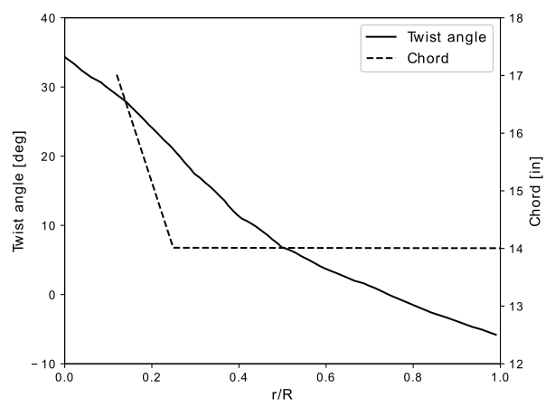

.. _XV15BETDisk_caseStudy:

.. |deg|    unicode:: U+000B0 .. DEGREE SIGN
   :ltrim:

XV-15 Rotor Blade by Blade Element Disk Method 
==============================================

Highlights
--------------

* Simulate hovering helicopter mode and airplane mode of XV-15 rotor using steady BET Disk solver in Flow360
* Convert dimensional input quantities to non-dimensional quantities in configuration json file
* Convert non-dimensional quantities in output to dimensional quantities

Introduction
-------------

The development of XV-15 tiltrotor was launched by the NASA Ames Research Center and Bell Helicopters in the late 1960s and early 1970s and it has become the foundation of many VTOL aircrafts today. Unlike typical helicopter rotors, tiltrotor blades demand a compromised design to operate efficiently in both helicopter and propeller modes, so the blades of XV-15 tiltrotor have high twist and solidity, along with small rotor radius. In this case study, we will apply our Blade Element Theory Model based solver in Flow360 to evaluate the performance of XV-15 rotor in both helicopter hovering mode and airplane mode.

.. _fig_XV15_landing:

   The Bell Textron XV-15 Tiltrotor aircraft prepares to land (source: `United States Coast Guard <https://commons.wikimedia.org/wiki/File:XV-15_N703NA_USCG.jpg>`_)

The definition of the cross sections of the rotor blade is shown in :numref:`tab_xv15_airfoils`. The main geometric characteristics of XV-15 rotor blades are listed in :numref:`tab_xv15_parameters`.

.. container:: twocol

   .. container:: leftside

      .. _tab_xv15_airfoils:
      .. csv-table:: Cross sections of XV-15 rotor blade
         :file: ./xv15_airfoils.csv
         :widths: 20, 20
         :header-rows: 1
         :delim: @

   .. container:: rightside

      .. _tab_xv15_parameters:
      .. csv-table:: Geometric characteristics of XV-15 rotor
         :file: ./xv15_parameters.csv
         :widths: 20, 20
         :header-rows: 1
         :delim: @

The radial distribution of chord and twist is shown in :numref:`fig_xv15_twist_chord_definition`.

.. _fig_xv15_twist_chord_definition:

   XV-15 rotor blade's twist and chord radial distribution

More information about the geometry and the high-fidelity detached eddy simulation using Flow360 can be found at 

`Feilin Jia, John Moore and Qiqi Wang, 2022 Assessment of Detached Eddy Simulation and Sliding Mesh Interface in Predicting Tiltrotor Performance in Helicopter and Airplane Modes <https://arxiv.org/pdf/2201.11560.pdf>`_

In this case study, the steady Navier-Stokes solver coupled with the Blade Element Theory Disk method is used to simulate the XV-15 rotor blades under two flight conditions: helicopter hovering mode and airplane mode. Compared to the high fidelity unsteady simulations with full rotor geometry in the above paper, the mesh of BET Disk solver is much coarser. The mesh used in the current case study contains 592K nodes. An overview of a slice of the mesh is shown below

.. container::

   |mesh1| |mesh2|

   |mesh3| |mesh4|

   .. |mesh1| image:: figures_BET_Tutorial/mesh_592K_zoom1.png
      :width: 49%

   .. |mesh2| image:: figures_BET_Tutorial/mesh_592K_zoom2.png
      :width: 49%

   .. |mesh3| image:: figures_BET_Tutorial/mesh_592K_zoom3.png
      :width: 49%

   .. |mesh4| image:: figures_BET_Tutorial/mesh_592K_zoom4.png
      :width: 49%
   
   .. rst-class:: center1

   Overview of volume mesh used in BET Disk simulations of XV-15 rotor, successively zooming in from top left->top right->bottom left->bottom right. 

The freestream quantities are shown below. These quantities are needed to set up the non-dimensional variables in case configuration and translate the non-dimensional output variables into dimensional values. More information on non-dimensionalization in Flow360 can be found at :ref:`nondimensionalization_Flow360`. The grid unit :math:`L_{gridUnit}=1\,\text{inch}=0.0254\,\text{meter}` in the above mesh. In this case study, the freestream conditions are set to standard sea level values as shown in :numref:`tab_air_isa`

.. _tab_air_isa:
.. csv-table:: Sea-level air properties
   :file: ./air_sea_level.csv
   :widths: 20, 20
   :align: center
   :header-rows: 1
   :delim: @

.. caution::
   
   In some simulations, the freestream is not treated to be in sea level standard on purpose. For example, in the "case 1a" from `3rd AIAA CFD High Lift Prediction Workshop <https://hiliftpw.larc.nasa.gov/Workshop3/testcases.html>`_, the viscosity of the freestream is adjusted to analyze the full-scale geometry at wind tunnel conditions, so please set the freestream properties based on your requirements. 

.. _BET_XV15_hovering_caseStudy:

Helicopter Hovering Mode
---------------------------

In helicopter hovering mode, the freestream velocity is zero. Five blade collective angles are considered in the current study: :math:`0^o, 3^o, 5^o, 10^o, 13^o` at :math:`r/R=0.75`, corresponding to low, medium and high disk loadings. The flow conditions are:

* Tip Mach Number, defined as :math:`U_\text{tip}/C_{\infty}`, is 0.69, so :math:`U_\text{tip}=0.69C_\infty`.
* Reynolds Number (based on reference chord (14 inch) and blade tip speed) = :math:`4.95\times 10^6`.
* Reference Temperature = 288.15 K.

Here are some points to set up the case configuration file:

1. :code:`freestream/Mach` is set to 0, because freestream velocity is zero.
2. :code:`freestream/MachRef` has to be a non-zero number because the above "Mach" is 0. This value could be arbitrary theoretically, but we let it equal to the tip Mach number (0.69) for convenience.
3. Either :code:`freestream/Reynolds` or :code:`freestream/muRef` should be given to set a proper freestream viscosity. Both options are explained below:
   
   * **Option 1**: set :code:`freestream/Reynolds`. The :code:`freestream/Reynolds` is based on grid unit as reference length, thus it is mesh dependent. It's definition is :math:`\rho_\infty U_\text{ref} L_\text{gridUnit}/{\mu_\infty}`. In the case description, we know the Reynolds number based on tip speed and reference chord is :math:`4.95\times 10^6`, so

   .. math::
      :label: hoverReynoldsChord

      \frac{\rho_\infty U_\text{tip} \text{chord}_\text{ref}}{\mu_\infty} = \frac{\rho_\infty \left(0.69 C_\infty\right) \text{chord}_\text{ref}}{\mu_\infty} = 4.95\times 10^6
   
then the "freestream/Reynolds" is calculated:

   .. math::
      :label: hoverReynoldsGridUnit

      \text{freestream/Reynolds}&=\frac{\rho_\infty U_\text{ref} L_\text{gridUnit}}{\mu_\infty} = \frac{\rho_\infty\cdot \text{MachRef} \cdot C_\infty L_\text{gridUnit}}{\mu_\infty} \\
      &=\frac{\rho_\infty \left(0.69 C_\infty\right) \text{chord}_\text{ref}}{\mu_\infty}\times\frac{\text{MachRef}}{0.69}\times\frac{L_\text{gridUnit}}{\text{chord}_\text{ref}} \\
      &= 4.95\times 10^6 \times \frac{0.69}{0.69}\times \frac{1\, \text{inch}}{14\, \text{inch}} = 3.3536\times10^5

Therefore, the "freestream/Reynolds" is :math:`3.3536\times10^5`

   * **Option 2**: set "freestream/muRef". The "muRef" here is a non-dimensional quantity. The "muRef" here is mesh dependent, because it depends on :math:`L_{gridUnit}`. Its definition is

   .. math::
      :label: muRefDef

      \text{freestream/muRef} = \frac{\mu_\infty}{\rho_\infty C_\infty L_\text{gridUnit}}

If you already know the Reynolds number then you could use the following equation to get the “freestream/muRef":

   .. math::
      :label: muRefEq

      \text{freestream/muRef} &= \frac{\rho_\infty U_\text{tip}\text{Chord}_\text{ref}/Re}{\rho_\infty C_\infty L_\text{gridUnit}} =\frac{\rho_\infty \left(0.69 C_\infty\right) \text{14 inch}}{\rho_\infty C_\infty \text{1 inch} \cdot 4.95\times10^6}  \\
      &=\frac{0.69\cdot \text{14 inch}}{\text{1 inch} \cdot 4.95\times 10^6} = 1.95152\times10^{-6} 
     
Therefore, the "freestream/muRef" is :math:`1.95152\times10^{-6}`

4. "BETDisks/omega". This is the non-dimensional angular speed of the rotor blades. Its definition is

   .. math::
      :label: BETDisk_omega_def

      \text{BETDisks/omega} = \Omega\cdot\frac{L_\text{gridUnit}}{C_\infty}

Because we know :math:`\Omega=\frac{U_\text{tip}}{\text{Radius}}`,

   .. math::
      :label: BETDisk_omega_calc

      \text{BETDisks/omega} &= \frac{U_\text{tip}}{\text{Radius}}\cdot\frac{L_\text{gridUnit}}{C_\infty} = \frac{0.69C_\infty\cdot \text{1 inch}}{\text{150 inch} \cdot C_\infty}\\
      &= 0.69/150 = 0.0046

Therefore, the "BETDisks/omega" is 0.0046

After setting up the case configuration file, the case is ready to submit. The 592K-node mesh file, and its corresponding mesh and case configuration files can be downloaded via the following links:

* Mesh file: `XV15_BETDisk_R150_592K.lb8.ugrid <https://simcloud-public-1.s3.amazonaws.com/XV15_BETDisk/XV15_BETDisk_R150_592K.lb8.ugrid>`_
* Mesh configuration file: `Flow360Mesh.json <https://simcloud-public-1.s3.amazonaws.com/XV15_BETDisk/Flow360Mesh.json>`_
* Case configuration file for :math:`\theta_{75}=0^o`: `Flow360_hover_pitch0.json <https://simcloud-public-1.s3.amazonaws.com/XV15_BETDisk/Flow360_hover_pitch0.json>`_
* Case configuration file for :math:`\theta_{75}=3^o`: `Flow360_hover_pitch3.json <https://simcloud-public-1.s3.amazonaws.com/XV15_BETDisk/Flow360_hover_pitch3.json>`_
* Case configuration file for :math:`\theta_{75}=5^o`: `Flow360_hover_pitch5.json <https://simcloud-public-1.s3.amazonaws.com/XV15_BETDisk/Flow360_hover_pitch5.json>`_
* Case configuration file for :math:`\theta_{75}=10^o`: `Flow360_hover_pitch10.json <https://simcloud-public-1.s3.amazonaws.com/XV15_BETDisk/Flow360_hover_pitch10.json>`_
* Case configuration file for :math:`\theta_{75}=13^o`: `Flow360_hover_pitch13.json <https://simcloud-public-1.s3.amazonaws.com/XV15_BETDisk/Flow360_hover_pitch13.json>`_

.. note::

   The only difference between the configuration files of the above 5 cases is the :code:`BETDisks/twists` distribution.

For detailed instructions on how to upload a mesh, run a case and download the results, please refer to the :ref:`Quick Start <quickstart>` section of this documentation - these details will not be covered in this case study.

Some tips on setting the input quantities related to BET can be found at :ref:`bet_input`. Please note that in the high fidelity detached eddy simulation of XV-15 rotor blades in `our paper <https://arxiv.org/pdf/2201.11560.pdf>`_, there is no hub, so to match the model in the high fidelity simulations, the chord length in :math:`r<0.09R` should be 0 in BET simulations. Therefore, in the case configuration file, the chord length is set to 0 right before the first cross section (:math:`r=0.09R`). This setting leads to the radial distribution similar to "chords_distribution_1" shown in :ref:`bet_input`. The forces and moments related to the BET Disk are saved to "bet_forces_v2.csv". A detailed description on this file can be found at :ref:`betDiskLoadingNote`. Here we will convert the non-dimensional values in the above csv file to dimensional values:

1. thrust and torque. Because the axial direction of the rotor is in Z axis, the thrust is saved as "Disk0_Force_z" and the torque is saved as "Disk0_Moment_z" in the .csv file. The dimensional thrust and torque can be calculated by :eq:`defBETForce` and :eq:`defBETMoment`:

   .. math::
      :label: thrust_convert

      \text{Thrust} &= \text{Disk0_Force_z}\cdot \rho_\infty C^2_\infty L^2_\text{gridUnit} \\
      &= \text{Disk0_Force_z}\cdot 1.225 kg/m^3 \times 340.3^2 m^2/s^2 \times 0.0254^2 m^2 \\
      &= \text{Disk0_Force_z}\cdot 91.5224 N 

   .. math::
      :label: torque_convert

      \text{Torque} &= \text{Disk0_Moment_z}\cdot \rho_\infty C^2_\infty L^3_\text{gridUnit} \\
      &= \text{Disk0_Moment_z}\cdot 1.225 kg/m^3 \times 340.3^2 m^2/s^2 \times 0.0254^3 m^3 \\
      &= \text{Disk0_Moment_z}\cdot 2.324669 N\cdot m 

The convergence history of dimensional thrust and torque using steady BET Disk solver is shown in following figures:

.. container::

   |hover_history_thrust| |hover_history_torque|

   .. |hover_history_thrust| image:: figures_BET_Tutorial/xv15_BETDisk_history_thrust_hover.svg
      :width: 49%

   .. |hover_history_torque| image:: figures_BET_Tutorial/xv15_BETDisk_history_torque_hover.svg
      :width: 49%
   
   .. rst-class:: center1

   Loading convergence of BET Disk simulation in hovering helicopter mode at various pitch angles.

2. sectional thrust and torque. In the "bet_forces_v2.csv" file, the sectional thrust coefficient is provided. Here we will show the process to convert the non-dimensional Ct into its physical dimension, i.e. sectional thrust per unit span in SI. so the dimensional quantities in :eq:`defBETCt` and :eq:`defBETCq` to compute dimensional sectional thrust:

* Radius of rotor disk :math:`R = 150\times L_{gridUnit} = 3.81\,\text{meter}`
* rotating angular speed :math:`\Omega = V_{tip}/R = Mach_{tip}*C_{\infty}/R = 61.6237\, \text{rad/second}`
* reference chord :math:`\text{chord}_{\text ref}=14\times L_{gridUnit} = 0.3556\, \text{meter}`

Assume we want to calculate the sectional thrust and torque at the first disk's first blade's second radial location, i.e. Disk0_Blade0_R1:

.. math::
   :label: sectionalThrust_convert

   &C_t = \text{Disk0_Blade0_R1_ThrustCoeff}

   &C_q = \text{Disk0_Blade0_R1_TorqueCoeff}

   &r = \text{Disk0_Blade0_R1_Radius}*L_\text{gridUnit}

   &\text{Thrust per unit blade span}_\text{Disk0_Blade_R1} = C_t\times\frac{1}{2}\rho_\infty\times\Omega^2 r^2 \text{chord}_\text{ref}\times R/r
   
   &\text{Torque per unit blade span}_\text{Disk0_Blade_R1} = C_q\times\frac{1}{2}\rho_\infty\times\Omega^2 r^2 \text{chrod}_\text{ref} R\times R/r

To show a closer comparison between high fidelity full-rotor unsteady simulation and BET Disk steady simulation, the physical sectional thrust, of :math:`\theta_{75}=10^o` case as an example, on a blade per unit span is shown below

.. container::

   |hover_sectionalThrust| |hover_history_thrust_compare|

   .. |hover_sectionalThrust| image:: figures_BET_Tutorial/xv15_BETDisk_hover_pitch10_sectionalThrust.svg
      :width: 49%

   .. |hover_history_thrust_compare| image:: figures_BET_Tutorial/xv15_BETDisk_hover_pitch10_thrust_history.svg
      :width: 49%
   
   .. rst-class:: center1

   Sectional thrust distribution and history of total thrust in hovering mode, :math:`\theta_{75}=10^o`.

The biggest difference between high fidelity simulation and BET Disk simulation is near the tip region, where blade-vortex interaction is strong. The flow around the tip can be highly dimensional, making BET Disk locally inaccurate. This normally happens at hovering or near-hovering conditions. From the total thrust of the three blades, compared to the Flow360 high fidelity unsteady simulation, the thrust predicted by BET Disk is ~8% different. This level of accuracy makes the BET Disk a useful tool in the preliminary design stages. 

To provide an overview of the propeller efficiency in hovering mode, the thrust coefficient, torque coefficient and figure of merit defined in :eq:`CT_CQ_definition` are calculated and compared with several experimental data and numerical prediction of high-fidelity DES simulations:

.. math::
   :label: CT_CQ_definition

   C_T &= \frac{\text{Thrust}}{\rho_\infty \left(\Omega R\right)^2A}

   C_Q &= \frac{\text{Torque}}{\rho_\infty \left(\Omega R\right)^2AR}

   \text{Figure of Merit} &= \frac{C_T^{3/2}}{\sqrt{2}C_Q}

where :math:`R` is rotor disk radius and :math:`A` is rotor disk area, i.e. :math:`\pi R^2`

.. container::

   |hover_CT_CQ| |hover_CT_FOM|

   .. |hover_CT_CQ| image:: figures_BET_Tutorial/xv15_BETDisk_CT_CQ_hover.svg
      :width: 49%

   .. |hover_CT_FOM| image:: figures_BET_Tutorial/xv15_BETDisk_CT_FOM_hover.svg
      :width: 49%
   
   .. rst-class:: center1

   Comparison on thrust/torque coefficient and figure of merit in hovering mode at various pitch angles.

Airplane Mode
---------------

In airplane mode, four blade collective angles are considered: :math:`26^o, 27^o, 28^o, 28.8^o` at :math:`r/R=0.75`. The flow conditions are:

* Tip Mach Number = 0.54.
* Reynolds Number (based on reference chord and tip speed, with no account for the inflow velocity) = :math:`4.5\times 10^6`.
* Reference chord = 14 inch.
* Reference Temperature= 288.15 K.
* Advance ratio (defined as tip speed over inflow speed) = 0.337

The mesh file and mesh configuration file are the same as the files in previous helicopter hovering mode. The case configuration files are different:

* Case configuration file for :math:`\theta_{75}=26^o`: `Flow360_airplane_pitch26.json <https://simcloud-public-1.s3.amazonaws.com/XV15_BETDisk/Flow360_airplane_pitch26.json>`_
* Case configuration file for :math:`\theta_{75}=27^o`: `Flow360_airplane_pitch27.json <https://simcloud-public-1.s3.amazonaws.com/XV15_BETDisk/Flow360_airplane_pitch27.json>`_
* Case configuration file for :math:`\theta_{75}=28^o`: `Flow360_airplane_pitch28.json <https://simcloud-public-1.s3.amazonaws.com/XV15_BETDisk/Flow360_airplane_pitch28.json>`_
* Case configuration file for :math:`\theta_{75}=28.8^o`: `Flow360_airplane_pitch28.8.json <https://simcloud-public-1.s3.amazonaws.com/XV15_BETDisk/Flow360_airplane_pitch28.8.json>`_

The convergence history of the thrust coefficient and torque coefficient using the steady BET Disk solver is shown below

.. container::

   |airplane_T_history| |airplane_Q_history|

   .. |airplane_T_history| image:: figures_BET_Tutorial/xv15_BETDisk_history_thrust_airplane.svg
      :width: 49%

   .. |airplane_Q_history| image:: figures_BET_Tutorial/xv15_BETDisk_history_torque_airplane.svg
      :width: 49%
   
   .. rst-class:: center1

   Convergence history of thrust coefficient and torque coefficient in airplane mode at various pitch angles.

As an example, similar to the helicopter hovering mode shown above, the physical sectional thrust for the :math:`\theta_{75}=26^o` case is shown below. We have comparisons to the high fidelity DES simulation both on a blade per unit span basis and for the total force. Please note the non-zero origin of the Y axis on the right plot of total force. 
   Similar to the helicopter hovering mode, the physica sectional thrust, of :math:`\theta_{75}=26^o` case as an example, on a blade per unit span and the total force compared to the high fidelity simulation is shown below

.. container::

   |airplane_sectionalThrust| |airplane_thrust_history|

   .. |airplane_sectionalThrust| image:: figures_BET_Tutorial/xv15_BETDisk_airplane_pitch26_sectionalThrust.svg
      :width: 49%

   .. |airplane_thrust_history| image:: figures_BET_Tutorial/xv15_BETDisk_airplane_pitch26_thrust_history.svg
      :width: 49%
   
   .. rst-class:: center1

   Sectional thrust distribution and thrust history in airplane mode at :math:`\theta_{75}=26^o`.

To provide an overview of power efficiency in airplane mode at various pitching angles, the figure below shows the comparison of the thrust coefficient, torque coefficient and propeller propulsive efficiency, defined in :eq:`propulsive_efficiency_eta`, between BET Disk and high fidelity simulations.

.. math::
   :label: propulsive_efficiency_eta

   \eta = \frac{C_T \cdot V_\infty}{C_Q \cdot V_\text{tip}}

.. container::

   |airplane_CTCQ| |airplane_CTeta|

   .. |airplane_CTCQ| image:: figures_BET_Tutorial/xv15_BETDisk_CT_CQ_airplane.svg
      :width: 49%

   .. |airplane_CTeta| image:: figures_BET_Tutorial/xv15_BETDisk_CT_eta_airplane.svg
      :width: 49%
   
   .. rst-class:: center1

   Comparison of thrust coefficient, torque coefficient and propulsive efficiency in airplane mode at various pitch angles.

