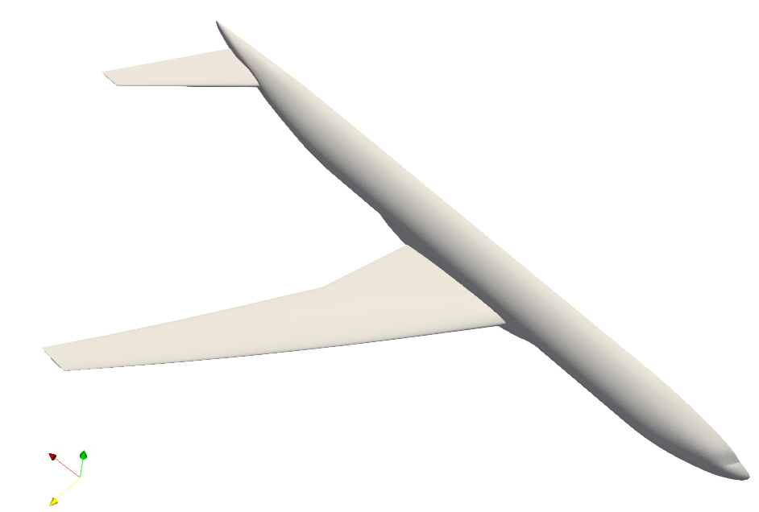
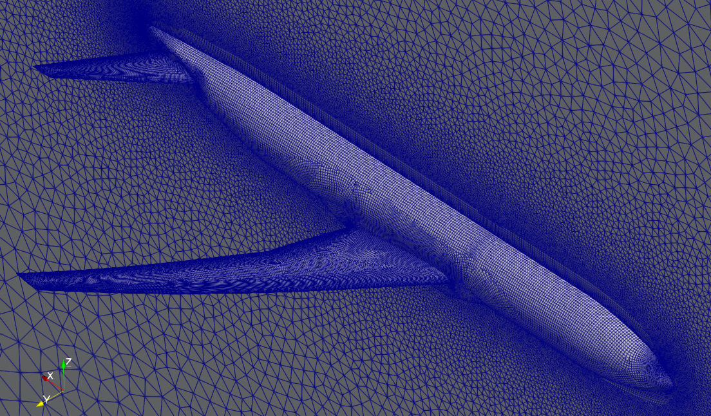
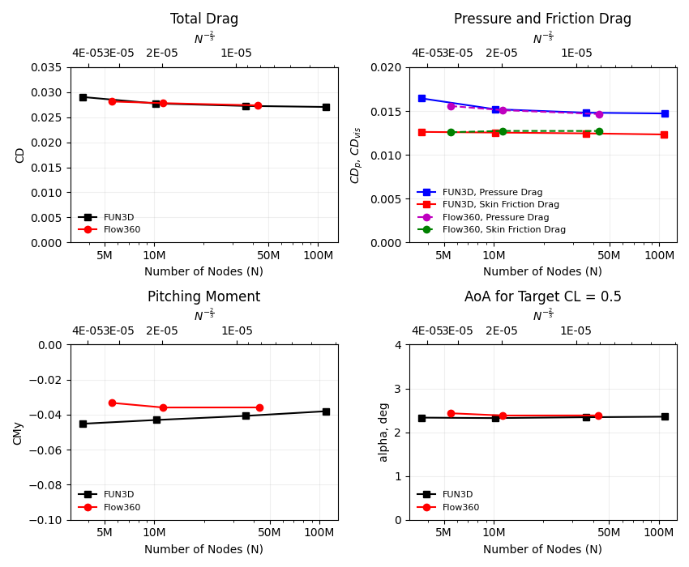
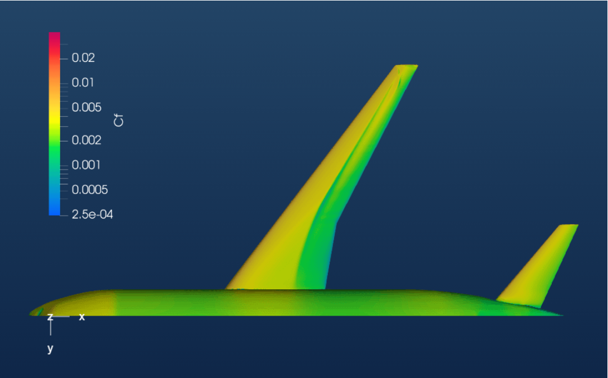
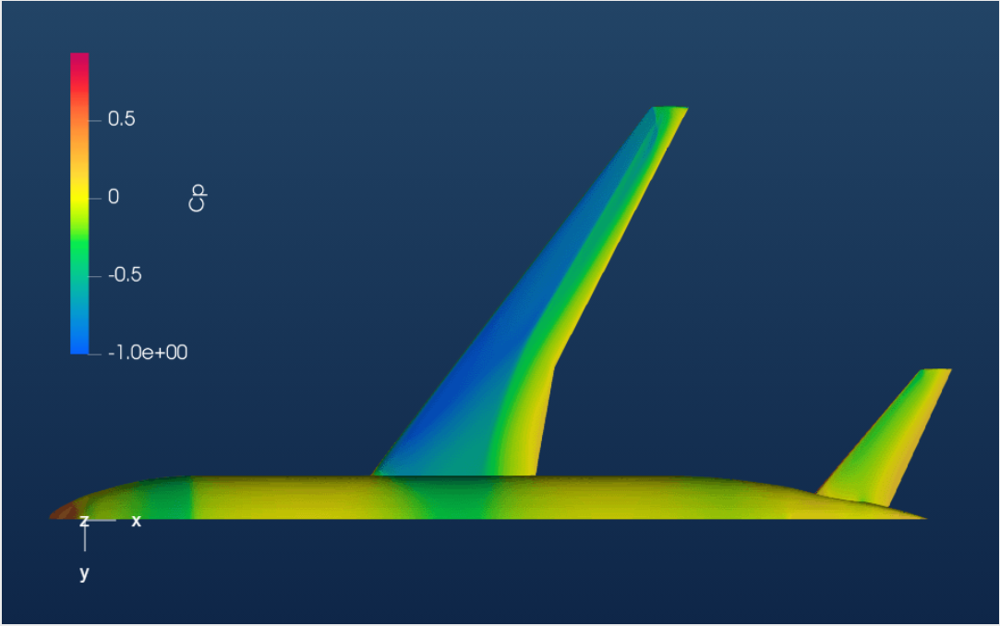
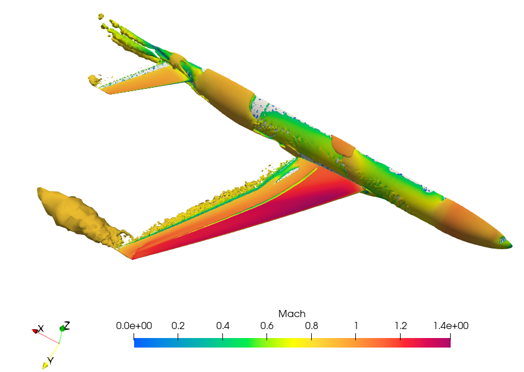

.. _dpw4:

.. |deg|    unicode:: U+000B0 .. DEGREE SIGN
   :ltrim:

Drag Prediction of Common Research Model
========================================

Introduction
------------

The purpose of this case study is to compute the turbulent flow past NASA's Common Research Model (CRM) (a transonic wing-body-tail model) from the 4th AIAA CFD Drag Prediction Workshop.  The goal of the workshop is to assess the state-of-the-art computational methods as practical aerodynamic tools for aircraft force and moment prediction of industry relevant geometries.  The workshop allows comparisons to be made between different solvers and equation sets, and for performance and accuracy to be assessed.

In this case study, we will use mesh created in Pointwise and run it through the Flow360 CFD solver developed by Flexcompute Inc. We will demonstrate how to upload a mesh, run a case and view results. Performance of results from Flow360 will be compared with flow solutions from `FUN3D <https://aiaa-dpw.larc.nasa.gov/Workshop4/presentations/DPW4_Presentations_files/D1-16_FUN3D_DPW_IV_2.pdf>`_, which were presented at the `4th AIAA CFD Drag Prediction Workshop (DPW-4) <https://aiaa-dpw.larc.nasa.gov/Workshop4/workshop4.html>`_.

Problem Description
-------------------

The problem considers the flow around the CRM at a freestream Mach number of 0.85 (:math:`M_{\infty} = 0.85`) to achieve a target lift coefficient of 0.5 (C\ :sub:`L`\ = 0.5).  The geometry of the CRM with a wing-body-tail configuration can be downloaded from `here <https://aiaa-dpw.larc.nasa.gov/Workshop4/DPW4-geom.html>`_, and is shown in :numref:`fig1_dpw4`.  The aircraft has a mirror symmetry.  Summary of the geometric parameters is given below.

.. _fig1_dpw4:

   Test geometry of the Drag Prediction Workshop

- Mean aerodynamic chord (MAC) = 275.8 in, located at y=468.75 in.
- Wing semi-span (b/2) = 1156.75 in.
- Reference area of the semi-span model = Sref/2 = 297,360.0 in\ :sup:`2`\.
- Moment reference center (MRC): x = 1325.90 in, y = 468.75 in, z = 177.95 in.
- Aspect Ratio (AR) = b\ :sup:`2`\/Sref = 9.0.

And the corresponding flow conditions are:

- Freestream Mach Number, :math:`M_{\infty} = 0.85`.
- Target Lift Coefficient, C\ :sub:`L`\ = 0.5.
- Tail Incidence angle = 0 |deg|.
- Reynolds Number (based on MAC) = 5 Million.
- Reference Temperature = 310.93 K.

Mesh
----

Grids were developed using Pointwise.  Flow360 supports mesh file formats in ugrid, cgns, and their .gz or .bz2 compressions.  For the purpose of this case study a cgns mesh file format and a medium-resolution mesh, with mixed hexahedral, tetrahedral, prism, and pyramid elements and with about 11.3M nodes was used.

.. _fig2_dpw4:

   Medium-resolution mesh of the CRM

Setup and Solution
------------------

Upload the Mesh File
^^^^^^^^^^^^^^^^^^^^

The first thing you need to do is to upload the mesh file and the mesh configuration file to Flow360 cloud. These files can be obtained from here:

- Mesh file: `mesh <https://simcloud-public-1.s3.amazonaws.com/dpw4/nasa_crm_pointwise_ds_0.001_medium_11.3M.cgns>`_ 
- Mesh configuration file: `Flow360Mesh.json <https://simcloud-public-1.s3.amazonaws.com/dpw4/Flow360Mesh.json?content_disposition=attachment>`_ 
  
We will do this step-by-step using the Python API.  Open your Python interpreter and import the Flow360 client, json module and read the configuration of mesh.

.. code-block:: python

   python3
   import flow360client
   import json

   meshJson = json.load(open('/path/to/Flow360Mesh.json')

Now upload the mesh using the following command:

.. code-block:: python

   meshId = flow360client.NewMesh(fname='/path/to/dpw4.cgns',         
                                  meshJson=meshJson, 
                                  meshName='DPW4_medium', 
                                  tags=[]
                                 )

Replace the file paths in meshJson and NewMesh with your own file paths.  Mesh name and tags are optional.  Executing this command will return a meshId, which can be used in the next step to run the case.

Run the Case
^^^^^^^^^^^^

To run a case, first download the the configuration file, named Flow360.json, of the CFD solver from `here <https://simcloud-public-1.s3.amazonaws.com/dpw4/Flow360.json?content_disposition=attachment>`_.  This file has been configured to run for this medium-resolution mesh.  If you decide to run a case with another mesh or flow condition, the configuration parameters need to be adjusted accordingly.  A detailed description of the configuration parameters can be found in our :ref:`API Reference <Flow360json>` section.  The case can be submitted using the following command:

.. code-block:: python

   caseId = flow360client.NewCase(meshId=meshId, 
                                  config='/output/path/for/Flow360.json', 
                                  caseName='DPW4_case', 
                                  tags=[]
                                 )

Replace the file path in config with your own. You could provide a caseName, which is "Flow360" by default. The tags are optional.

Downloading the Results
^^^^^^^^^^^^^^^^^^^^^^^

To download the solver log for your case, use the following command:

.. code-block:: python

   flow360client.case.DownloadSolverOut(caseId, fileName='path/to/log')

The second argument fileName is optional, its default value is 'solver.out'.

The surface data (surface distributions and slices) and the entire flow field can be downloaded, respectively, using:

.. code-block:: python

   flow360client.case.DownloadSurfaceResults(caseId, fileName='path/to/surfaceSol')
   flow360client.case.DownloadVolumetricResults(caseId, fileName='path/to/volumeSol')

The second argument fileName is optional, its default value is "volumes.tar.gz" for volume solution and "surfaces.tar.gz" for surface/slice solution.

The residuals history and total forces can be downloaded, respectively, using the following commands:

.. code-block:: python

   flow360client.case.GetCaseResidual(caseId)
   flow360client.case.GetCaseTotalForces(caseId)

Finally, you can download the surface forces by their component names using the following commands:

.. code-block:: python

   flow360client.case.GetCaseSurfaceForcesByNames(caseId, <list of boundaryNames>)

Replace the caseId with your own case's ID and <list of boundaryNames> with names of the boundaries. There is a `script <https://simcloud-public-1.s3.amazonaws.com/dpw4/downloadAll.py?content_disposition=attachment>`_ to download all of the above stuff by: :code:`python3 downloadAll.py caseId`.

Grid Convergence
----------------

The grid convergence of the chosen mesh in this case study has been done by comparing the angles of attack, coefficients of total drag, pressure drag, skin friction drag and pitching moment obtained from Flow360 with solutions presented by FUN3D at the Drag Prediction Workshop.  This grid convergence is presented in :numref:`fig3_dpw4`, and the number of nodes and cells for a coarse, medium and fine grids are presented in :numref:`tab1_dpw4`.

.. _tab1_dpw4:
.. table:: Mesh Statistics for different grid sizes
   :align: center

   +--------+------------+------------+
   |        | # of Nodes | # of Cells |
   +========+============+============+
   | Coarse |    5.5 M   |   10.2 M   |
   +--------+------------+------------+
   | Medium |   11.3 M   |   18.7 M   |
   +--------+------------+------------+
   |  Fine  |    43 M    |   84.4 M   |
   +--------+------------+------------+

.. _fig3_dpw4:

   Grid convergence of Flow360 compared with FUN3D results from the 4th AIAA CFD Drag Prediction Workshop in 2009. The x-axis is the number of mesh grid points N. The scale of the expected numerical error is also labeled for N^-2/3; the y-axis shows the total drag (top-left plot), pressure and skin friction drag (top-right plot), pitching moment (bottom-left plot) coefficients and angles of attack (bottom-right plot).

Results
-------

The results data obtained from the previous step can be post-processed in either ParaView or Tecplot.  You may specify your preference in the Flow360.json configuration file under the outputFormat argument.  The coefficients of skin friction (C\ :sub:`f`\) and pressure (C\ :sub:`p`\) can be viewed on our `Web UI <https://client.flexcompute.com/app/case/all>`_ under the visualization tab.

:numref:`fig4_dpw4` shows the contour plots of coefficient of skin friction

.. _fig4_dpw4:

   Coefficient of Skin Friction

:numref:`fig5_dpw4` shows contour plots of coefficient of pressure

.. _fig5_dpw4:

   Coefficient of Pressure

:numref:`fig6_dpw4` shows the Q-criterion plot, colored by Mach number.  The threshold for Q-criterion for this case is 1.35e-7, which can be calculated using:

.. math:: 

   Q_{threshold} = (\frac{Freestream\ Mach\ Number}{Wing\ Span})^2 = (\frac{M_{\infty}}{b})^2

.. _fig6_dpw4:

   Q-criterion plot, colored by Mach Number

Summary
-------

This tutorial demonstrated how to set up, solve and present results of an external aerodynamics flow over NASA's Common Research Model (CRM) from the Drag Prediction Workshop using Flow360's Python API.  The Angle of Attack, C\ :sub:`D`\, C\ :sub:`D,p`\, C\ :sub:`D,vis`\, and C\ :sub:`My`\  data for a target C\ :sub:`L`\  of 0.5 obtained through Flow360 has been compared with the FUN3D solutions presented at the 4th Drag Prediction Workshop for accuracy.

