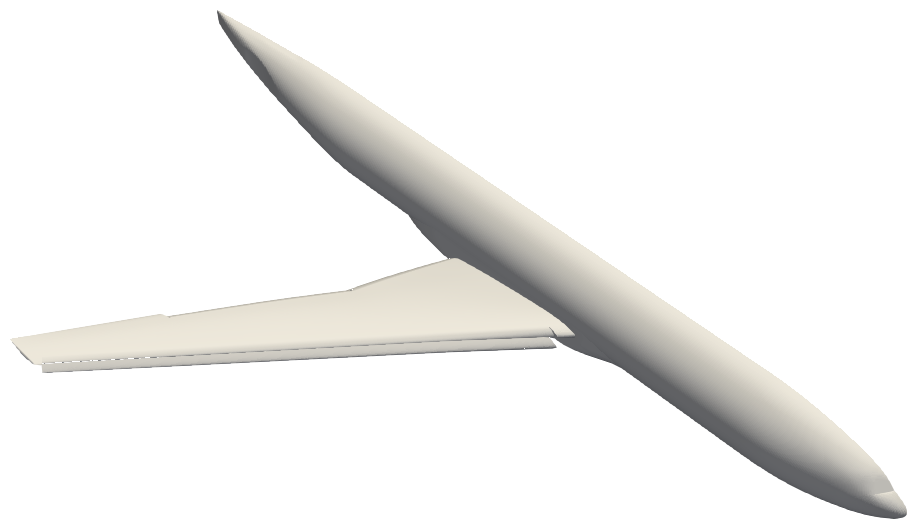
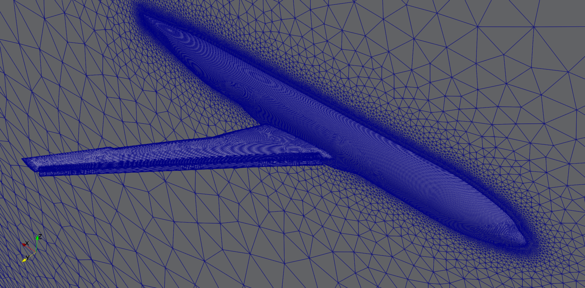
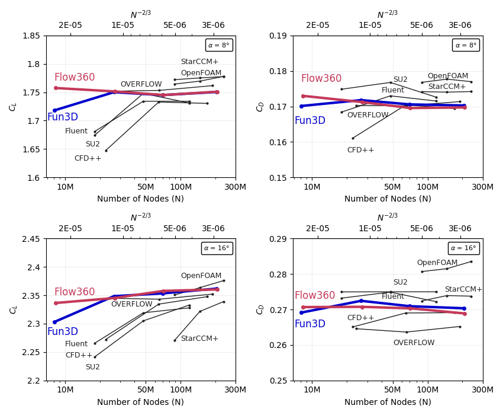
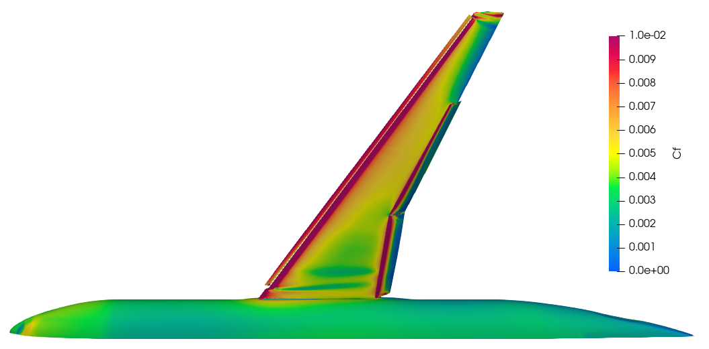
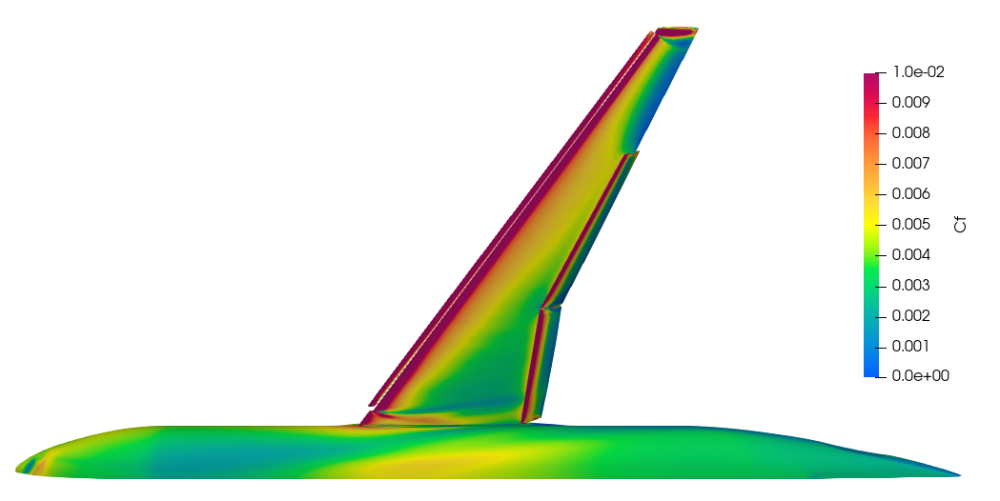
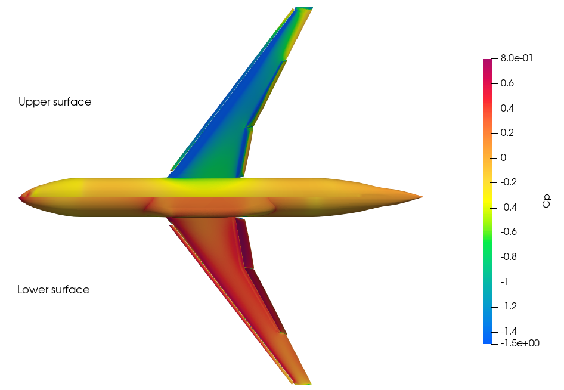
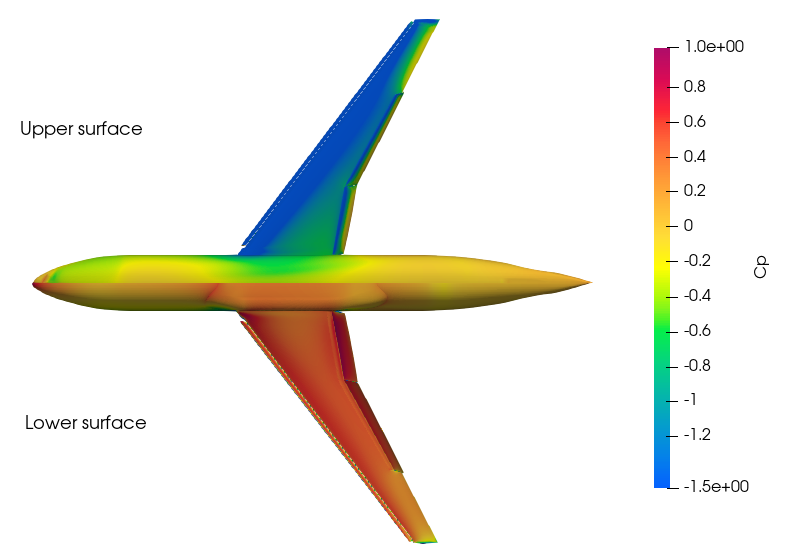
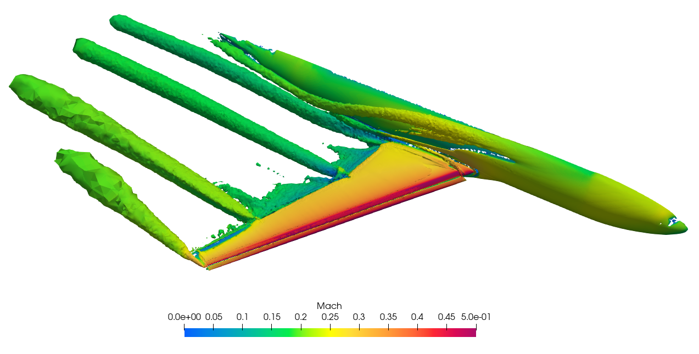
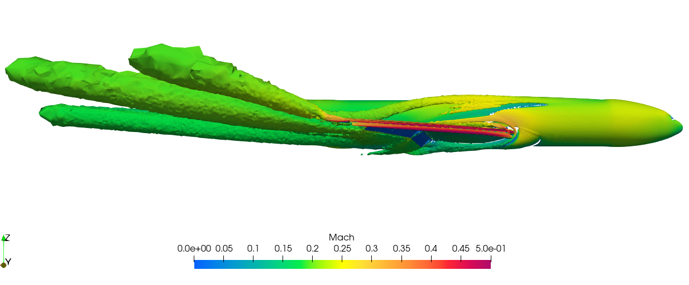
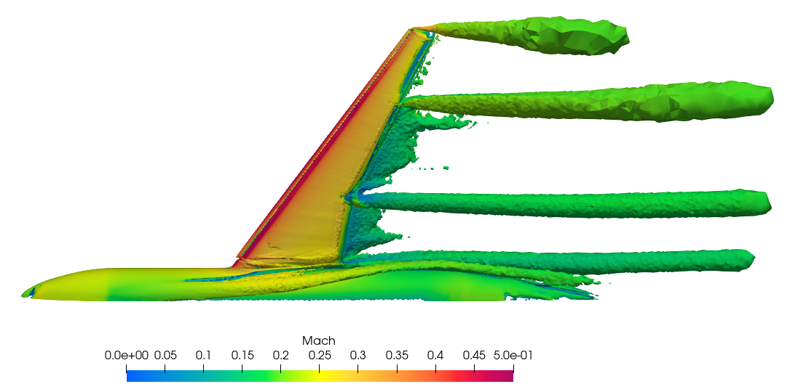

.. _hlcrm:

.. |deg|    unicode:: U+000B0 .. DEGREE SIGN
   :ltrim:

.. |agr|  unicode:: U+003B1 .. GREEK SMALL LETTER ALPHA

High Lift Common Research Model (HL-CRM)
========================================

Introduction
------------

The purpose of this case study is to compute the turbulent flow past a NASA Common Research Model (CRM) with a full flap gap from the AIAA CFD High Lift Prediction Workshop. The goal of the workshop is to research the state-of-the-art in difficult-to predict aircraft configurations, such as take-off and landing scenarios. These cases may be harder to converge, and exhibit complex flow physics. The workshop allows comparisons to be made between different solvers and equation sets, and for performance and accuracy to be assessed.

In this case study, we will use mesh provided by the workshop committee and run Flow360 CFD solver developed by Flexcompute Inc. We will demonstrate how to upload a mesh, run a case and perform post processing. Performance of results from Flow360 will be compared to flow solutions from other leading open-source and commercial solvers, which are published in the `3rd AIAA CFD High Lift Prediction Workshop (HiLiftPW-3) <https://hiliftpw.larc.nasa.gov/index-workshop3.html>`_.

Problem Description
-------------------

The problem considers the flow around the HL-CRM at angles of attack |agr| = 8 |deg| and 16 |deg| and a freestream Mach number of 0.2 (:math:`M_{\infty} = 0.2`).  The geometry of the HL-CRM with gapped configuration can be downloaded from `here <https://hiliftpw.larc.nasa.gov/Workshop3/geometries.html>`_, and is shown in :numref:`Fig1_hlcrm`. The airplane has mirror symmetry. As a common practice, only half of the plane is simulated. Summary of geometry parameters is given below.

.. _Fig1_hlcrm:

   Test geometry of the High Lift Prediction Workshop.

- Mean aerodynamic chord (MAC) = 275.8 in, located at y = 468.75 in
- Wing semi-span (b/2) = 1156.75 in
- Reference area of the semi-span model = Sref/2 = 297,360.0 in\ :sup:`2`\ 
- Moment reference center (MRC): x = 1325.90 in, y = 0.0 in, z = 177.95 in
- Aspect Ratio (AR) = b\ :sup:`2`\ /Sref = 9.0

Mesh
----

Grids have been developed and provided by the workshop to enable a fair comparison across a variety of solvers.  Flow360 supports mesh files formats in AFLR3 and CGNS, or their .gz or .bz2 compressions.  For the purpose of this case study we will use ugrid mesh file, which is of the AFLR3 format.  A medium-resolution mesh, with mixed hexahedral, tetrahedral, prism, and pyramid elements and with about 27M nodes, can be downloaded from `here <https://flow360-resources.s3-us-gov-east-1.amazonaws.com/hlpw3/Woeber_Pointwise_HLCRM_FullGap_HexPrismPyrTets_Medium.b8.ugrid.gz>`_.  The file is already compressed in a .gz format.  Also, download the .mapbc file, to specify the solid wall (no-slip) boundaries, from `here <https://flow360-resources.s3-us-gov-east-1.amazonaws.com/hlpw3/Woeber_Pointwise_HLCRM_FullGap_HexPrismPyrTets_Medium.mapbc?content_disposition=attachment>`_.  Meshes of other resolutions can also be downloaded from `here <https://hiliftpw-ftp.larc.nasa.gov/HiLiftPW3/HL-CRM_Grids/Committee_Grids/B2-HLCRM_UnstrPrismTet_PW/FullGap/AFLR3/>`_.

   Medium-resolution mesh of the HL-CRM; Outboard Flap (bottom-left) and Slat (bottom-right).

Setup and Solution
------------------

Upload the Mesh File
^^^^^^^^^^^^^^^^^^^^

Now that the `mesh <https://flow360-resources.s3-us-gov-east-1.amazonaws.com/hlpw3/Woeber_Pointwise_HLCRM_FullGap_HexPrismPyrTets_Medium.b8.ugrid.gz>`_ has been downloaded, it can be uploaded to the Flow360 cloud. We will do this using the Python API. Open the Python API and import the Flow360 client.

.. code-block:: python
   
   python3
   import flow360client

Before we upload the mesh, we need to specify our no-slip boundary conditions. We will do this using the .mapbc file (downloaded from `here <https://flow360-resources.s3-us-gov-east-1.amazonaws.com/hlpw3/Woeber_Pointwise_HLCRM_FullGap_HexPrismPyrTets_Medium.mapbc?content_disposition=attachment>`_). Make sure the boundary names in your .mapbc file do not have any spaces, otherwise the python code will not parse it. To specify the no-slip boundaries, use the following command line:

.. code-block:: python

   noSlipWalls = flow360client.noSlipWallsFromMapbc('output/path/for/hlcrm.mapbc')

Replace the file path with your own .mapbc file's path.

You can also specify the no-slip boundary conditions using the JSON mesh configuration files (download Flow360Mesh.json file form `here <https://flow360-resources.s3-us-gov-east-1.amazonaws.com/hlpw3/Flow360Mesh.json?content_disposition=attachment>`_).  Use the following commands to do so:

.. code-block:: python

   import json
   meshJson = json.load(open('/path/to/Flow360Mesh.json'))

Again, replace the file path with your own file's path.  The Flow360Mesh.json file for this tutorial has the following contents:

.. code-block:: json

   {
       "boundaries" :
       {
        "noSlipWalls" : [2,3,5,7,9]
       }
   }

If using the .mapbc file, use the following command to upload your mesh:

.. code-block:: python

   meshId = flow360client.NewMesh(fname='/path/to/hlcrm.b8.ugrid', 
                                  noSlipWalls=noSlipWalls, 
                                  meshName='HLCRM_medium', 
                                  tags=[]
                                 )

Or, if you choose to use the mesh JSON configuration file, use the following command to upload your mesh:

.. code-block:: python

   meshId = flow360client.NewMesh(fname='/path/to/hlcrm.b8.ugrid',
                                  meshJson=meshJson,
                                  meshName='HLCRM_medium',
                                  tags=[]
                                 )

Replace the path in fname with your own file's path. Parameter inputs of meshName and tags are optional.  Upon executing this command, it will return the meshId. Use that for the next step.

Run the Case
^^^^^^^^^^^^

To run a case, first prepare a JSON input file, either manually or by using the fun3d_to_flow360.py script:

.. code-block:: python

   python3 /path/to/flow360/flow360client/fun3d_to_flow360.py 
   /path/to/fun3d.nml/path/to/hlcrm.mapbc /output/path/for/Flow360.json

The Flow360.json configuration file for this case (|agr| = 16 |deg|) can be downloaded from `here <https://flow360-resources.s3-us-gov-east-1.amazonaws.com/hlpw3/Flow360.json?content_disposition=attachment>`_.  Be sure to change the flow and solver parameters in JSON configuration file for other cases (e.g. |agr| = 8 |deg|).  A full description of the flow configuration parameters can be found :ref:`here <Flow360json>`.  The case can be submitted using the following command line:

.. code-block:: python

   caseId = flow360client.NewCase(meshId=meshId, 
                                  config='/output/path/for/Flow360.json', 
                                  caseName='HLCRM_case', 
                                  tags=['alpha 16']
                                 )

Replace the meshId generated from the above step, and give your own config path. Parameter inputs of caseName and tags are optional. Upon finishing this command, it will return the caseId. Use that for the next step.

Downloading the Results
^^^^^^^^^^^^^^^^^^^^^^^

To download the solver log for your case, use the following command:

.. code-block:: python

   flow360client.case.DownloadSolverOut(caseId, fileName='path/to/log')

The second argument fileName is optional, its default value is 'solver.out'.

The surface data (surface distributions and slices) and the entire flow field can be downloaded, respectively, using:

.. code-block:: python

   flow360client.case.DownloadSurfaceResults(caseId, fileName='path/to/surfaceSol')
   flow360client.case.DownloadVolumetricResults(caseId, fileName='path/to/volumeSol')

The second argument fileName is optional, its default value is "volumes.tar.gz" for volume solution and "surfaces.tar.gz" for surface/slice solution.

The residuals history and total forces can be downloaded, respectively, using the following commands:

.. code-block:: python

   flow360client.case.GetCaseResidual(caseId)
   flow360client.case.GetCaseTotalForces(caseId)

Finally, you can download the surface forces by their component names using the following commands:

.. code-block:: python

   flow360client.case.GetCaseSurfaceForcesByNames(caseId, <list of boundaryNames>)

Replace the caseId with your own case's ID and <list of boundaryNames> with names of the boundaries. There is a `script <https://flow360-resources.s3-us-gov-east-1.amazonaws.com/dpw4/downloadAll.py?content_disposition=attachment>`_ to download all of the above stuff by: :code:`python3 downloadAll.py caseId`.

Grid Convergence
----------------

The grid convergence of the chosen mesh in this case study has been done by comparing the coefficients of lift and drag for angle of attacks 8 |deg| and 16 |deg| obtained through Flow360 with `solutions presented by other solvers at the High Lift workshop <https://hiliftpw-ftp.larc.nasa.gov/HiLiftPW3/ResultsFromHiLiftPW3/>`_.  This grid convergence is presented in :numref:`Fig3_hlcrm`, and the mesh statistics for a coarse, medium, fine and extra fine grids are presented in :numref:`tab1_hlcrm`.

.. _tab1_hlcrm:
.. table:: Mesh Statistics for different grid sizes
   :align: center

   +--------------+------------+------------+
   |              | # of Nodes | # of Cells |
   +==============+============+============+
   | Coarse       |    8.3 M   |   18.9 M   |
   +--------------+------------+------------+
   | Medium       |    27 M    |   46.8 M   |
   +--------------+------------+------------+
   |  Fine        |    70.7 M  |   116.3 M  |
   +--------------+------------+------------+
   |  Extra Fine  |    208 M   |   385.6 M  |
   +--------------+------------+------------+

.. _Fig3_hlcrm:

   Grid convergence of Flow360 compared to the participants of the 3rd AIAA CFD High Lift Prediction Workshop in 2017. The x-axis is the number of mesh grid points N. The scale of the expected numerical error is also labeled for N^-2/3; the y-axis shows the lift (left plots) and drag (right plots) coefficients computed on various grids, at 8 (upper plots) and 16 (lower plots) degrees angles of attack.

Flow360 performs very well compared to other CFD solvers. Even using coarse mesh, Flow360 obtains results that are very close to results calculated from fine meshes.

Results
-------

The results data obtained from the previous step can be post-processed in either ParaView or Tecplot. We will use ParaView to post-process these results and plot coefficients of skin friction and pressure.

:numref:`Fig4_hlcrm` shows the contour plots of coefficient of skin friction for angle of attacks 8 |deg| and 16 |deg|.

.. _Fig4_hlcrm:

   Coefficient of skin friction for angle of attacks 8 (top) and 16 (bottom) degrees.

:numref:`Fig5_hlcrm` shows contour plots of coefficient of pressure angle of attacks 8 |deg| and 16 |deg| for both the upper and lower surfaces of the wing.

.. _Fig5_hlcrm:

   Coefficient of pressure for angle of attacks 8 (top) and 16 (bottom) degrees.

:numref:`Fig6_hlcrm` shows the Q-criterion plot for Mach number for the coarse grid (8.3M nodes) for the angle of attack 16 |deg|.

.. _Fig6_hlcrm:

   Q-criterion plots of the Mach Number for the coarse grid for angle of attack 16 degrees.

Summary
-------

This case study demonstrated how to set up, solve and present results of an external aerodynamics flow over NASA's Common Research Model (CRM) from the High Lift Prediction Workshop using Flow360 Python API. The C\ :sub:`L`\  and C\ :sub:`D`\  data obtained through Flow360 has been compared with the solutions from various other solvers from the High Lift Prediction Workshop for accuracy. 
