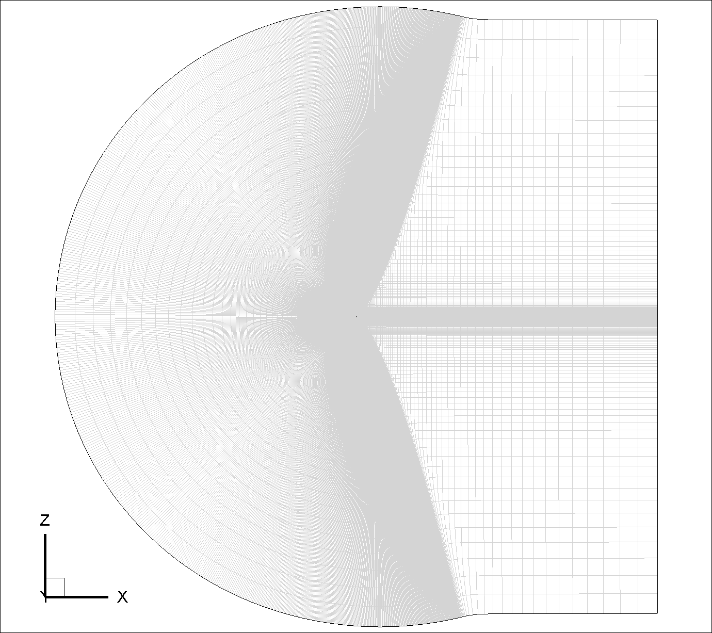
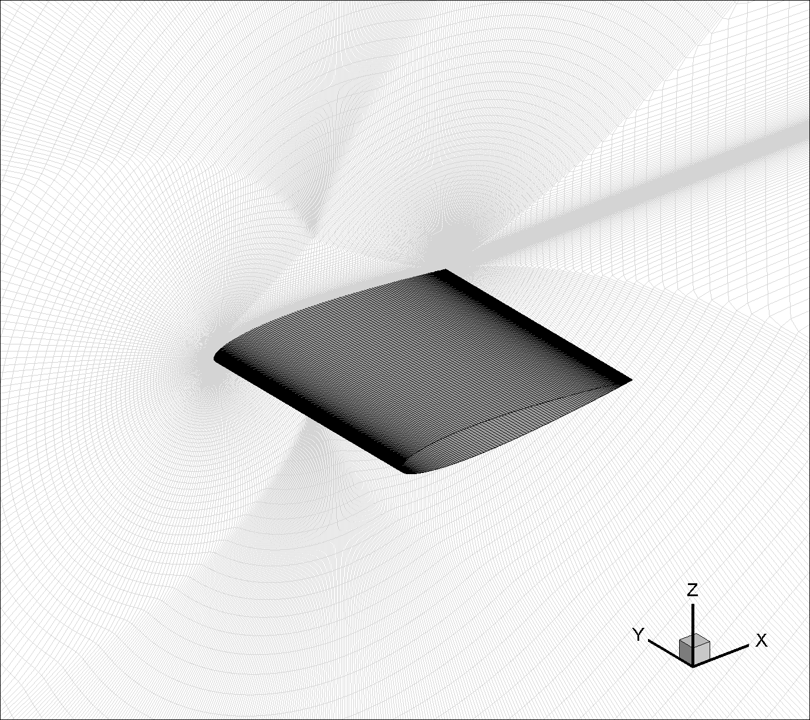
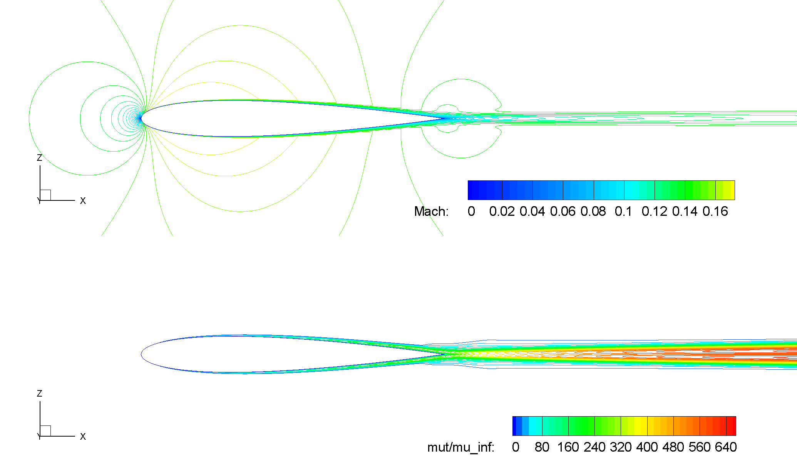
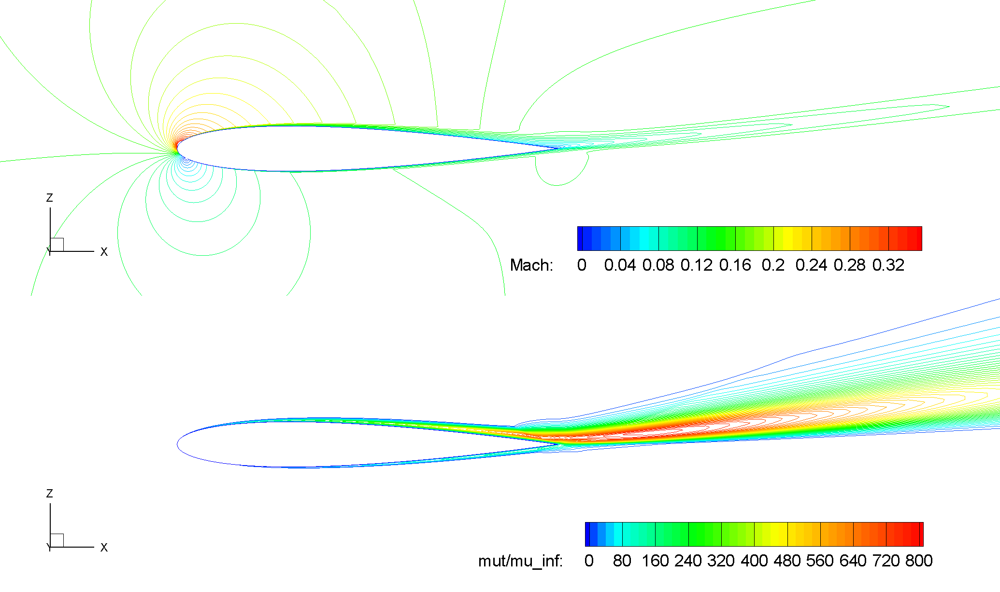
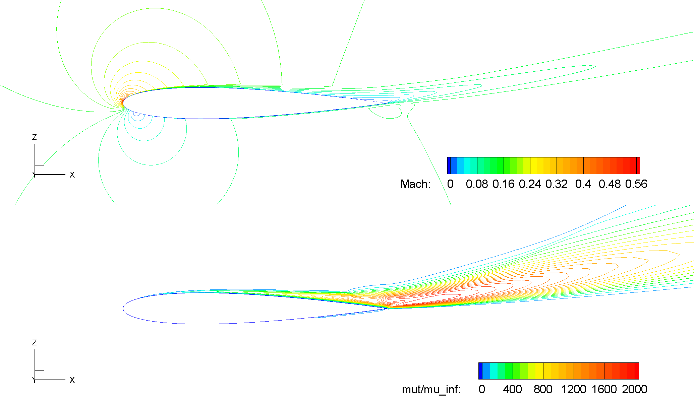
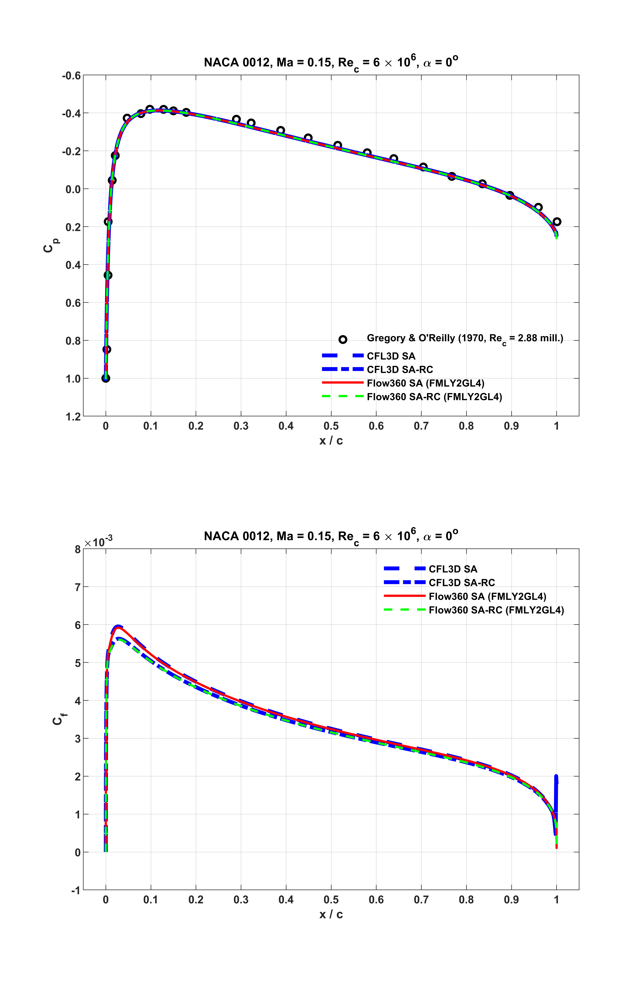
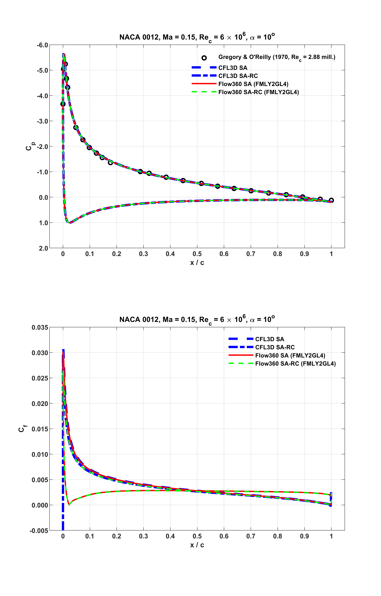
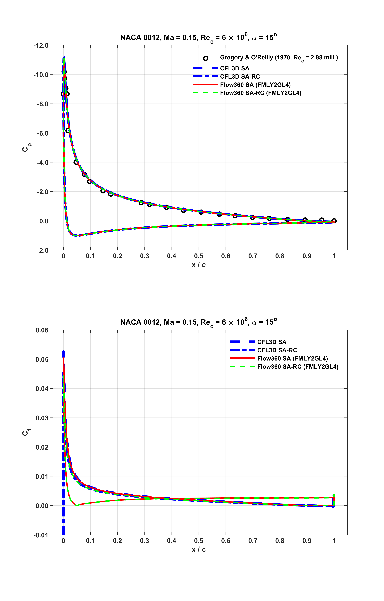
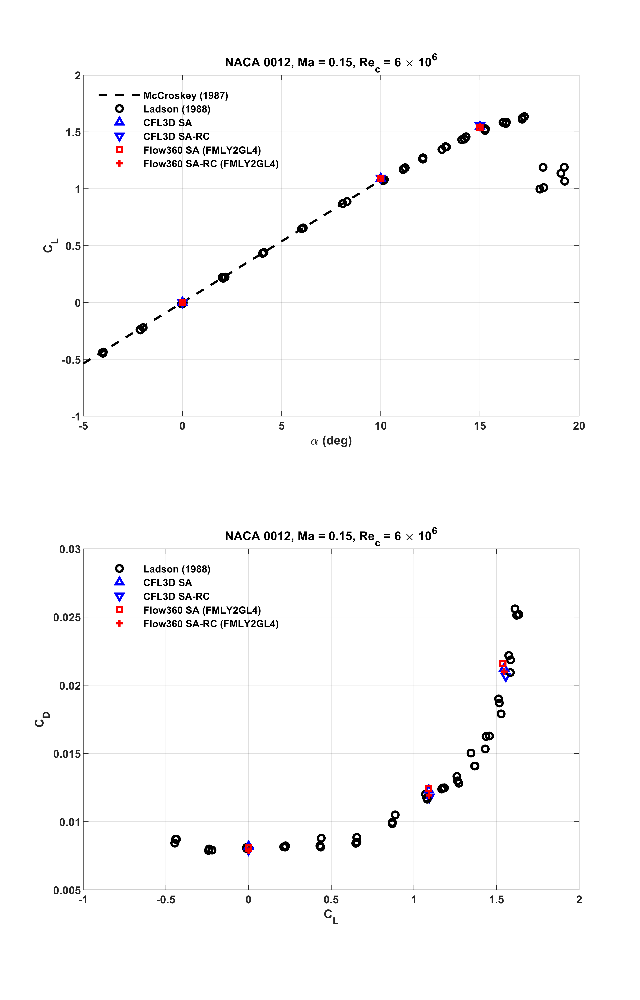

.. _naca0012_caseStudy:

.. |deg|    unicode:: U+000B0 .. DEGREE SIGN
   :ltrim:
   
.. |agr|  unicode:: U+003B1 .. GREEK SMALL LETTER ALPHA

NACA 0012 Low Speed Airfoil
===========================

Introduction
------------

The purpose of this case study is to verify and validate the functionality of the Flow360 solver and the implementation of the Spalart-Allmaras (S-A) turbulence model, with respect to the NACA 0012 low speed airfoil validation case. This is one of the cases originally provided by `the NASA Langley Turbulence Modeling Resource database <https://turbmodels.larc.nasa.gov/naca0012_val.html>`_ with accurate and up-to-date information on widely-used turbulence models, as also described by `the ONERA-elsA website <http://elsa.onera.fr/TMR-0001/GENERATED.html#academic-naca0012-lowspeed>`_. Recent high-accuracy numerical investigations on asymptotic grid convergence behaviors over three families of nested grids are described on this `NASA-LaRC-TMR webpage <https://turbmodels.larc.nasa.gov/naca0012numerics_val.html>`_. Similar validation results from OVERFLOW were documented by `Jespersen et al <https://turbmodels.larc.nasa.gov/Papers/NAS_Technical_Report_NAS-2016-01.pdf>`_.

In this study, Reynolds-averaged Navier-Stokes (RANS) simulations utilizing the S-A turbulence model were performed at the same operating conditions as above for the airfoil. According to `these major conclusions <https://turbmodels.larc.nasa.gov/naca0012numerics_val_sa_withoutpv.html>`_: 1st, the trailing edge streamwise spacing has profound influence on the airfoil lift and moment results, and the grid of Family II yields the most accurate results; 2nd, numerical schemes incorporated with 2nd-order accuracy for turbulence advection are desirable for better asymptotic grid convergence; in the current validation cases, the grid of Family II at Level-4 and 2nd-order accuracy for turbulence model equation were utilized. This grid resolution is comparable to that used in the reference validation cases. Current numerical results were validated with respect to available experimental data, as well as other CFD results where appropriate.

Mesh and Flow Configuration
---------------------------

From the three series of nested grids with varying trailing edge streamwise spacing, available from `this NASA webpage <https://turbmodels.larc.nasa.gov/naca0012numerics_grids.html>`_, we used the grid of Family II at Level-4 (897 x 2 x 257) for this validation. The geometry and the mesh of this quasi-3D CFD model are shown in :numref:`Fig1_NACA0012GeoMsh`. As seen, the grid has a C-type topology, wrapping around the airfoil from the downstream farfield, around the lower surface to the upper, then back to the downstream farfield again. Also, in the wake region, the grid connects to itself in a point-matched manner. The chord length is scaled into unity, and the grid unit is taken to be meter. The origin of the grid coordinates is at the leading edge of the airfoil. The x-axis is in alignment with the chord line. Also, the grid is stretched for one spanwise cell in the negative y direction with the grid spacing of 1 meter. The original unstructured CGNS grid files downloaded from the NASA webpage are in the ADF data format and have to be converted into the HDF5, to meet :ref:`the grid requirements<manualMeshingFlow360Section>` of Flow360. For this validation case, the converted grid file with the HDF5 data structure is available `here <https://simcloud-public-1.s3.amazonaws.com/validation/naca0012/n0012familyII.4.hex.hdf5.cgns.tar.gz>`_.

.. _Fig1_NACA0012GeoMsh:

   Quasi-3D CFD model of NACA 0012 airfoil (Family II, Grid Level-4).
   
As suggested by NASA-LaRC-TMR and ONERA-elsA, for this essentially incompressible flow, the freestream Mach number is :math:`M_{\infty} = 0.15`, the Reynolds number per chord length is :math:`Re_{c} = 6 \times 10^6`, and the reference temperature is :math:`T_{ref} = 300 K`. The turbulent flows past the airfoil were simulated at three angles of attack, i.e. :math:`\alpha = 0^o`, :math:`10^o` and :math:`15^o`. :numref:`Tab1_FlowConfig` summarizes the key flow configuration parameters for Flow360. General guidances on :ref:`the non-dimensionalization conventions<nondimensionalization_Flow360>` and :ref:`the model configurations<Flow360json>` are given in those sections of this online documentation.

.. _Tab1_FlowConfig:
.. csv-table:: Basic solver configuration parameters
   :file: ./naca0012_tab1_keyflowconfig.csv
   :widths: 13, 6, 10, 45
   :align: center
   :header-rows: 1
   :delim: @
   
“NoSlipWall” boundary condition is applied to the adiabatic viscous surface of the airfoil, and “SlipWall” is used as the symmetry condition in the spanwise. “Freestream” boundary condition is utilized for the upstream and the downstream farfields, together with the default value of the freestream “turbulentViscosityRatio”, i.e. :math:`\frac{\mu_t}{\mu_{\infty}} = 0.210438` for the S-A model. This is equivalent to the boundary value based on the S-A approximate turbulent kinematic viscosity :math:`\tilde{\nu}`, i.e. :math:`\frac{\tilde{\nu}}{\nu_{\infty}} = 3`, as used in the CFL3D predictions. More descriptions about these freestream turbulence boundary conditions can be found from this NASA webpage on `the Spalart-Allmaras turbulence model <https://turbmodels.larc.nasa.gov/spalart.html>`_.

Steady-state solutions were computed iteratively, utilizing 2nd-order schemes for both the RANS equations and the turbulence model equation. For the former, the CFL number was gradually ramped up to 100. Detailed Flow360 solver and mesh configuration files, `<Flow360.json> <https://simcloud-public-1.s3.amazonaws.com/validation/naca0012/NACA0012_FMLY2GL4_AOA15_SARC_2ndOrd_CFL100_Flow360.json>`_ and `<Flow360Mesh.json> <https://simcloud-public-1.s3.amazonaws.com/validation/naca0012/NACA0012_FMLY2_Flow360Mesh.json>`_, are given here as an example for the case with the S-A model and its Rotation/Curvature (R/C) correction at :math:`\alpha = 15^o`.

Besides, according to :ref:`Flow360's definitions<Flow360json>` of the angle of attack :math:`\alpha`, the sideslip angle :math:`\beta` and the grid coordinates, the following correlations are imposed at the “Freestream” farfield boundaries.

.. math::
      :label: FreestreamBC
	  
	  U^*_{\infty} &= M_{\infty} \cdot cos(\beta) \cdot cos(\alpha) \\
      V^*_{\infty} &= - M_{\infty} \cdot sin(\beta) \\
      W^*_{\infty} &= M_{\infty} \cdot cos(\beta) \cdot sin(\alpha) 
	  
Where, the components of the velocity are non-dimensionalized by the freestream speed of sound :math:`C_{\infty}`. Also, the effects of these two angles are intrinsically taken into account by the solver in the computed :math:`C_l` and :math:`C_d` values, etc.

Numerical Results
-----------------

Two-dimensional steady viscous mean flows past the NACA 0012 airfoil were simulated at the aforementioned operating conditions. Aerodynamic characteristics were visualized through contour plots of Mach number and turbulent viscosity ratio on the longitudinal cut-plane at :math:`y = -0.5`. Typical results of current RANS simulations, based on the S-A model with the R/C correction, are shown in :numref:`Fig2a_Ma_mutRatio_AOA00`, :numref:`Fig2b_Ma_mutRatio_AOA10` and :numref:`Fig2c_Ma_mutRatio_AOA15` for the three angles of attack, respectively. 

.. _Fig2a_Ma_mutRatio_AOA00:

   Contours of Mach number and turbulent viscosity ratio, NACA 0012, SA-RC, :math:`\alpha = 0^o`.
   
As seen from the above figure, for the zero lift condition at :math:`\alpha = 0^o`, symmetric flow patterns are established across the chord line at :math:`z = 0`.
   
.. _Fig2b_Ma_mutRatio_AOA10:

   Contours of Mach number and turbulent viscosity ratio, NACA 0012, SA-RC, :math:`\alpha = 10^o`.
   
For a relatively high lift condition at :math:`\alpha = 10^o`, large wake region trailing down from the airfoil is observed.
   
.. _Fig2c_Ma_mutRatio_AOA15:

   Contours of Mach number and turbulent viscosity ratio, NACA 0012, SA-RC, :math:`\alpha = 15^o`.
   
Also, as expected, at a higher angle of attack :math:`\alpha = 15^o` towards the operating condition for :math:`C_{l,max}`, the flow starts separating from the upper surface near the trailing edge. This is shown in the above figure where detachment of the contour line of :math:`M = 0` occurs at a more detailed level.

   
For these operating conditions, surface distributions of pressure and skin friction coefficients, i.e. :math:`C_p = \frac{p - p_{\infty}}{0.5 \cdot \rho_{\infty} \cdot U^2_{ref}}` and :math:`C_f = \frac{\tau_w}{0.5 \cdot \rho_{\infty} \cdot U^2_{ref}}`, are examined in :numref:`Fig3a_CpCf_AOA00`, :numref:`Fig3b_CpCf_AOA10` and :numref:`Fig3c_CpCf_AOA15`, with respect to reference data. In these figures, Flow360 results are indicated as the red solid and the green dashed lines for the S-A model without and with the R/C correction, respectively. The corresponding CFL3D results are shown as the blue dashed and dash-dot lines. Experimental data are given as symbols. Notably, these measurements of :math:`C_p` were made at a lower Reynolds number :math:`Re_c = 2.88 \times 10^6` by `Gregory and O'Reilly <https://reports.aerade.cranfield.ac.uk/bitstream/handle/1826.2/3003/arc-rm-3726.pdf>`_.  

.. _Fig3a_CpCf_AOA00:

   Surface distributions of :math:`C_p` and :math:`C_f`, NACA 0012, :math:`\alpha = 0^o`.
   
.. _Fig3b_CpCf_AOA10:

   Surface distributions of :math:`C_p` and :math:`C_f`, NACA 0012, :math:`\alpha = 10^o`.
   
.. _Fig3c_CpCf_AOA15:

   Surface distributions of :math:`C_p` and :math:`C_f`, NACA 0012, :math:`\alpha = 15^o`.
   
As seen from these above figures, at all the three distinct lift conditions, Flow360 predictions accurately capture the experimental data, and closely match the counterparts of the reference numerical results. Notably, as shown in :numref:`Fig3c_CpCf_AOA15` associated with :math:`\alpha = 15^o`, the :math:`C_f` value of the current result with the S-A model approaches zero around :math:`x/c = 0.9078` on the upper surface of the airfoil near the trailing edge. This indicates separated mean flow occurs as observed from the previous :numref:`Fig2c_Ma_mutRatio_AOA15`. For the current result with the SA-RC model, the separation point emerges around :math:`x/c = 0.8992`. These locations are at the upstream bounds of the suggested intervals as given on the NASA webpages.
   
The integrated :math:`C_l` and :math:`C_d` values of the current predictions are summarized in :numref:`Tab2a_ClCd`, :numref:`Tab2b_ClCd` and :numref:`Tab2c_ClCd` for :math:`\alpha = 0^o`, :math:`10^o` and :math:`15^o`, respectively, together with available reference CFD data. As seen, for all the tested operating conditions, the accuracy of Flow360 results are comparable.  

.. _Tab2a_ClCd:
.. csv-table:: Lift and drag coefficients for the NACA 0012 airfoil with the S-A model
   :file: ./naca0012_tab2a_ClCd_AOA00.csv
   :widths: 10, 8, 6, 10, 8, 8, 8
   :align: center
   :header-rows: 1
   :delim: @
   
It is noted that, for most of these representative aerodynamic quantities, the results of Flow360 are at either the upper or the lower bounds of the reference intervals. It is suspected that this is due to the differences in the discretization, such as node-centered or cell-centered schemes, as well as convergence criteria, at least as seen from the :math:`C_l` values at :math:`\alpha = 0^o`. It is also noted that the reference data such as those CFL3D results were computed with the farfield point vortex (PV) correction based on inviscid characteristic methods as given by `Thomas and Salas <https://doi.org/10.2514/3.9394>`_. At the current accuracy level for validation with farfield boundaries about 500 chords away, its effects would be inappreciable. 
   
.. _Tab2b_ClCd:
.. csv-table:: Lift and drag coefficients for the NACA 0012 airfoil with the S-A model
   :file: ./naca0012_tab2b_ClCd_AOA10.csv
   :widths: 14, 8, 6, 8, 8, 8, 8
   :align: center
   :header-rows: 1
   :delim: @
   
Importantly, a different computational grid with substantially finer trailing edge streamwise spacing is used for the current cases. As described on `the NASA webpage <https://turbmodels.larc.nasa.gov/naca0012_val.html>`_, before June 23, 2014, there was a typo in the slightly scaled version of the formula that was used to generate the NACA 0012 airfoil profile. This caused a slight non-closure of the order of :math:`1 \times 10^{-8}` at the trailing edge, and affected the earlier grid files, as well as the corresponding numerical results as refered to here. This issue would not have significant influence at the accuracy level required for validation purpose. However, it has been shown that the trailing edge streamwise spacing has profound influence on the airfoil lift and moment results, as analysed by `Diskin et al <https://arc.aiaa.org/doi/10.2514/1.J054555>`_ and `Atkins <https://turbmodels.larc.nasa.gov/NACA0012numerics_val/NASA-TM-2018-220106-Atkins-convergenceanalysis.pdf>`_.

Since the typo discovered, thorough high-accuracy numerical analysis had been performed to reveal scenarios such as grid convergence, etc. Details of these updated investigations are given on this `turbulence model numerical analysis (TMNA) <https://turbmodels.larc.nasa.gov/naca0012numerics_val.html>`_ webpage of NASA, as well as `the ONERA-elsA webpage <http://elsa.onera.fr/TMR-0001/GENERATED.html#academic-naca0012-lowspeed>`_.  These updated data of :math:`C_l` and :math:`C_d` computed on the same grid as used in this study without the farfield PV correction, available only at :math:`\alpha = 10^o`, are also given in :numref:`Tab2b_ClCd`. These are at the bottom of the table and denoted by (TMNA, noPV). As seen, the agreement of Flow360 results with respect to these updates are closer.
   
.. _Tab2c_ClCd:
.. csv-table:: Lift and drag coefficients for the NACA 0012 airfoil with the S-A model
   :file: ./naca0012_tab2c_ClCd_AOA15.csv
   :widths: 10, 8, 6, 8, 8, 8, 8
   :align: center
   :header-rows: 1
   :delim: @

The corresponding :math:`C_l` and :math:`C_d` data given in the above tables are also displayed in this following figure, together with the experimental data measured by `Ladson <https://ntrs.nasa.gov/citations/19880019495>`_. Notably, in this figure, at low-to-moderate angles of attack, linear variation of :math:`C_l` with the best fit lift slope provided by `McCroskey <https://ntrs.nasa.gov/citations/19880002254>`_ is also shown. As seen, the current results agree well with these references. More discussions about the experimental data compared in this and the above figures are given on `this NASA webpage <https://turbmodels.larc.nasa.gov/naca0012_val.html>`_.
   
.. _Fig4_ClCd:

   Comparisons of :math:`C_l` and :math:`C_d` at :math:`\alpha = 0^o`, :math:`10^o` and :math:`15^o`.
   
Remarks
-------

Through this validation study, the flow field, the surface data and the representative aerodynamic quantities predicted by Flow360 were carefully examined. With respect to the latest reference numerical results computed on the same grid as used here, the available agreement on :math:`C_l` and :math:`C_d` reaches the third significant digit.

