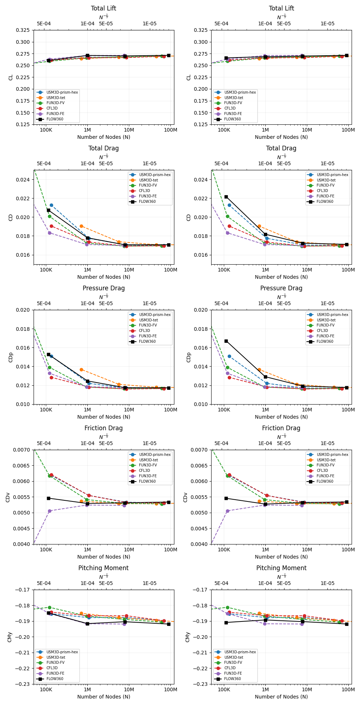
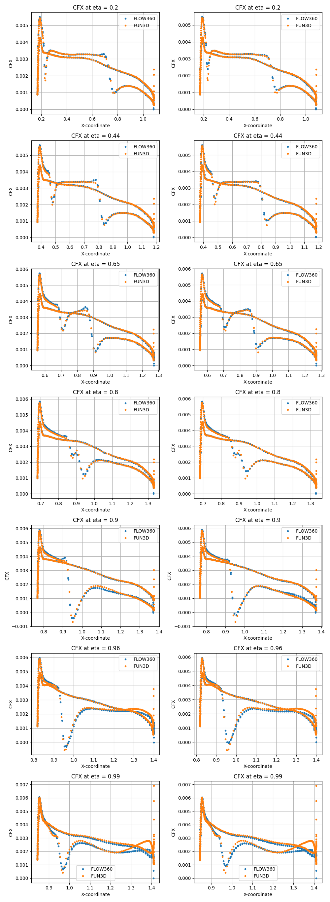
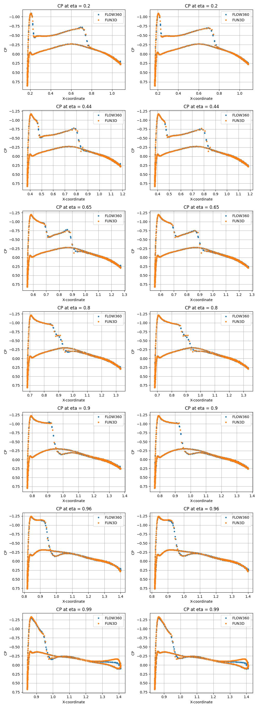
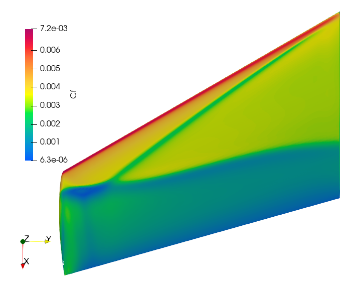
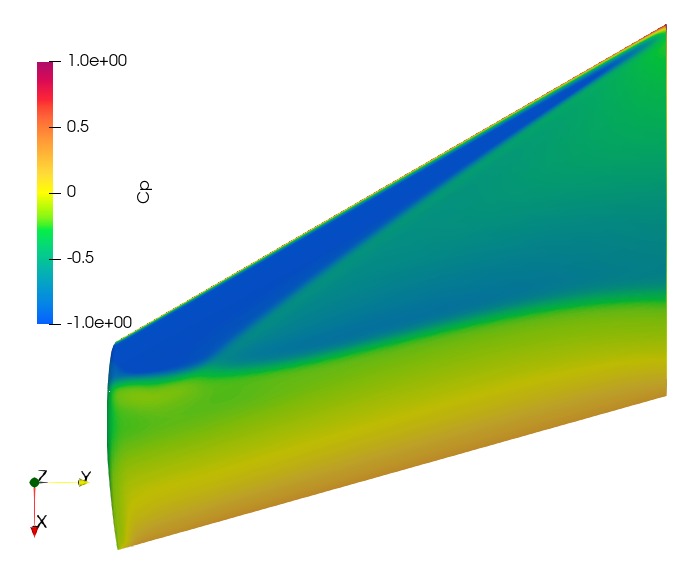

.. _om6_caseStudy:

.. |deg|    unicode:: U+000B0 .. DEGREE SIGN
   :ltrim:

ONERA M6 Wing
=============

Introduction
------------

The Onera M6 wing is a classic CFD validation case for external flows because of its simple geometry combined with complexities of transonic flow (i.e. local supersonic flow, shocks, and turbulent boundary layer separation). It is a swept, semi-span wing with no twist and uses a symmetric airfoil using the ONERA D section. More information about the geometry can be found at `NASA's website <https://www.grc.nasa.gov/www/wind/valid/m6wing/m6wing.html>`_. The parameters of the geometry are:

- Mean Aerodynamic Chord (MAC) = 0.80167.
- Semi-span = 1.47602.
- Reference area = 1.15315.

.. _fig1_om6_caseStudy:

.. figure:: figures_OM6_Tutorial/Geometry_Iso.png
   :scale: 70%
   :align: center

   ONERA M6 Wing Geometry

The mesh used for this case contains 8M nodes and 47M tetrahedrons, and the flow conditions are:

- Mach Number = 0.84.
- Reynolds Number (based on MAC) = 11.72 Million.
- Alpha = 3.06 |deg|.
- Reference Temperature = 297.78 K.

Setup and Solution
------------------

The 8M-node mesh file, and its corresponding mesh and case configuration files can be downloaded via the following links:

- Mesh file: `wing_tetra.8M.lb8.ugrid <https://simcloud-public-1.s3.amazonaws.com/om6_8M/wing_tetra.8M.lb8.ugrid>`_
- Mesh configuration file: `Flow360Mesh.json <https://simcloud-public-1.s3.amazonaws.com/om6_8M/Flow360Mesh.json>`_
- Case configuration file: `Flow360.json <https://simcloud-public-1.s3.amazonaws.com/om6_8M/Flow360.json>`_

For detailed instructions to upload a mesh, run a case and download the results for an ONERA M6 Wing, please refer to the :ref:`Quick Start <quickstart>` section of this documentation - these details will not be covered in this case study.

Grid Convergence
----------------

The grid convergence of the 8M-node mesh in this case study has been done by comparing the coefficients of total lift, total drag, pressure drag, skin friction drag and pitching moment obtained from Flow360 with `solutions provided by various other solvers <https://simcloud-public-1.s3.amazonaws.com/om6_8M/combined_forces_pitchmom_maxmut.dat>`_.   This grid convergence is presented in :numref:`fig2_om6_caseStudy`, and the mesh statistics for the coarse, medium, fine and extra  fine grids are presented in :numref:`tab1_om6_caseStudy`.

.. _tab1_om6_caseStudy:
.. table:: Mesh Statistics for different grid sizes
   :align: center

   +--------------+------------+---------------------------+
   |              | # of Nodes | # of Cells (Tetrahedrons) |
   +==============+============+===========================+
   | Coarse       |    113K    |   663K                    |
   +--------------+------------+---------------------------+
   | Medium       |    1M      |   6M                      |
   +--------------+------------+---------------------------+
   |  Fine        |    8M      |   47M                     |
   +--------------+------------+---------------------------+
   |  Extra Fine  |    90M     |   537M                    |
   +--------------+------------+---------------------------+

.. _fig2_om6_caseStudy:

   Grid convergence of Flow360 results compared with results from various other solvers.  The x-axis is the number of mesh grid points N. The scale of the expected numerical error is also labeled for N^-2/3; the y-axis shows the total lift, total drag, pressure and skin friction drag, and pitching moment coefficients with pressure-density limiter turned off (left) and on (right).

The discrepancy between the left and right plots in :numref:`fig2_om6_caseStudy` is due to the presence of shock on the upper surface of this transonic wing.  To capture these shocks the pressure-density limiter option, :code:`limiterPressureDensity`, needs to be set true (right plots) in the :code:`navierStokerSolver` of the Flow360.json configuration file.

Results
-------

The presence of these shock waves are particularly noticeable in :numref:`fig3_om6_caseStudy` and :numref:`fig4_om6_caseStudy`, where the Viscous stress coefficient along x-direction and Coefficient of pressure are plotted over various y-normal slices of the wing and compared with `FUN3D <https://simcloud-public-1.s3.amazonaws.com/om6_8M/FUN3D_OM6_A3p06_CPCF.dat>`_ results.

.. _fig3_om6_caseStudy:

   Viscous stress coefficient along x-direction plotted over various y-normal slices with pressure-density limiter turned off (left) and on (right).

.. _fig4_om6_caseStudy:

   Coefficient of pressure along x-direction plotted over various y-normal slices with pressure-density limiter turned off (left) and on (right).

:numref:`fig5_om6_caseStudy` shows the contour plot of coefficient of skin friction (Cf).

.. _fig5_om6_caseStudy:

   Coefficient of Skin Friction

And :numref:`fig6_om6_caseStudy` shows the contour plot of coefficient of pressure (Cp).

.. _fig6_om6_caseStudy:

   Coefficient of Pressure

Summary
-------

This case study presented the results of a transonic flow over an ONERA M6 Wing, and demonstrated the importance of using a pressure-density limiter to capture the effects of the shock waves on the upper surface of this wing.  The CL, CD, CDp, CDv, and CMy data obtained through Flow360 has been compared with various other solvers.  Also, the Cp and CFx  y-normal slices data from Flow360 is compared with FUN3D to show the capturing of these shock waves by turning on the :code:`limitPressureDensity` option in the :code:`navierStokerSolver` of the Flow360.json configuration file.
