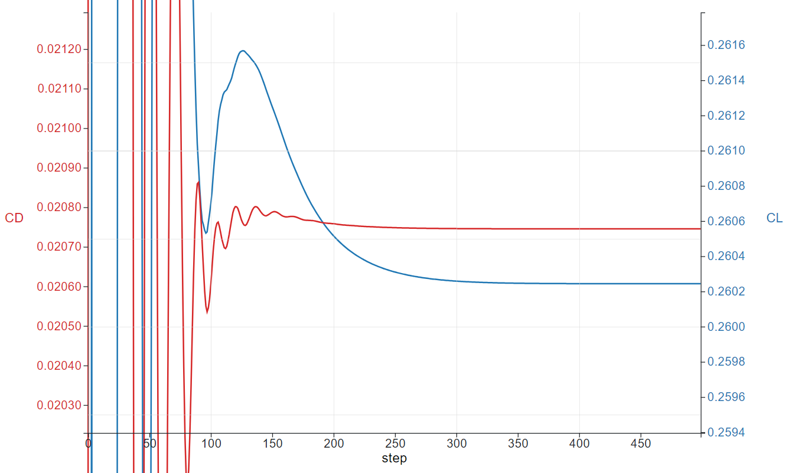
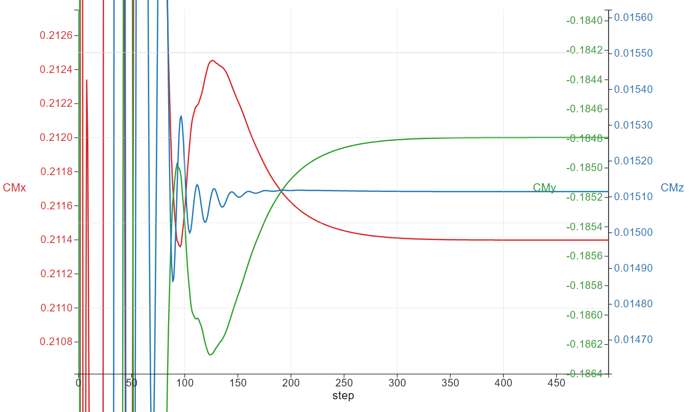
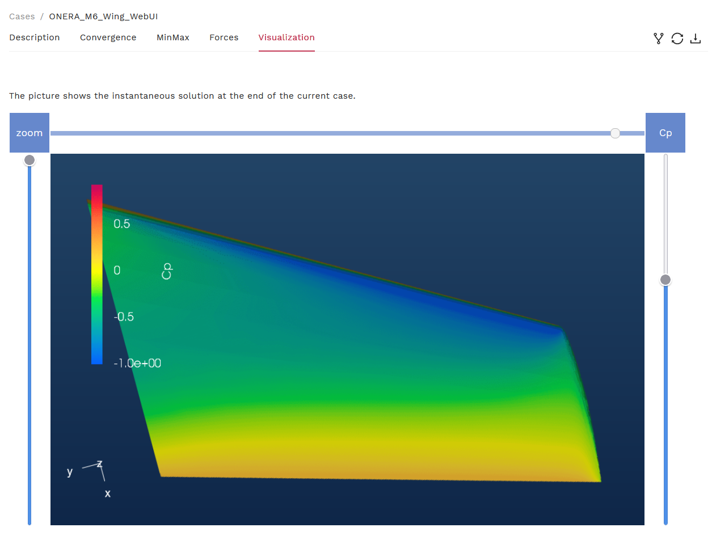

.. _om6_wing_pyAPI:
.. |deg|    unicode:: U+000B0 .. DEGREE SIGN
   :trim:

Run CFD using Python API: An example of ONERA M6 Wing
*****************************************************

The Onera M6 wing is a classic CFD validation case for external flows because of its simple geometry combined with complexities of transonic flow (i.e. local supersonic flow, shocks, and turbulent boundary layer separation).  It is a swept, semi-span wing with no twist and uses a symmetric airfoil using the ONERA D section.  More information about the geometry can be found at `NASA's website <https://www.grc.nasa.gov/www/wind/valid/m6wing/m6wing.html>`_.  The geometry parameters are:

- Mean Aerodynamic Chord (MAC) = 0.80167
- Semi-span = 1.47602
- Reference area = 1.15315

.. image:: figures_OM6_Tutorial/Geometry_Iso.png
   :scale: 70%
   :align: center

The mesh used for this case contains 113K nodes and 663K tetrahedrons, and the flow conditions are:

- Mach Number = 0.84
- Reynolds Number (based on MAC) = 11.72 Million
- Alpha = 3.06 |deg|.
- Reference Temperature = 297.78 K

Upload the Mesh File
^^^^^^^^^^^^^^^^^^^^

Before uploading a mesh, if you have not done so already, install the Flow360 Python API client.  For installation instructions, visit the :ref:`API Reference <api>` section of this documentation.  To upload a mesh and run a case, open your Python interpreter and import the flow360 client.

.. code-block:: python

   python3
   import flow360client

Specify no-slip boundaries - you can do this in three ways:

a. By directly feeding it into the noSlipWalls argument:

.. code-block:: python

   noSlipWalls = [1]

b. By using the .mapbc file:

.. code-block:: python

   noSlipWalls = flow360client.noSlipWallsFromMapbc('/path/to/fname.mapbc')

(**Note**: Make sure the boundary names in your .mapbc file do NOT contain any spaces )

c. And by using the meshJson object:

.. code-block:: python

   import json
   meshJson = json.load(open('/path/to/Flow360Mesh.json'))

The `Flow360Mesh.json <https://simcloud-public-1.s3.amazonaws.com/om6/Flow360Mesh.json?content_disposition=attachment>`_ file for this tutorial has the following contents:

.. code-block:: python

   {
       "boundaries" :
       {
        "noSlipWalls" : [1]
       }
   }

Download the mesh file from `here <https://simcloud-public-1.s3.amazonaws.com/om6/wing_tetra.1.lb8.ugrid>`_.  
If using options (a) and (b), use the following command to upload your mesh:

.. code-block:: python

   meshId = flow360client.NewMesh(fname='/path/to/mesh.lb8.ugrid',
                                  noSlipWalls=noSlipWalls,
                                  meshName='my_mesh',
                                  tags=[],
                                  endianness='little'
                                 )

If using option (c), use the following command to upload your mesh:

.. code-block:: python

   meshId = flow360client.NewMesh(fname='/path/to/mesh.lb8.ugrid',
                                  meshJson=meshJson,
                                  meshName='my_mesh',
                                  tags=[],
                                  endianness='little'
                                 )

(**Note**: Arguments of meshName and tags are optional. If using a mesh filename of the format mesh.lb8.ugrid (little-endian format) or mesh.b8.ugrid (big-endian format), the endianness argument is optional. However, if you choose to use a mesh filename of the format mesh.ugrid, you must specify the appropriate endianness ('little' or 'big') in NewMesh. More information on endianness can be found `here <https://en.wikipedia.org/wiki/Endianness>`_.)

Currently supported mesh file formats are .ugrid, .cgns and their .gz and .bz2 compressions. The mesh status can be checked by using:

.. code-block:: python

   ## to list all your mesh files
   flow360client.mesh.ListMeshes()
   ## to view a particular mesh
   flow360client.mesh.GetMeshInfo('mesh_Id')

Replace the mesh_Id with your mesh's ID.

Run a Case
^^^^^^^^^^

The `Flow360.json <https://simcloud-public-1.s3.amazonaws.com/om6/Flow360.json?content_disposition=attachment>`_ file for this case has the following contents.  A full dictionary of configuration parameters for the JSON input file can be found :ref:`here <Flow360json>`.

.. literalinclude:: files/Flow360_om6.json
   :linenos:

Use this JSON configuration file and run the case with the following command:

.. code-block:: python
   
   caseId = flow360client.NewCase(meshId='mesh_Id',
                                  config='/output/path/for/Flow360.json',
                                  caseName='my_case',
                                  tags=[]
                                 )

(**Note**: Arguments of meshName and tags are optional.)

The case status can be checked by using: 

.. code-block:: python

   ## to list all your cases
   flow360client.case.ListCases()
   ## to view a particular case
   flow360client.case.GetCaseInfo('case_Id')

Replace the mesh_Id and case_Id with your mesh and case IDs, respectively.

Deleting a Mesh/Case
^^^^^^^^^^^^^^^^^^^^

An uploaded mesh/case can be deleted using the following commands (*Caution*: You will not be able to recover your deleted case or mesh files including its results after your deletion):

.. code-block:: python

   ## Delete a mesh
   flow360client.mesh.DeleteMesh('')
   ## Delete a case
   flow360client.case.DeleteCase('')

Download the Results
^^^^^^^^^^^^^^^^^^^^

To download the surface data (surface distributions and slices) and the entire flow field, use the following command lines, respectively:

.. code-block:: python

   flow360client.case.DownloadSurfaceResults('case_Id', 'surfaces.tar.gz')
   flow360client.case.DownloadVolumetricResults('case_Id', 'volume.tar.gz')

Once downloaded, you can postprocess these output files in either Tecplot or ParaView. You can specify this in the Flow360.json file under the volumeOutput, surfaceOutput, and sliceOutput sections.

To download the solver.out file, use the following command:

.. code-block:: python

   flow360client.case.DownloadSolverOut('case_Id', fileName='solver.out')

You can also download the nonlinear residuals, surface forces and total forces by using the following command line:

.. code-block:: python

   flow360client.case.DownloadResultsFile('case_Id', 'fileName.csv')

Replace caseId with your caseId and fileName with nonlinear_residual, surface_forces and total_forces for their respective data.

.. _visResults:

Visualizing the Results
^^^^^^^^^^^^^^^^^^^^^^^

While your case is running, or after that, you can visualize the Residuals and Forces plot on our website (https://client.flexcompute.com/app/case/all) by clicking on your case name and viewing them under the **Convergence** and **Forces** tabs, respectively.

.. image:: figures_OM6_Tutorial/ConvergenceTab.png
   :align: center

For example, the Forces plots for this case are:

.. image:: figures_OM6_Tutorial/CF.png
   :align: center

Once your case has completed running, you can also visualize the contour plots of the results under the **Visualization** tab.  Currently, contour plots for Coefficient of Pressure (C\ :sub:`p`\), Coefficient of Skin Friction (C\ :sub:`f`\), Y+, and C\ :sub:`f`\  with streamlines are provided.

