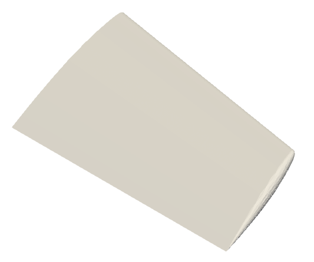
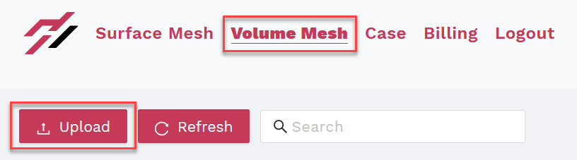
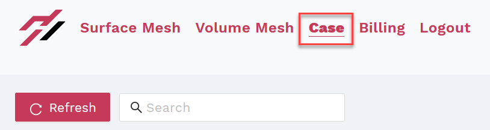
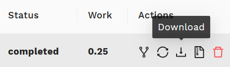
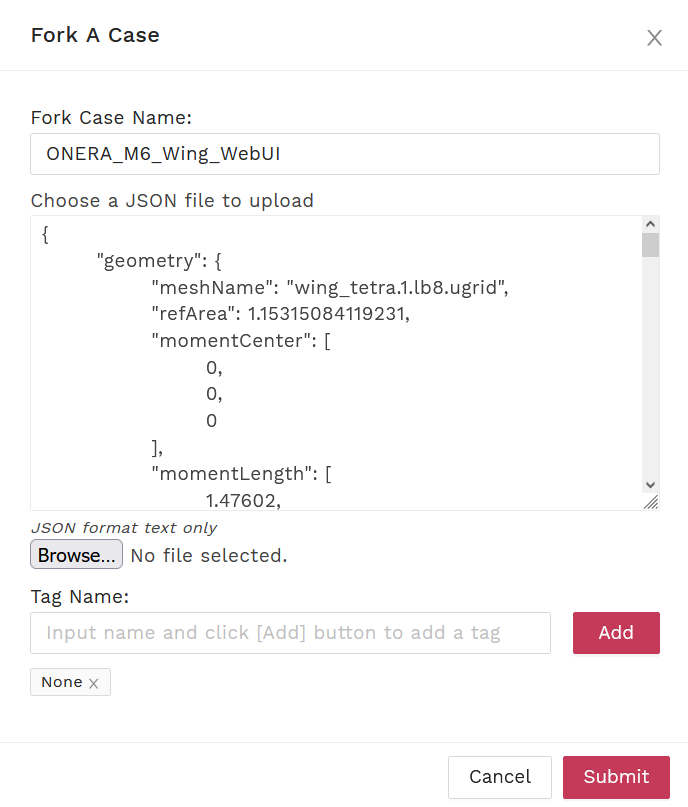
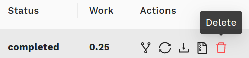

.. _om6_wing_webUI:
.. |deg|    unicode:: U+000B0 .. DEGREE SIGN
   :trim:

Run CFD using Web UI: An example of ONERA M6 Wing
*************************************************

The Onera M6 wing is a classic CFD validation case for external flows because of its simple geometry combined with complexities of transonic flow (i.e. local supersonic flow, shocks, and turbulent boundary layer separation).  It is a swept, semi-span wing with no twist and uses a symmetric airfoil using the ONERA D section.  More information about the geometry can be found at `NASA's website <https://www.grc.nasa.gov/www/wind/valid/m6wing/m6wing.html>`_.  The geometry parameters are:

- Mean Aerodynamic Chord (MAC) = 0.80167
- Semi-span = 1.47602
- Reference area = 1.15315

The mesh used for this case contains 113K nodes and 663K tetrahedrons, and the flow conditions are:

- Mach Number = 0.84
- Reynolds Number (based on MAC) = 11.72 Million
- Alpha = 3.06 |deg|.
- Reference Temperature = 297.78 K

Get CFD results in two simple steps
===================================

After you `sign in <https://client.flexcompute.com/app/login>`_, visit https://client.flexcompute.com/app/volumemeshes. 

**Step 1. Upload the Volume Mesh File:**

To upload a volumetric mesh file, under the **Volume Mesh** tab click on **Upload** icon as displayed below:

This will open a window.  You need to upload two files here.  The first is the volume mesh.  Download an example mesh of  M6 Wing `here <https://simcloud-public-1.s3.amazonaws.com/om6/wing_tetra.1.lb8.ugrid>`_.  The second is the mesh configuration json.  Download one `here <https://simcloud-public-1.s3.amazonaws.com/om6/Flow360Mesh.json?content_disposition=attachment>`_.  When uploading the mesh, be sure to set the Endianness to 'little endian' for this tutorial.  More information on endianness can be found `here <https://en.wikipedia.org/wiki/Endianness>`_.  (**Note**: Mesh Name and Tags are optional. For Release History, the latest solver version will be used here by default.)  Then click submit to upload and process your mesh. You can see the status of the mesh under the **Status** tab.

**Step 2. Launch a CFD Case:**

You do not have to wait for your mesh to be processed. Once your mesh is uploaded you can start the case submission process. To start a new case, click on the airplane icon under the **Actions** tab as shown below.

Once you click the airplane icon, the webpage will re-direct you to an interactive interface to either generate a case configuration json online or upload a pre-configured json file.  Please use this `Flow360.json <https://simcloud-public-1.s3.amazonaws.com/om6/Flow360.json?content_disposition=attachment>`_ file for the current case. A full dictionary of configuration parameters for the JSON input file can be found :ref:`here <Flow360json>`.  You may also provide a Case Name and Tags to track your case later on. Hit **Submit** to run your case.  Once the case is submitted, you can check the case status by clicking the **Case** tab.

.. raw:: html

   

Advanced Functions
==================

Visualizing the Results:
^^^^^^^^^^^^^^^^^^^^^^^^

While your case is running, or after that, you can visualize the Residuals and Forces plot by clicking on your case name and viewing them under the **Convergence** and **Forces** tabs, respectively.

For example, the Forces plots for this case are:

.. image:: figures_OM6_Tutorial/CD_CL.png
   :align: center

.. image:: figures_OM6_Tutorial/CM.png
   :align: center

Once your case has completed running, you can also visualize the contour plots of the results under the **Visualization** tab.  Currently, contour plots for Coefficient of Pressure (C\ :sub:`p`\), Coefficient of Skin Friction (C\ :sub:`f`\), Y+, and C\ :sub:`f`\  with streamlines are provided.

.. image:: figures_OM6_Tutorial/VisResults.png
   :scale: 70%
   :align: center

Downloading the Results:
^^^^^^^^^^^^^^^^^^^^^^^^

Once your case has finished running, you can download the results (Surfaces, Volume and Log) by clicking the download arrow under the **Actions** tab.

The Volume and Surface data can be post-processed in either ParaView or Tecplot, based on your selection of outputFormat in the Flow360.json file. And the Log file (solver.out) can be used to view the solver time and other run details.

Fork a Case:
^^^^^^^^^^^^

You can also restart a case, to continue from the last point of the previous run, by clicking the **Fork a Case** icon under the **Actions** tab and change the parameters of your Flow360.json configuration file according to your needs or upload an entirely new configuration file.

Deleting a Mesh/Case:
^^^^^^^^^^^^^^^^^^^^^

You can delete a mesh/case by clicking on the trash can icon under the **Actions** tab. (*Caution*: You will not be able to recover your deleted case or mesh files including its results after your deletion.)

