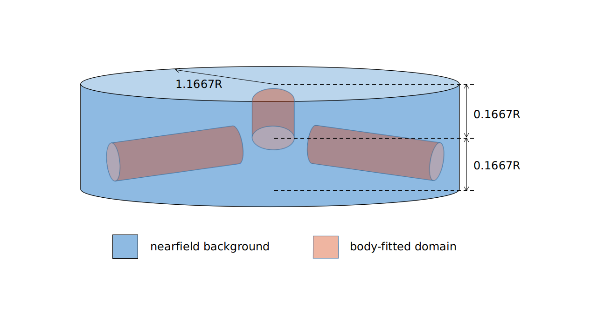
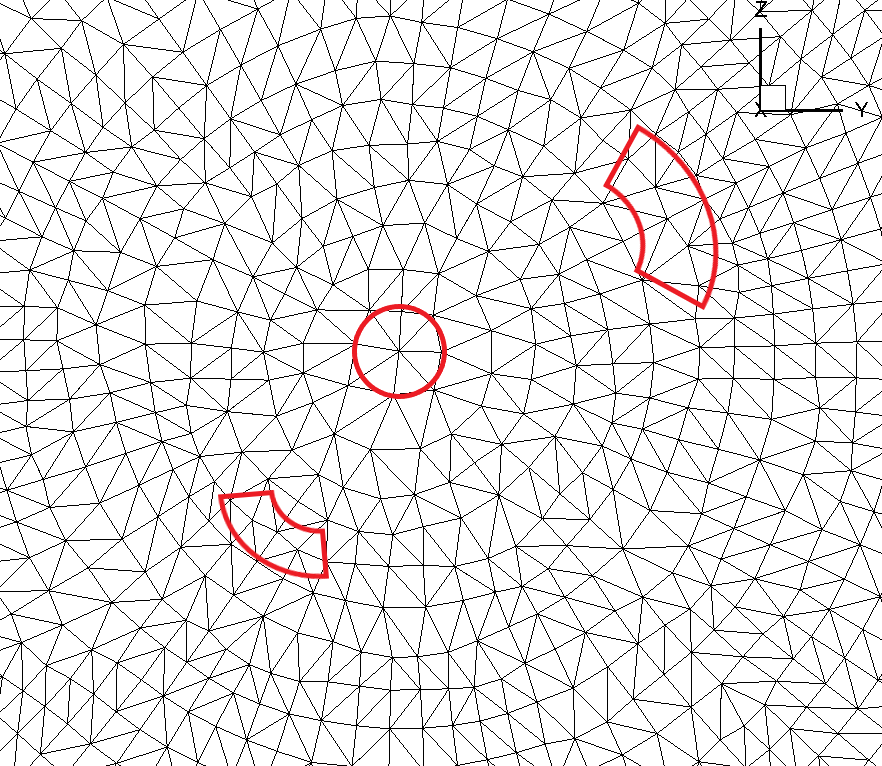
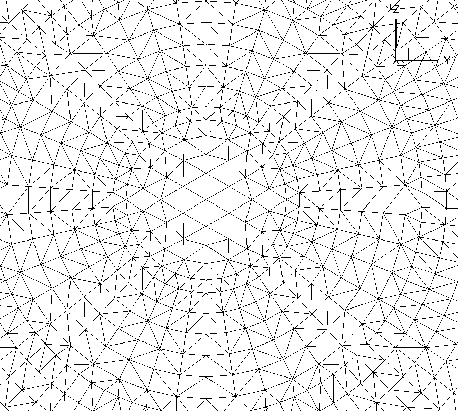
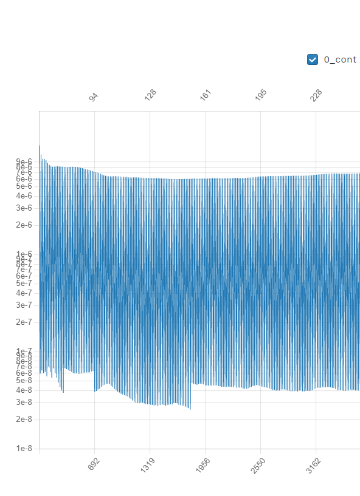

.. _rotation_interface:
.. |deg|    unicode:: U+000B0 .. DEGREE SIGN

Run CFD on a propeller using a Rotation interface
======================================================

Quick Start using the XV 15 geometry.
------------------------------------------
The `XV15 tiltotor airplane <https://en.wikipedia.org/wiki/Bell_XV-15>`__ is a commonly used test bed for propeller validation work. As you can see from the following papers, we have done extensive validations on this geometry. We will now use it to show you how to analyze the performance of a propeller-type geometry with the help of a sliding mesh configuration.

* :ref:`Rotor5: Rotor analysis under 5 hours using ultra-fast and high-fidelity CFD simulation and automatic meshing<rotor5Paper>`
* :ref:`Assessment of Detached Eddy Simulation and Sliding Mesh Interface in Predicting Tiltrotor Performance in Helicopter and Airplane Modes<DESXV15>` 

Basic description
-----------------

In order to simulate the flow around a rotating geometry, we need to set up a mesh with two regions, an inner “rotational volume” and an outer “stationary volume”. The interface between those two regions needs to be a solid of revolution, i.e. sphere/cylinder/etc..

.. figure:: rotationInterfaceFigs/rotInterfaceView.png
    :width: 600px
    :align: center
    :alt: Inner, rotating, mesh volume enclosing the XV15 three-blade prop

    Inner mesh volume enclosing the XV15 three-bladed prop

.. figure:: rotationInterfaceFigs/farfieldView.png
        :width: 600px
        :align: center
        :alt: Farfield stationary mesh volume enclosing the above inner block

        Farfield stationary mesh volume enclosing the above inner block

        body fitted cylinder blocks inside a larger nearfield domain

Please note that it is possible, just like in the figure above, to set up nested rotational interfaces to simulate for example a rotating propeller with blades that pitch as they rotate (i.e. a helicopter\'s cyclical ). We could also enclose more rotating regions within the outer stationary farfield domain to simulate multiple rotors.

Rotation interface
~~~~~~~~~~~~~~~~~~

The rotation interface needs to be a body of revolution (sphere, cylinder etc.) which encloses the entire rotor blades. The grid points on the rotation interface can not be arbitrary. It is mandatory that they form a set of concentric rings. 

        Non concentric circle mesh on rotation interface

As shown in the above figure, the grid points on the rotation interface do not satisfy the concentricity requirement. Certain points slightly deviate from the perfect concentric circle.

        Concentric circle mesh on rotation interface

This figure shows a slightly different grid that does satisfy that requirement. Notice how all the nodes are on concentric circles.
The reason for that requirement is that it greatly speeds up the interpolation process. Since this interpolation happens twice for every interface node (inner and outer domain) and for every pseudo timestep, already knowing where the neighbors are without having to run a search algorithm every time to find the closest node is very efficient.

Creating an interface with concentric mesh rings
~~~~~~~~~~~~~~~~~~~~~~~~~~~~~~~~~~~~~~~~~~~~~~~~

For this case study we will provide the mesh. But for your own cases, knowing that we have this concentric mesh requirement, the easiest way to create the meshes for the interface regions is to do it programmatically. We have a lot of scripts to generate various body of revolution interface shapes that will allow you to generate an interface region no matter what your geometry. Just contact us and we will help you get setup with the scripts you need.

For plain cylindrical or spherical interfaces we have some pre-generated interfaces in CGNS format ready for you to download from `this link <https://simcloud-public-1.s3.amazonaws.com/rotationInterface/CGNS_rotation_interfaces.tgz>`__.
You will notice that they come in various height to radius ratios, as well as various resolutions. Please choose the version that best fits your needs, then rotate/scale the imported mesh to align the interface around your geometry.

XV15 Example setup
------------------

We will now show you how to simulate the flow around an XV15 propeller.

First, the rotor has a 150” (inches)  radius and the blades have a chord of roughly 11”. For simplicity, we will use the SI system and convert these two dimensions to 3.81meters radius and 0.279meter chord.

A complete CGNS mesh is available `here <https://simcloud-public-1.s3.amazonaws.com/xv15/XV15_Hover_ascent_coarse.cgns>`__, along with its associated `Mesh.json file <https://simcloud-public-1.s3.amazonaws.com/xv15/XV15_quick_start_mesh.json>`__.

If you are comfortable with the CGNS format, you can run the "cgnslist" command which will show you that the **XV15_Hover_ascent_coarse.cgns** file contains the following blocks and boundaries

*farField*

    *farField/farField*

    *farField/rotationInterface*

*innerRotating*

    *innerRotating/blade*

    *innerRotating/rotationInterface*

This tells us that we have two mesh regions (*farField* and *innerRotating*). Inside *innerRotating* we have some *blades* and as a part of *farField* we have the *farField* boundaries.

.. _defMeshJson:

Defining a Mesh.json file
~~~~~~~~~~~~~~~~~~~~~~~~~~~~

The Mesh.json file contains the information the mesh preprocessor needs
in order to perform its job.
We need to give it the information as to which domains are the
“NoSlipWalls” and which are the “rotationInterfaces” along with some key
rotation interface geometry information, namely the rotation axis vector and the center of rotation.

You do NOT need to give it any “FarField”, “SlipWall” domain informations.

In our case, our XV15_quick_start_mesh.json file looks like:

.. code-block:: javascript

  {
    "boundaries": {
        "noSlipWalls": [
            "innerRotating/blade"]
    },
    "slidingInterfaces" : [
        {
          "stationaryPatches" : ["farField/rotationInterface"],
          "rotatingPatches" : ["innerRotating/rotationInterface"],
            "axisOfRotation" : [0,0,-1],
            "centerOfRotation" : [0,0,0]
        }
    ]
    }

Uploading your mesh
~~~~~~~~~~~~~~~~~~~~~~~~~~~~~~~~~~~~

Now that you have the **XV15_Hover_ascent_coarse.cgns** mesh file and its associated **XV15_quick_start_mesh.json** mesh preprocessor input file, you may upload the mesh through either the API or the Web-UI.

Defining a Flow360.json file.
~~~~~~~~~~~~~~~~~~~~~~~~~~~~~~~~~~~~

Once your mesh has been uploaded, the last step before launching a simulation is to create a Flow360.json file with all the information needed by Flow360 solver to run your case.

For this example we have provided you with two different Flow360 json input files. Please download the one for the `initial 1st order run <https://simcloud-public-1.s3.amazonaws.com/xv15/XV15_quick_start_flow360_1st.json>`__ and the other for the `final 2nd order runs <https://simcloud-public-1.s3.amazonaws.com/xv15/XV15_quick_start_flow360_2nd.json>`__. More on 1st order vs 2nd order :ref:`below <1st2ndorder>`

For this case, our Flow360 solver input json files have 11 sections:

-   "geometry"
-   "runControl"
-   "volumeOutput"
-   "surfaceOutput"
-   "sliceOutput"
-   "navierStokesSolver"
-   "turbulenceModelSolver"
-   "freestream"
-   "boundaries"
-   "slidingInterfaces"
-   "timeStepping"

Most of those categories are self evident and won’t be discussed here, just take a look at the downloaded json files or go to our documentation page on :ref:`solver configuration <Flow360Meshjson>`  to see what each sections does. Or for a more detailed description on how to setup your Flow360.json file for your configuration please see our dedicated :ref:`Case Studies <examples>`

.. _1st2ndorder:

1st vs 2nd order CFD runs:
~~~~~~~~~~~~~~~~~~~~~~~~~~

If you look through most Flow360.json files you will see the "navierStokesSolver" section showing:

"navierStokesSolver" : {

"orderOfAccuracy" : 1 or 2 }

"turbulenceModelSolver" : {

"orderOfAccuracy" : 1 or 2 }

This dictates whether the code will run using 1st or 2nd order interpolation in space
algorithms. 1st order accuracy is much faster and much more robust.

For time accurate solutions, involving rotating components, we recommend to start the flow simulation using the 1st "orderOfAccuracy" for at least 1 revolution, to help quickly establish the flow. Then continue with however many 2nd order accurate revolutions needed for the flow to properly establish itself and for the forces to stabilize. Please note that if you have some parts of your vehicle downstream of your propellers, it may take many more revolutions for the propeller's wake to reach the downstream components. If that is the case, you could run a first set of the 2nd order revolutions with a larger time step to help the flow establish itself quicker. Then perform a more precise, better converged, 2nd order run with smaller time steps to get more accurate forces. These consecutive operations are easily done in Flow360 through our "fork" function that launches a new job using the flow solution of the parent run as the initial condition of the child run. 

Also, for 1st order we recommend using the following "timeStepping" values:

-   max Pseudo Steps =12
-   CFL initial=1
-   CFL final = 1000
-   rampSteps= 10 (i.e. rampSteps is 2 steps less then maxPseudoSteps)

For the 2nd order run, the recommendations are as follows:

-   max Pseudo Steps =35
-   CFL initial=1
-   CFL final = 1e7
-   rampSteps= 33 (i.e. rampSteps is 2 steps less then maxPseudoSteps)

These are just guidelines to get your started and will most likely need to be revised for your specific cases.

Case input conditions
~~~~~~~~~~~~~~~~~~~~~~

For the current case, the input flow conditions are:

-  5m/s inflow speed
-  600 RPM
-  speed of sound = 340.2 m/s
-  Rho = 1.225 kg/m\ :sup:`3`
-  Alpha = -90 |deg| which means the air coming down from above, i.e. an ascent case.

Other key values are :

- The reference Mach value is arbitrarily set to the Tip mach number for the blades.
- For the 1st order run we will do 1 revolution at 6 |deg| per time step. Hence the "maxPhysicalSteps" : 60 value (60*6 |deg| =360 |deg| )
- for the 2nd order run we will do 5 revolutions at 3 |deg| per time step.

Using the Non-dimensionalization equations described in the  :ref:`conventions<nondimensionalization_Flow360>`  part of the documentation we get the following flow conditions and timeStepping values in our 1st order Flow360.json file.

.. code-block:: javascript

  {    "freestream" :
      {
          "muRef" : 4.29279e-08,
          "Mach" : 1.46972e-02,
          "MachRef" : 0.70,
          "Temperature" : 288.15,
          "alphaAngle" : -90.0,
          "betaAngle" : 0.0
      },
      "boundaries" : {
          "farField/farField" : { "type" : "Freestream" },
          "farField/rotationInterface" : { "type" : "SlidingInterface" },
          "innerRotating/rotationInterface" :   { "type" : "SlidingInterface" },
          "innerRotating/blade" :   { "type" : "NoSlipWall" }
      },
      "slidingInterfaces" : [
      {
          "stationaryPatches" : ["farField/rotationInterface"],
          "rotatingPatches" : ["innerRotating/rotationInterface"],
          "axisOfRotation" : [0,0,-1],
          "centerOfRotation" : [0,0,0],
          "omega" : 1.84691e-01,
          "volumeName" : ["innerRotating"]
      }
      ],
      "timeStepping" : {
  		"timeStepSize" : 5.67000e-01,
  		"maxPhysicalSteps" : 60,
  		"maxPseudoSteps" : 12,
          "CFL" : {
              "initial" : 1,
              "final" : 1000,
              "rampSteps" : 10
          }
      }
      }

Case running
~~~~~~~~~~~~~~~~~~~~~~

The first order case should finish in less then a minute on this fairly coarse 915K nodes mesh.

The second order run takes about 3.5 to 4 minutes to complete its 5 revolutions. Please note that at the end of the 2nd order run you will have done 6 revolutions in total (1 for the 1st order run and 5 for the 2nd order run).

For a time accurate case to be considered well converged we like to have at least 2 orders of magnitude reduction in the residuals within each time step.

    2nd order convergence plot showing more then 2 orders of magnitude decrease in the residuals for each subiterations.

The forces also seem to have stabilized after completing 6 revolutions.

.. figure:: rotationInterfaceFigs/force_convergence.png
    :width: 600px
    :align: center
    :alt: convergence of forces

    2nd order run's force history plot showing good stabilization of the forces.

Congratulations! You have now finished your first Flow360 simulation for a rotating propeller using a rotational interface.
