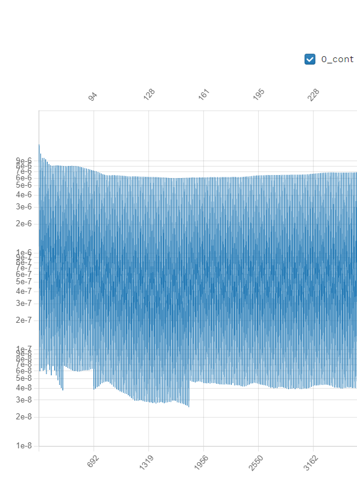

.. _rotation_interface_quickstart:
.. |deg|    unicode:: U+000B0 .. DEGREE SIGN

Run CFD on a propeller: An example XV-15 rotor geometry
=========================================================

Uploading the mesh file for the XV-15 rotor
-------------------------------------------------------
The `XV-15 tiltotor aircraft <https://en.wikipedia.org/wiki/Bell_XV-15>`__ is a commonly used test bed for propeller validation work.  We will use its rotor geometry to quickly run an isolated rotor case. This same geometry and additional simulation details are discussed in depth :ref:`here <rotation_interface>`.

In order to run a rotating geometry we need to set up a mesh with two blocks, an inner “rotational volume” and an outer “stationary volume”. The interface between those two volumes needs to be a solid of revolution (i.e., sphere, cylinder, etc.).

.. figure:: rotationInterfaceQSFigs/rotInterfaceView.png
    :width: 600px
    :align: center
    :alt: Inner block enclosing the XV-15 3-bladed prop

    Inner block enclosing the XV-15 3-bladed propeller

.. _uploadXV15meshFile:

For our purposes we will use a pre-generated CGNS mesh `available here <https://simcloud-public-1.s3.amazonaws.com/xv15/XV15_Hover_ascent_coarse.cgns>`__ along with its associated `Mesh.json <https://simcloud-public-1.s3.amazonaws.com/xv15/XV15_quick_start_mesh.json>`__ file. The XV-15 mesh can be uploaded either through the Flow360 :ref:`Web UI <om6_wing_webUI>` or through the :ref:`Python API <om6_wing_pyAPI>`.

XV15 rotor case setup
----------------------

Once your mesh has been uploaded, the last step before launching a run is to create a Flow360.json file with runtime parameters needed by the Flow360 solver.

.. _xv15jsondownload:

For this example we have provided you with two different Flow360.json input files, one for the `initial 1st order run <https://simcloud-public-1.s3.amazonaws.com/xv15/XV15_quick_start_flow360_1st.json>`__ and one for the `final 2nd order run <https://simcloud-public-1.s3.amazonaws.com/xv15/XV15_quick_start_flow360_2nd.json>`__. For more on 1st vs 2nd order simulations :ref:`see the FAQ <1st2ndorder>`.

Case inputs
~~~~~~~~~~~~~~~~~~~~~~

For our case we have the following operating conditions:

-   Airspeed = 5 m/s
-   Rotation rate = 600 RPM
-   Speed of sound = 340.2 m/s
-   Density = 1.225 kg/m\ :sup:`3`
-   Alpha = -90 |deg|, air coming down from above (i.e., an ascent case)

Other key considerations:

-   The reference Mach value is arbitrarily set to the tip Mach number for the blades
-   For the 1st order run we will do 1 revolution at 6 |deg| per time step

    -   hence "maxPhysicalSteps" : 60 (i.e., 360 |deg|/6 |deg|)

-   for the 2nd order run we will do 5 revolutions at 3 |deg| per time step

Non-dimensionalizing the above (see :ref:`Conventions<nondimensionalization_Flow360>`) and referencing the CFL guidelines (see :ref:`FAQ <1st2ndorder>`) we get the following flow conditions and timeStepping values in our 1st order Flow360.json file.

.. code-block:: javascript

  {
      "freestream" :
      {
          "muRef" : 4.29279e-08,
          "Mach" : 1.46972e-02,
          "MachRef" : 0.70,
          "Temperature" : 288.15,
          "alphaAngle" : -90.0,
          "betaAngle" : 0.0
      },
      "boundaries" : {
          "farField/farField" : { "type" : "Freestream" },
          "farField/rotationInterface" : { "type" : "SlidingInterface" },
          "innerRotating/rotationInterface" : { "type" : "SlidingInterface" },
          "innerRotating/blade" : { "type" : "NoSlipWall" }
      },
      "slidingInterfaces" : [
      {
          "stationaryPatches" : ["farField/rotationInterface"],
          "rotatingPatches" : ["innerRotating/rotationInterface"],
          "axisOfRotation" : [0,0,-1],
          "centerOfRotation" : [0,0,0],
          "omega" : 1.84691e-01,
          "volumeName" : ["innerRotating"]
      }
      ],
      "timeStepping" : {
          "timeStepSize" : 5.67000e-01,
          "maxPhysicalSteps" : 60,
          "maxPseudoSteps" : 12,
          "CFL" : {
              "initial" : 1,
              "final" : 1000,
              "rampSteps" : 10
          }
      }
  }

Running and convergence checking
--------------------------------------

Using either the :ref:`Web UI <om6_wing_webUI>` or the :ref:`Python API <om6_wing_pyAPI>` launch a new case referencing the mesh uploaded :ref:`above <uploadXV15meshFile>` and the initial 1st order Flow360.json file :ref:`previously downloaded <xv15jsondownload>`. The final 2nd order case can be immediately forked from the first case, as outlined in the :ref:`FAQ <1st2ndorder>`.

The initial 1st order case should finish in less then a minute on this fairly coarse 915k node mesh.

The final 2nd order case takes about 3.5 to 4 minutes to run its 5 revolutions. Please note that at the end of the 2nd order run you will have done 6 revolutions (1 for the 1st order run and 5 for the 2nd order run).

For a time-accurate case to be considered well converged we like to reduce residuals by at least 2 orders of magnitude within each time step.

    Convergence plot (2nd order case) showing more than 2 orders of magnitude decrease in residuals for each time step.

The forces also seem to have stabilized after running for 6 revolutions.

    Force history plot (2nd order case) showing stabilization of the forces.

Congratulations. You have now run your first propeller using a rotational interface in Flow360.
