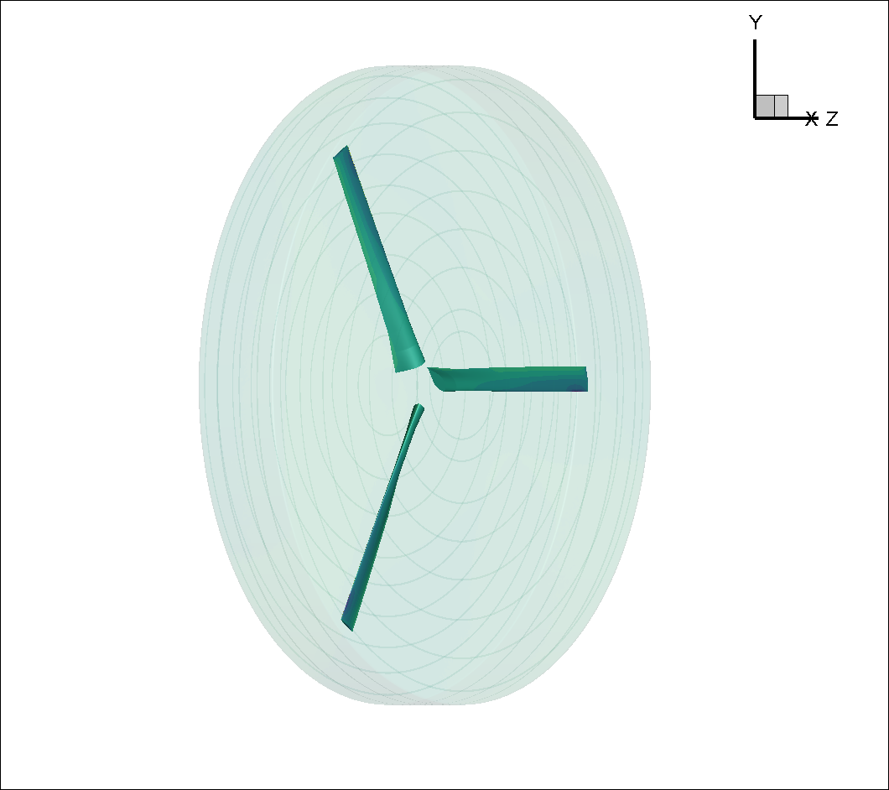

.. _rotation_interface_quickstart:
.. |deg|    unicode:: U+000B0 .. DEGREE SIGN

Run CFD on a propeller: An example XV15 rotor geometry.
=========================================================

Uploading the mesh file for the XV 15 rotor.
-------------------------------------------------------
The `XV15 tiltotor airplane <https://en.wikipedia.org/wiki/Bell_XV-15>`__ is a commonly used test bed for propeller validation work.  We will use its rotor geometry to quickly run an isolated rotor case. This same geometry and how to run it is discussed more in depth in a :ref:`tutorial <rotation_interface>`

As discussed in the associated :ref:`tutorial <rotation_interface>`, In order to run a rotating geometry we need to set up a mesh with two blocks, an inner “rotational volume” and an outer “stationary volume”. The interface between those two volumes needs to be a solid of revolution, ie sphere/cylinder/etc...

    Inner block enclosing the XV15 3 bladed prop

.. _uploadXV15meshFile:

For our purposes we will use a pre-generated complete CGNS mesh `available here <https://simcloud-public-1.s3.amazonaws.com/xv15/XV15_Hover_ascent_coarse.cgns>`__ along with its associated `Mesh.json file <https://simcloud-public-1.s3.amazonaws.com/xv15/XV15_quick_start_mesh.json>`__
Please download those mesh files and upload them to our servers either through the :ref:`webUI <om6_wing_webUI>` or through the :ref:`Python API <om6_wing_pyAPI>`

XV15 rotor case setup
----------------------

Once your mesh has been uploaded, the last step before launching a run would be to create a Flow360.json file with all the information
needed by Flow360 to run your case.

.. _xv15jsondownload:

For this example we have provided you with two different Flow360 json input files. Please download the one for the `initial 1st order run <https://simcloud-public-1.s3.amazonaws.com/xv15/XV15_quick_start_flow360_1st.json>`__ and the other for the `final 2nd order runs <https://simcloud-public-1.s3.amazonaws.com/xv15/XV15_quick_start_flow360_2nd.json>`__. For more on 1st order vs 2nd order :ref:`see the FAQ <1st2ndorder>`

Case input conditions
~~~~~~~~~~~~~~~~~~~~~~

For our case we have the following input conditions:

-  5m/s inflow speed
-  600 RPM
-  speed of sound = 340.2 m/s
-  Rho = 1.225 kg/m\ :sup:`3`
-  Alpha = -90 |deg| which means the air coming down from above, i.e. an ascent case.

other key values are :

- The reference Mach value is arbitrarily set to the Tip mach number for the blades.
- For the 1st order run we will do 1 revolution at 6 |deg| per time step. Hence the "maxPhysicalSteps" : 60 value (60*6 |deg| =360 |deg| )
- for the 2nd order run we will do 5 revolutions at 3 |deg| per time step.

Using the Non-dimensionalization equations described in the  :ref:`conventions<nondimensionalization_Flow360>`  part of the documentation along with CFL guidelines outlined in the :ref:`FAQ <1st2ndorder>` we get the following flow conditions and timeStepping values in our 1st order Flow360.json file.

.. code-block:: javascript

  {    "freestream" :
      {
          "muRef" : 4.29279e-08,
          "Mach" : 1.46972e-02,
          "MachRef" : 0.70,
          "Temperature" : 288.15,
          "alphaAngle" : -90.0,
          "betaAngle" : 0.0
      },
      "boundaries" : {
          "farField/farField" : { "type" : "Freestream" },
          "farField/rotationInterface" : { "type" : "SlidingInterface" },
          "innerRotating/rotationInterface" :   { "type" : "SlidingInterface" },
          "innerRotating/blade" :   { "type" : "NoSlipWall" }
      },
      "slidingInterfaces" : [
      {
          "stationaryPatches" : ["farField/rotationInterface"],
          "rotatingPatches" : ["innerRotating/rotationInterface"],
          "axisOfRotation" : [0,0,-1],
          "centerOfRotation" : [0,0,0],
          "omega" : 1.84691e-01,
          "volumeName" : ["innerRotating"]
      }
      ],
      "timeStepping" : {
  		"timeStepSize" : 5.67000e-01,
  		"maxPhysicalSteps" : 60,
  		"maxPseudoSteps" : 12,
          "CFL" : {
              "initial" : 1,
              "final" : 1000,
              "rampSteps" : 10
          }
      }
      }

Case running and convergence checking
--------------------------------------

Using either the :ref:`webUI <om6_wing_webUI>` or the :ref:`Python API <om6_wing_pyAPI>` please launch a new case using the mesh you have uploaded :ref:`above <uploadXV15meshFile>` and the two Flow360.json files you have :ref:`just downloaded <xv15jsondownload>`. As outlined in the :ref:`FAQ <1st2ndorder>` you will need to launch the 1st order case first and then fork that case to a 2nd order case.

The first order case should finish in less then a minute on this fairly coarse 915K node mesh.

The second order case takes about 3.5 to 4 minutes to run its 5 revolutions. Please note that at the end of the 2nd order run you will have done 6 revolutions (1 for the 1st order run and 5 for the 2nd order run).

For a time accurate case to be considered well converged we like to have at least 2 orders of magnitude in the residuals within each time step.

.. figure:: rotationInterfaceQSFigs/residuals_convergence.png
    :width: 600px
    :align: center
    :alt: convergence of residuals

    2nd order convergence plot showing more then 2 orders of magnitude decrease in the residuals for each subiterations.

The forces also seem to have stabilized after running for 6 revolutions

.. figure:: rotationInterfaceQSFigs/force_convergence.png
    :width: 600px
    :align: center
    :alt: convergence of forces

    2nd order run's force history plot showing good stabilization of the forces.

Congratulations. You have now run your first propeller using a rotational interface in Flow360.
