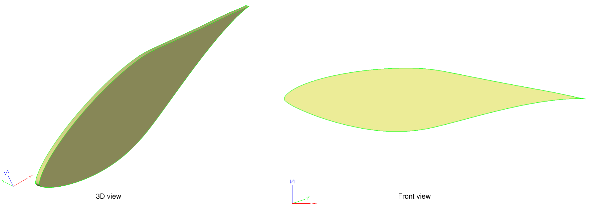
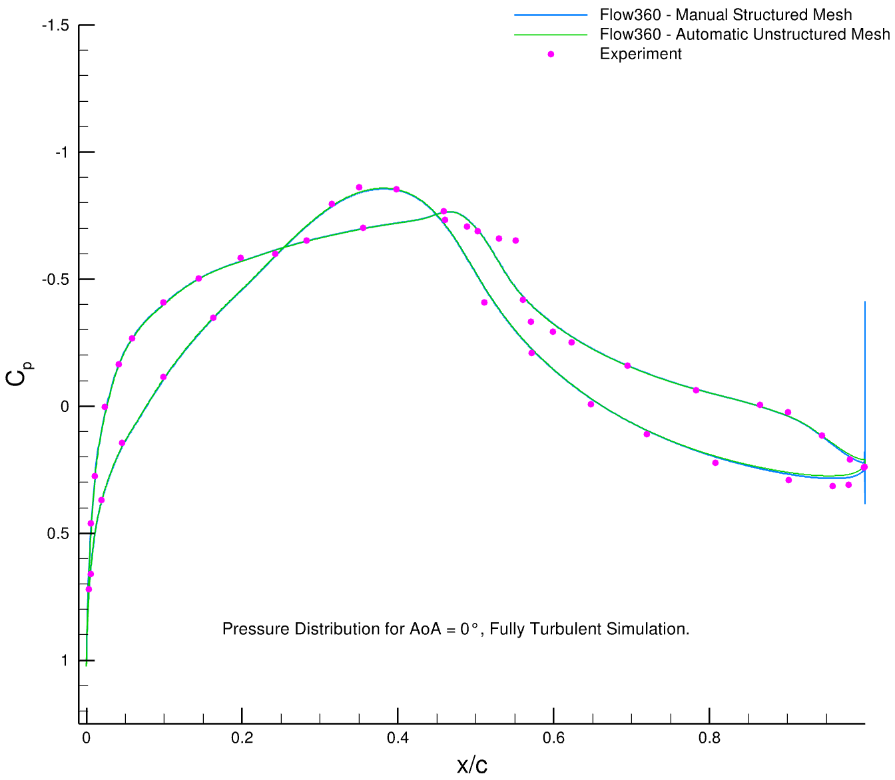
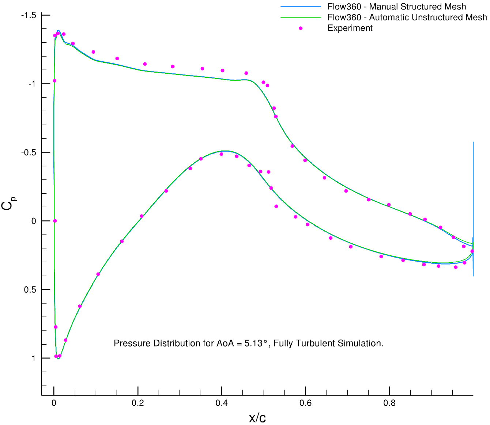
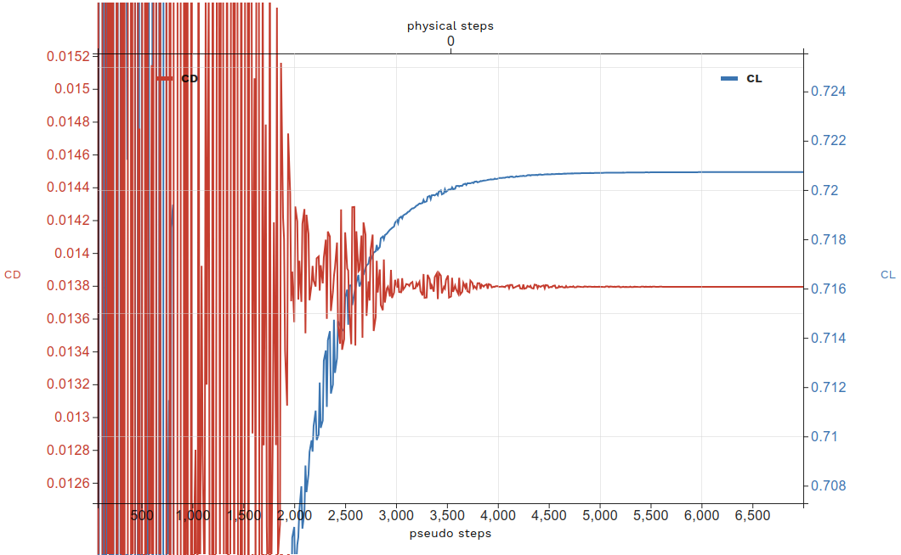
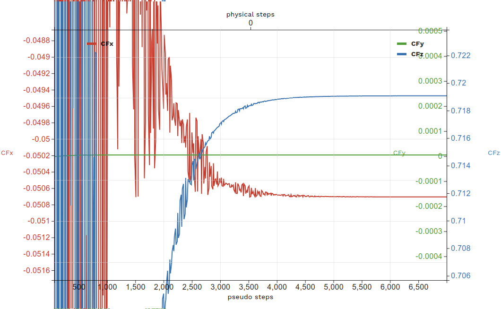
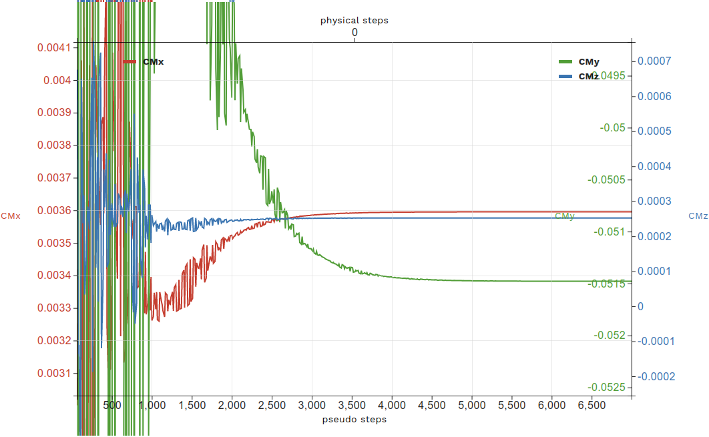

.. _s809_airfoil_pyAPI:
.. |deg|    unicode:: U+000B0 .. DEGREE SIGN
   :trim:

Run CFD using Python API: An example of S809 Airfoil
*****************************************************

For the quick start, NREL's S809 Airfoil is chosen. The S809 has 21% thickness and is designed specifically for horizontal-axis wind turbine. For the simulation, a quasi model is created in ESP using the airfoil coordinates.

   Quasi model generated in ESP

The flow conditions are:

- Mach Number = 0.15
- Reynolds Number = 2 Million
- Alpha = 5.13 |deg|
- Reference Temperature = 293.15 K

Quasi Model in ESP
^^^^^^^^^^^^^^^^^^
In order to create a quasi model from the S809 airfoil in ESP:

- Define thickness of the quasi model as a configuration parameter.

.. code-block:: tcl

   CFGPMTR span 0.01

- Define two spline sketches including upper and lower airfoil coordinates.
- Create a wire body from sketches, create a face from wire body and extrude the face.
- Define edge attributes.
- Define face attributes.
- Define group attributes.

All above mentioned steps are included in the `s809.csm <https://simcloud-public-1.s3.amazonaws.com/s809/s809.csm?content_disposition=attachment>`_ file.

Mesh Setup
^^^^^^^^^^
We use edge and face attributes defined to have control over the mesh. For the leading and trailing edge, we define high aspect-ratio anisotropic layers with initial height of 4e-04. Then, we let the anisotropic mesh distribution to be projected on edges at the left and right sides of the quasi model.
For the upper and lower surface of the quasi model, we defined a face attribute called `wing` and we use maximum edge length to control the resolution of the unstructured mesh on that face.

The surface mesh parameters are available in the `s809SurfaceMesh.json <https://simcloud-public-1.s3.amazonaws.com/s809/s809SurfaceMesh.json?content_disposition=attachment>`_ file:

.. literalinclude:: files/s809SurfaceMesh.json
   :linenos:

In order to generate the volume mesh, we use field constraint to have control over the maximum edge length and resolution of unstructured mesh. 
The initial height of the anisotropic mesh at wall boundaries are indicated by 'firstLayerThickness' and 'growthRate'.

The volume mesh parameters are available in the `s809VolumeMesh.json <https://simcloud-public-1.s3.amazonaws.com/s809/s809VolumeMesh.json?content_disposition=attachment>`_ file:

.. literalinclude:: files/s809VolumeMesh.json
   :linenos:

Case Setup
^^^^^^^^^^

The case setup parameters for the S809 airfoil simulation is available in the `s809Case.json <https://simcloud-public-1.s3.amazonaws.com/s809/s809Case.json?content_disposition=attachment>`_ file.

Run a Case
^^^^^^^^^^

To run this case by using the Flow360 Python API client, we generate the surface mesh from the csm file, then call the volume mesher to generate the volume mesh and eventually we run the case.

.. code-block:: python

   surfaceMeshId = flow360client.NewSurfaceMeshFromGeometry("s809.csm", "s809SurfaceMesh.json", solverVersion="beta-22.3.1.0")
   volumeMeshId = flow360client.NewMeshFromSurface(surfaceMeshId=surfaceMeshId, config="s809VolumeMesh.json", solverVersion="beta-22.3.1.0")
   caseId = flow360client.NewCase(meshId = volumeMeshId, config="s809Case.json", caseName='QuickStart_S809')

To make it easier we are going to use a Python script that takes csm, mesh input JSON files and case JSON as configuration parameters.
The `submitCase.py <https://simcloud-public-1.s3.amazonaws.com/s809/submitCase.py?content_disposition=attachment>`_ file takes a JSON input and submits a simulation. The input JSON has the following contents:

.. literalinclude:: files/simConfiguration.json
   :linenos:

Use this JSON simulation file and run the case with the following command:

.. code-block:: python

   python submitCase.py -json simConfiguration.json

Download the Results
^^^^^^^^^^^^^^^^^^^^

To download the surface and volume solution for postprocessing, we use the Flow360 Python API client.

The `downloadCase.py <https://simcloud-public-1.s3.amazonaws.com/s809/downlaodCase.py?content_disposition=attachment>`_ file takes a JSON input and downloads solution files. The input JSON has the following contents:

.. literalinclude:: files/getCase.json
   :linenos:

Use this JSON simulation file and run the case with the following command:

.. code-block:: python

   python downloadCase.py -json getCase.json

You can use them and plot the solution in your postprocessing software. Below you can find pressure coefficient comparison.

The `s809structured.cgns <https://simcloud-public-1.s3.amazonaws.com/s809/s809structured.cgns?content_disposition=attachment>`_ is a structured mesh generated manually using hyperbolic extrusion and converted into unstructured mesh.

.. _visResults:

Visualize the Results
^^^^^^^^^^^^^^^^^^^^^^^
You can always find the convergence histogram on the website by clicking on your case name and select **Convergence** and **Forces** tabs.

For the S809 simulation the convergence histogram of forces are:

