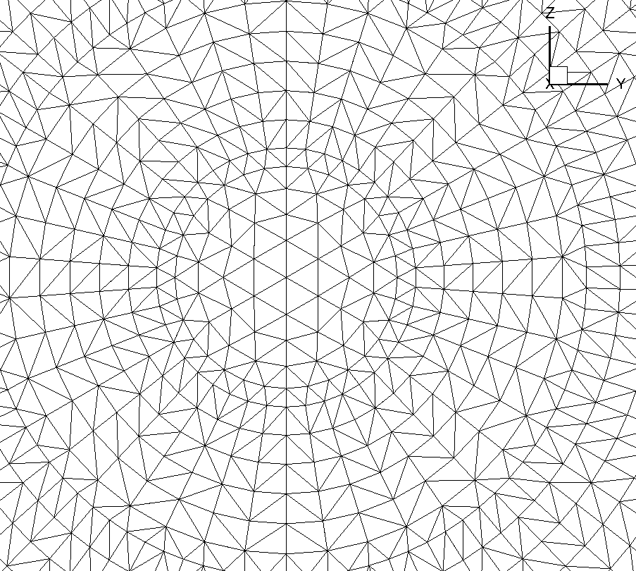

Frequently Asked Questions
==========================

Where are my AWS credentials stored locally?
--------------------------------------------

Your AWS credentials are encrypted and stored locally (if you hit Yes previously at authentication step) at

.. code-block:: python

   ~/.flow360/

For security, your password is stored as hashed value, so nobody can guess your password.

How to check my mesh processing status?
---------------------------------------

To list all your mesh files:

.. code-block:: python

   >>> flow360client.mesh.ListMeshes()

To view one particular mesh:

.. code-block:: python

   >>> flow360client.mesh.GetMeshInfo('')

My case is still running, but how can I check the current residual and surface force result?
--------------------------------------------------------------------------------------------

.. code-block:: python

   >>> caseResid = flow360client.case.GetCaseResidual('')

How do I download or view a finished case result?
-------------------------------------------------

To download the surface data (surface distributions and slices):

.. code-block:: python

   >>> flow360client.case.DownloadSurfaceResults('', '/tmp/surfaces.tar.gz')

Replace the second parameter with your target location and output file name, ending with '.tar.gz'.

To download the entire flowfield:

.. code-block:: python

   >>> flow360client.case.DownloadVolumetricResults('', '/tmp/volume.tar.gz')

How can I delete my mesh or case?
---------------------------------

To delete a mesh:

.. code-block:: python

   >>> flow360client.mesh.DeleteMesh('')

To delete a case:

.. code-block:: python

   >>> flow360client.case.DeleteCase('')

.. danger::

   You won't be able to recover your deleted cases or mesh files including its results after your deletion.

How should I set the non-dimensional quantities in case configuration file?
----------------------------------------------------------------------------------

See :ref:`FAQ on non-dimensionalization of input parameters <FAQ_input_nondim_quantity>`.

How can I translate the non-dimensional quantities of output to dimensional quantities?
-----------------------------------------------------------------------------------------

see :ref:`FAQ on translating non-dimensional outputs <FAQ_output_nondim_quantity>`.

.. _1st2ndorder:

1st vs 2nd order CFD runs?
--------------------------

If you look at most Flow360.json files you will see something like:

.. code-block:: javascript

  {
    "navierStokesSolver" : {
        "orderOfAccuracy" : 1 or 2
    },
    "turbulenceModelSolver" : {
        "orderOfAccuracy" : 1 or 2
    }
  }

This dictates whether the code will run its algorithms using 1st or 2nd order interpolation in space. 1st order accuracy is much faster and much more robust than 2nd order accuracy, but nowhere near as accurate.

For time-accurate runs where we have rotating components we recommend to first run 1 revolution using "orderOfAccuracy" : 1 to help establish the flow. Then follow that with however many 2nd order accurate revolutions are needed for the flow to properly establish itself and for the forces to stabilize. Please note that if you have some parts of your vehicle downstream of your propellers it may take many revolutions for the propeller's wake to reach the downstream geometry components.

If you want to speed things up you can run a first set of 2nd order accurate revolutions with a larger time step to help the flow establish itself quicker and then do a more precise, better converged, 2nd order run with smaller time steps to get more accurate forces. This is easily done in Flow360 through our "fork" functionality that launches a new child case using the flow solution of the parent case as the initial condition.

Also, for 1st order simulations we recommend using the following "timeStepping" values:

.. code-block:: javascript

  "maxPseudoSteps" : 12,
  "CFL" : {
      "initial" : 1,
      "final" : 1000,
      "rampSteps" : 10 (i.e., rampSteps is 2 steps less then maxPseudoSteps)
  }

For 2nd order simulations we recommend using the following "timeStepping" values:

.. code-block:: javascript

  "maxPseudoSteps" : 35,
  "CFL" : {
      "initial" : 1,
      "final" : 1e7,
      "rampSteps" : 33 (i.e., rampSteps is 2 steps less then maxPseudoSteps)
  }

These are just guidelines to get you started and will most likely need to be revised for your specific cases.

.. _meshErrorDistanceWrong:

Mesh Error: Distance between 2 nodes on ring is wrong! What does this mean?
---------------------------------------------------------------------------

When doing a mesh with a rotation interface, if you get a mesh processor error that looks like this:

.. code-block::

    Distance between 2 nodes on ring is wrong!
    The distance from first to last = 2.5959001398487129e+02 (as reference)
    But the distance = 2.7487841069926304e+02 between 2 nodes:.......

This means that your rotation interface grid does not satisfy the Flow360 concentricity requirements.

The rotation interface needs to be a body of revolution (e.g., sphere, cylinder, etc.) which encloses the entire rotating geometry. The grid points on the rotation interface can not be arbitrary. **It is mandatory that they form a set of concentric rings**. 

        Non-concentric circle mesh on rotation interface

The grid points on the rotation interface shown in the figure above do not satisfy the concentricity requirement. Certain points deviate slightly from a perfectly concentric circle.

        Concentric circle mesh on rotation interface

This figure shows a slightly different grid that does satisfy the concentricity requirement. Notice how all the nodes are on concentric circles.

The reason for this requirement is that it greatly speeds up the interpolation process. Since this interpolation happens twice for every interface node (inner and outer domain) and for every pseudo-timestep, already knowing where the neighbors are without having to run a search algorithm every time to find the closest node is very efficient.

.. _creatinganinterfaceRegion:

How do I create a rotating interface with concentric mesh rings?
----------------------------------------------------------------

For your own cases, knowing that we have this concentric mesh requirement, the easiest way to create the meshes for the interface regions is to do it programmatically. We have a lot of scripts to generate various body of revolution interface shapes that will allow you to generate an interface region no matter what your geometry. Just contact us and we will help you get setup with the scripts you need.

For plain cylindrical or spherical interfaces we also have pre-generated interfaces in CGNS format ready for you to download from `this link <https://simcloud-public-1.s3.amazonaws.com/rotationInterface/CGNS_rotation_interfaces.tgz>`__.
You will notice that they come in various height to radius ratios as well as various resolutions. You will need to choose the version that best fits your needs and then rotate/scale the imported mesh to align the interface around your geometry.
