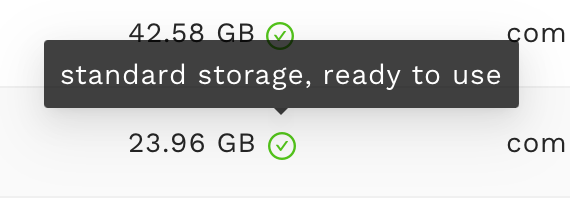
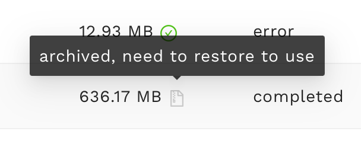
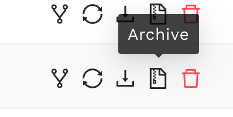
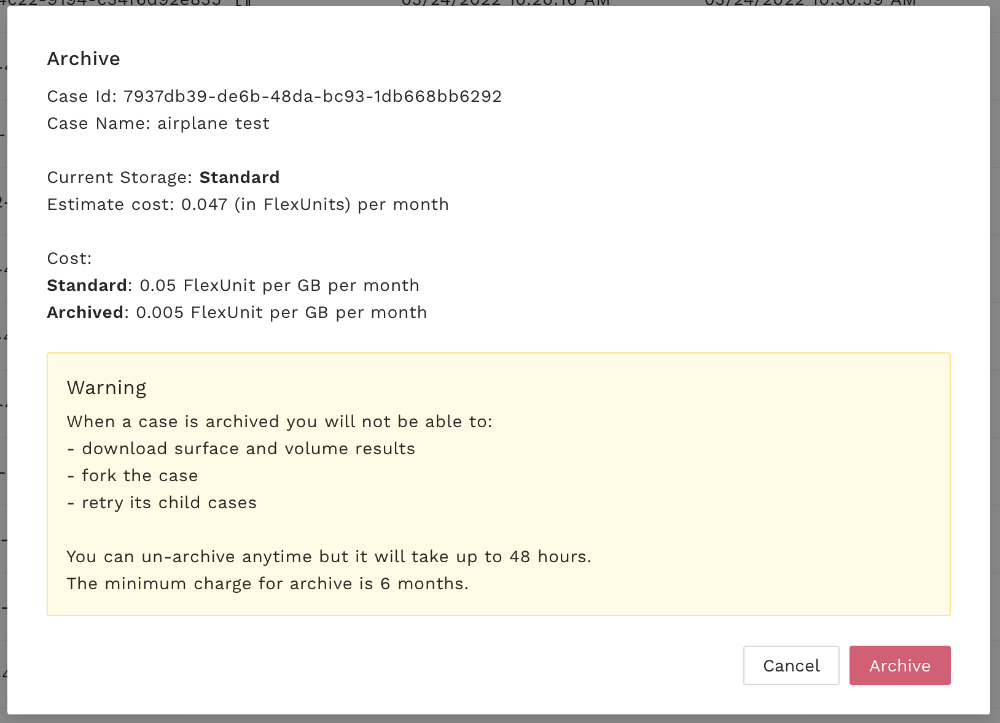
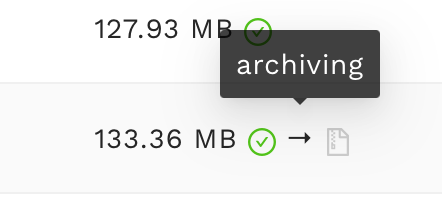
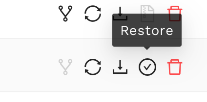
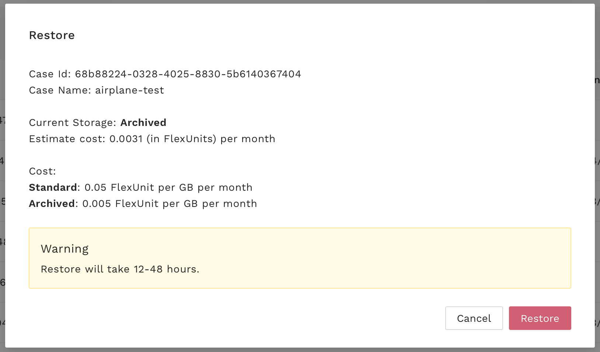
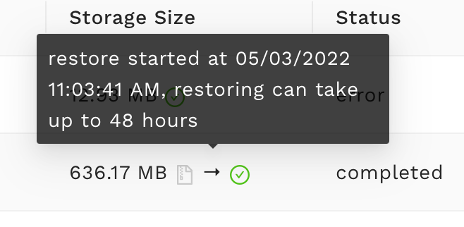

Frequently Asked Questions
==========================

Where are my AWS credentials stored locally?
--------------------------------------------

Your AWS credentials are encrypted and stored locally (if you hit Yes previously at authentication step) at

.. code-block:: python

   ~/.flow360/

For security, your password is stored as hashed value, so nobody can guess your password.

How to check my mesh processing status?
---------------------------------------

To list all your mesh files:

.. code-block:: python

   >>> flow360client.mesh.ListMeshes()

To view one particular mesh:

.. code-block:: python

   >>> flow360client.mesh.GetMeshInfo('')

My case is still running, but how can I check the current residual and surface force result?
--------------------------------------------------------------------------------------------

.. code-block:: python

   >>> caseResid = flow360client.case.GetCaseResidual('')

How do I download or view a finished case result?
-------------------------------------------------

To download the surface data (surface distributions and slices):

.. code-block:: python

   >>> flow360client.case.DownloadSurfaceResults('', '/tmp/surfaces.tar.gz')

Replace the second parameter with your target location and output file name, ending with '.tar.gz'.

To download the entire flowfield:

.. code-block:: python

   >>> flow360client.case.DownloadVolumetricResults('', '/tmp/volume.tar.gz')

How can I delete my mesh or case?
---------------------------------

To delete a mesh:

.. code-block:: python

   >>> flow360client.mesh.DeleteMesh('')

To delete a case:

.. code-block:: python

   >>> flow360client.case.DeleteCase('')

.. danger::

   You won't be able to recover your deleted cases or mesh files including its results after your deletion.

How should I set the non-dimensional quantities in case configuration file?
----------------------------------------------------------------------------------

See :ref:`FAQ on non-dimensionalization of input parameters <FAQ_input_nondim_quantity>`.

How can I translate the non-dimensional quantities of output to dimensional quantities?
-----------------------------------------------------------------------------------------

See :ref:`FAQ on translating non-dimensional outputs <FAQ_output_nondim_quantity>`.

Does FlexCompute charge for data storage?
-----------------------------------------

For some data storage we do not charge, but for some data we do. See details:

+---------------+--------------+-------------------------+
| resource      | storage type | storage price           |
+===============+==============+=========================+
| surface mesh  |              | free                    |
+---------------+--------------+-------------------------+
| volume mesh   |              | free                    |
+---------------+--------------+-------------------------+
| case          | standard     | 0.05  FlexUnit/GB/month |
|               +--------------+-------------------------+
|               | archived     | 0.005 FlexUnit/GB/month |
+---------------+--------------+-------------------------+

.. warning::

   The minimum archived data cost is 6 months. Archiving operation is fast, but restoring can take up to 48 hours. When you restore your data from archive before the six month period, you will see a pro-rata charge added to your transaction history for the remaining period.

To reduce data storage costs we encourage to\:

1. Delete case if results will no longer be needed.
2. Download results to local drive and delete case on FlexCompute.
3. Archive case to reduce storage costs by 10x and still be able to revisit the case in the future.

What is storage type?
---------------------

We have two storage types\: **standard** and **archived**. You can check storge type for each case next to the storage size on the case table view:

**Standard** storage allows for all operations: retry case, fork case, download all results including surface results and volumetric results.

**Archived** storage disables these operations: fork case, retry direct child case, download surface and volume results.

How can I archive my case?
--------------------------

You can only archive a case with status **completed** and storage type **standard**.

To archive an individual case follow these steps\:

1. Go to `client.flexcompute.com <https://client.flexcompute.com>`_.
2. Navigate to case you want to archive
3. From action list click archive button:

4. You will see the following window with details about archiving operation:

.. warning::

   The minimum archived data cost is 6 months. Archiving operation is fast, but restoring can take up to 48 hours. When you restore your data from archive before the six month period, you will see a pro-rata charge added to your transaction history for the remaining period.

5. Select "Archive". The icon next to storage size will change:

6. Archiving usually takes up to few minutes. When done, the storage type becomes **archived**.

How can I restore my archived case?
-----------------------------------

1. Go to `client.flexcompute.com <https://client.flexcompute.com>`_.
2. Navigate to case you want to restore
3. From action list click restore button:

4. You will see the following window with details about restoring operation:

.. warning::

   When you restore your data from archive before the six month period, you will see a pro-rata charge added to your transaction history for the remaining period.

5. Select "Restore". The icon next to storage size will change:

6. Restoring takes up to 48 hours. When done, the storage type becomes **standard**.

I have many cases, how can I archive all of them at once?
---------------------------------------------------------

Contact support@flexcompute.com

