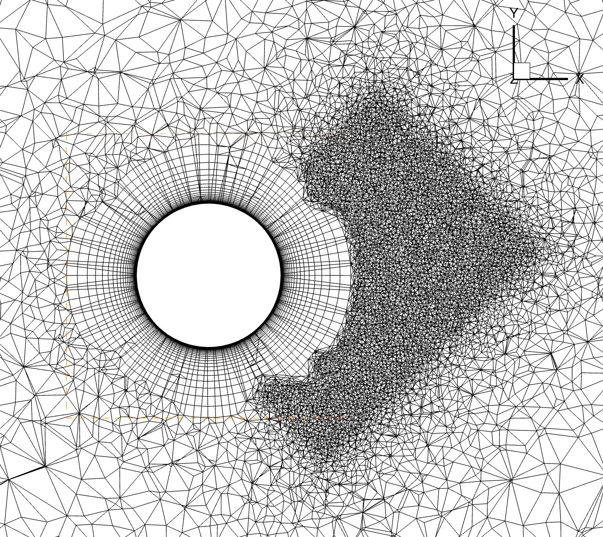

.. _automatedMeshing:

Automated Meshing
*************************

Overview
========

Flow360 offers automated meshing, from CAD geometry to a surface mesh and finally to a volume mesh. The supported CAD format is \*.csm file which is Engineering Sketch Pad (EPS) format. The generated volume format is CGNS.

Geometry
========

The Engineering Sketch Pad is a solid-modeling, feature-based, web-enabled system for building parametric geometry.
It can be downloaded from `ESP's website <https://acdl.mit.edu/ESP/>`_.
Please check out pre-built ESP, you don't need to compile software from source.
The geometry in ESP is described in a text \*.csm file containing all CAD instructions. See csm example\:

.. code-block::

    # Branches:
    sphere    0   0   0   1

    attribute groupName $mysphere

    end

which will create a sphere of radius = 1 at (0, 0, 0). The face of the sphere will be labelled as `mysphere`.

.. _fig1_geometry:

   Engineering Sketch Pad view of the geometry.

.. _ESPtoSurfaceMeshSection:

Surface Meshing
===============

The surface mesher takes the geometry file and configuration JSON file as input parameters and generates a surface mesh. The meshing configuration file (or dict in python), also called surfaceMesh.json, contains information such as maximum element edge length, curvature resolution angle or growth rate of 2D layers. See JSON example:

.. literalinclude:: surfaceMesh.example.json
    :language: JSON

The surface mesh is created by submitting a geometry file and JSON file using :code:`NewSurfaceMeshFromGeometry()` function. See the example below\:

.. code-block:: python

    import flow360client
    surfaceMeshId = flow360client.NewSurfaceMeshFromGeometry("path/to/geometry.csm", "surfaceMesh.json", surfaceMeshName="my_surface_mesh")

The above code will create a surface mesh of geometry using :code:`"maxEdgeLength": 0.05` on a surface labelled as `mysphere`, see line 4 of the \*.csm file.

.. _fig1_surfMesh:

   Auto-generated surface mesh.

Inputs\:

- geometry.csm file
- surface mesh config.json or python dict

Outputs\:

- surface mesh
- :code:`surfaceMeshId`

For a full description of config.json for surface mesher see :ref:`here.<JSON surface mesher>`

.. _SurfaceToVolumeMeshSection:

Volume Meshing
==============

The volume mesher takes a :code:`surfaceMeshId` and config JSON as arguments and generates a CGNS mesh suitable for the Flow360 solver. The JSON configuration file (or dict in python) specifies the first layer thickness, growth rate, sizes and location of refinement zones (sources) and actuator disks. All geometry from ESP is treated as a no-slip wall therefore prism layers will be grown off geometry surfaces. 

The farfield will be created automatically\: 

- semi-spherical if the geometry is bounded by :code:`y=0` plane. The :code:`y=0` plane will be set as a symmetry plane boundary condition.  
- spherical otherwise.

Below is an example of a JSON configuration file:

.. literalinclude:: volumeMesh.example.json
    :language: JSON

The volume mesh is created by :code:`NewMeshFromSurface()` function using :code:`surfaceMeshId` and config.json. See the example below\:

.. code-block:: python

    volumeMeshId = flow360client.NewMeshFromSurface(surfaceMeshId, "volumeMesh.json", meshName="my_volume_mesh")

The above code will create a volume mesh out of the surface mesh. The refinement zone (source) of size=4x3x2 will be placed with its centre at (2,0,0). Additionally, it will be rotated by 45 degrees around the [0,0,1] axis. Spacing of 0.05 will be applied in this zone.

.. _fig1_volMesh:

   Auto-generated volume mesh.

Inputs\:

- :code:`surfaceMeshId`
- volume mesh config.json or python dict

Outputs\:

- volume CGNS mesh
- Flow360Mesh.json
- :code:`volumeMeshId`

For a full description of config.json for volume mesher see :ref:`here.<JSON volume mesher>`

.. _JSON surface mesher:

JSON surface mesher
===================

.. csv-table::
   :file: ./surfaceMesher.csv
   :header-rows: 1
   :delim: @
   :widths: 20 10 10 10 50

.. _JSON surface mesher edges:

edges
-----

.. csv-table::
   :file: ./surfaceMesherEdges.csv
   :header-rows: 1
   :delim: @
   :widths: 20 10 10 10 50

Example\:

.. code-block:: json

    "edges": {                               
        "leadingEdge":  {              
            "firstLayerThickness": 1e-3   
        },                             
        "trailingEdge":  {             
            "firstLayerThickness": 1e-3   
        }                              
    }                                                                                                                                                                                                                                                                                                        
   

.. _fig1_surfMesh_edges:

   Surface mesh of a wing. Leading edge and trailing edge are labelled and first layer thickness is applied to the layers grown from the edges.

.. _JSON surface mesher faces:

faces
-----  
                           
.. csv-table::
   :file: ./surfaceMesherFaces.csv
   :header-rows: 1
   :delim: @
   :widths: 20 10 10 10 50  

Example\:

.. code-block:: json 

    "faces": {                         
        "rightWing": {           
            "maxEdgeLength": 0.05,  
            "adapt": false          
        },                       
        "fuselage": {            
            "maxEdgeLength": 0.05,  
            "adapt": false          
        }                        
    }  

.. _JSON volume mesher:

JSON volume mesher
==================

.. csv-table::
   :file: ./volumeMesher.csv
   :header-rows: 1
   :delim: @
   :widths: 20 10 10 10 50

.. _JSON volume mesher sources:

sources (list)
--------------

.. csv-table::
   :file: ./volumeMesherSources.csv
   :header-rows: 1
   :delim: @
   :widths: 20 10 10 10 50

Example\:

.. code-block:: json

   "sources": [                                                                                                                                                                                                                                                                                                            
    {                                                                                                                                                                                                                                                                                                           
        "size": [4, 3, 2],
        "center": [2, 0, 0],                                                                                                                                                                                                                                                                                       
        "spacing": 0.05,                                                                                                                                                                                                                                                                                    
        "axisOfRotation": [ 0, 0, 1 ],                                                                                                                                                                                                                                                                             
        "angleOfRotation": 45                                                                                                                                                                                                                                                                                                                                                                                                                                                                                                                                                                           
    },                                                                                                                                                                                                                                                                                                          
    {                                                                                                                                                                                                                                                                                                           
        "type": "cylinder",                                                                                                                                                                                                                                                                                        
        "radius": 4,                                                                                                                                                                                                                                                                                            
        "lengthZ": 5,
        "center": [5, 0, 0],
        "spacing": 0.05,                                                                                                                                                                                                                                                                                            
        "axisOfRotation": [0, 1, 0],                                                                                                                                                                                                                                                                               
        "angleOfRotation": 90                                                                                                                                                                                                                                                                                                                                                            
    }]                                                                                                                                                                                                                                                                                                          
   

.. _JSON volume mesher actuatorDisks:

actuatorDisks (list)
--------------------  
                                  
.. csv-table::
   :file: ./volumeMesherActuatorDisks.csv
   :header-rows: 1
   :delim: @
   :widths: 20 10 10 10 50   

Example\:

.. code-block:: json 

   "actuatorDisks": [                                
    {                               
        "innerRadius": 0,            
        "outerRadius": 10,              
        "thickness": 0.5,             
        "axisThrust": [1, 0, 0],      
        "center": [0, 0, 0],         
        "spacingAxial": 0.01,          
        "spacingRadial": 0.03,         
        "spacingCircumferential": 0.03 
    }] 