.. _Rotor5QuickStart:

Quick Start
===========

Welcome to Rotor5! This page will guide you through a quick setup with Rotor5 and running a simple demo case. Let's get started.

After login, once click "Apps" in the top menu, you will see the entrance for Rotor5 as shown in the following screenshot.

.. _Fig1_Rotor5Entry:
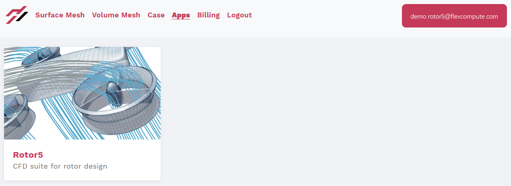

Let's enter by clicking on this web application and start to create a simple propeller by clicking on the "+ New" tag near the top-left corner as shown below.

.. _Fig2_CreateNew:
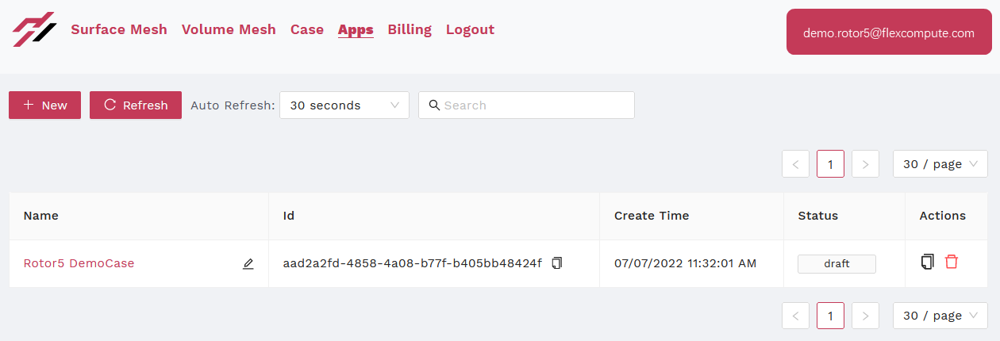
   
Geometry
--------
   
Once click "+ New", you will be automatically directed to the page to select or create new geometry as shown in the next figure. Also, if you like, you can return back to the previous page and rename your case by clicking on the "<-" tag at the top-left corner. Besides, if you have other previously saved cases, these rotor configurations will also be listed and selectable on this page. 

Let's create a new propeller by clicking on the "(+) Create new" tag, and this will direct you to the rotor setup page starting with a new blade. 

.. _Fig3_Geometry:
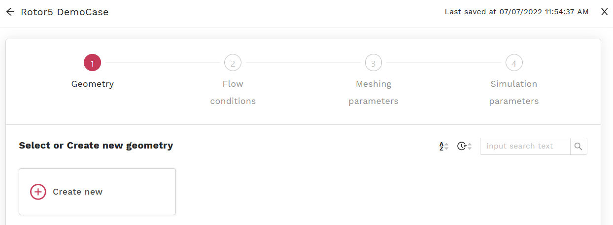

Under the "blade" tag, click on "(+) Create new" as shown in the below figure. Notably, the blade profiles for your previously created cases, if any, are also listed here and reusable. You can also return back to the last page to select a different geometry you had by clicking on the "<- select geometry" tag located at the mid-right of the page.

.. _Fig4_NewBlade:
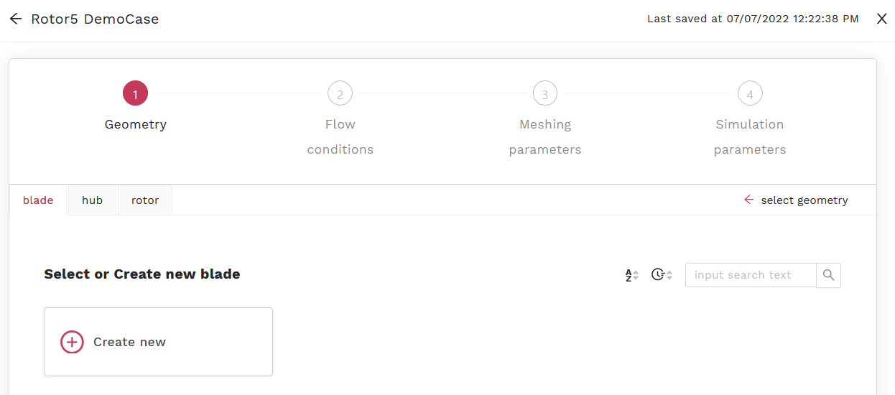

To create a new blade, it starts with sectional airfoil profiles. For our current case, this is illustrated in the below figure.  

.. _Fig5_Airfoils:
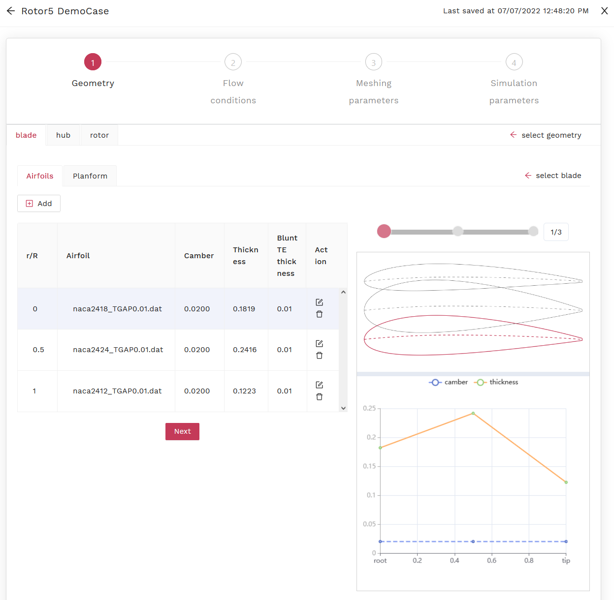
   
These airfoil data were added into this page by clicking on the "[+] Add" tag located just below the "Airfoils". For this demo case, these three airfoil datasets are available here, namely naca2418_TGAP0.01.dat, naca2424_TGAP0.01.dat, and naca2412_TGAP0.01.dat. (external links need to be updated.) 

.. _Tab1_Airfoils:
.. csv-table:: Sectional configuration and airfoil profiles
   :file: ./csvTables/Geo_Airfoil.csv
   :widths: 20, 30
   :align: center
   :header-rows: 1
   :delim: @

Please upload the above airfoil datasets through the pop-up window as shown below, and fill in the spanwise locations, i.e. :math:`r/R`, according to :numref:`Tab1_Airfoils`. Notably, the values of the "Camber", "Thickness", and "Blunt TE thickness" are automatically calculated based on the airfoil data just uploaded, and the profile at the mid-span has the largest thickness and the tip has the thinnest. The profiles of these airfoils and the corresponding spanwise distributions of the camber and the thickness are also shown on the lower right side of the page. You can twist each spanwise location of these airfoils by dragging the corresponding highlighted "solid circle" through the horizontal bar located above the airfoil shapes on the right side of the page, but make sure the values of :math:`r/R` are the same as given in the above table, before clicking on the "Next" tag. You can also reuse existing blades by clicking on "<- select blade".

.. _Fig6_AddAirfoil:
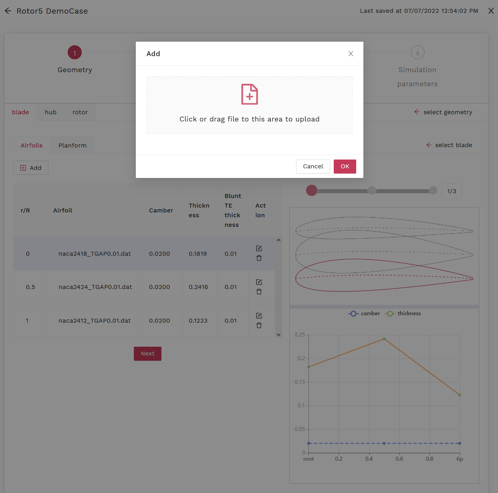

For the "Next", let's define our planform, as illustrated in the following figure. Notably, for this demo case, the "Rotor radius" is :math:`3.81 m`. Also, on this and the following pages, the parameter marked by a red star is mandatory.

.. _Fig7_Planform:
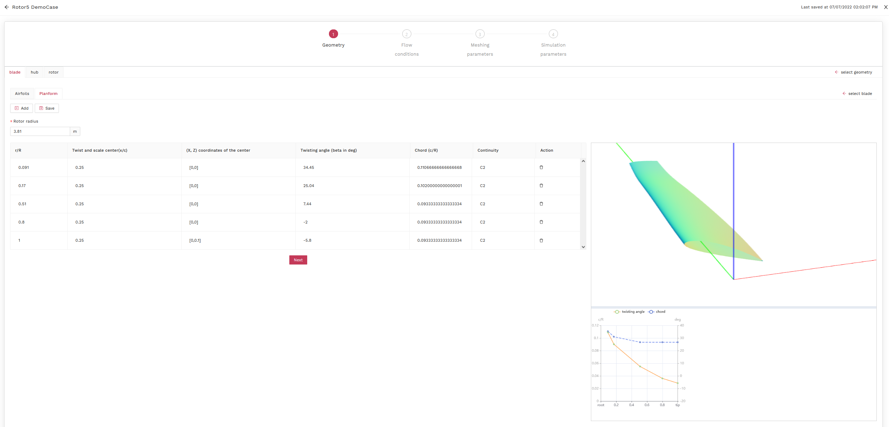

Please "[+] Add" in these planform data row-by-row as given in :numref:`Tab2_Planform`. Notably, the rows are automatically re-sorted according to the spanwise locations with the data for the blade tip given at the bottom of the list. You can roll down to see them, if needed. Also, the geometry of the blade and the spanwise distributions of the twisting angle and the relative chord length are also shown on the right side of the page. 
   
.. _Tab2_Planform:
.. csv-table:: Planform configuration parameters
   :file: ./csvTables/Geo_Planform.csv
   :widths: 10, 10, 15, 20, 30, 15
   :align: center
   :header-rows: 1
   :delim: @
   
Once finished, please click on the "Next". On the following page, let's define a new hub by clicking on the "(+) Create new" tag as shown in the next figure. 

.. _Fig8_CreateHub:
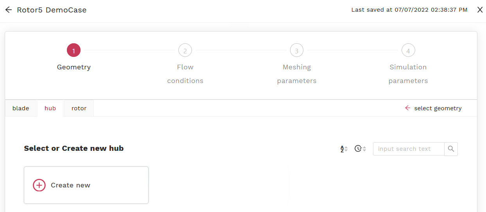

For this demo case, the hub profile is defined using a dataset available here. (external link needs to be updated.) It contains the axial and radial coordinates, i.e. :math:`(z, r)`, for 100 points on the hub profile. Please upload this datafile by clicking on the "[+] Add" tag, and from the drop down list, select "Upload a file". Then, your page should looks similar to the below figure with the shape of the hub profile displayed on the right side. You can roll down and check all the data points, if needed.

.. _Fig9_HubProfile:
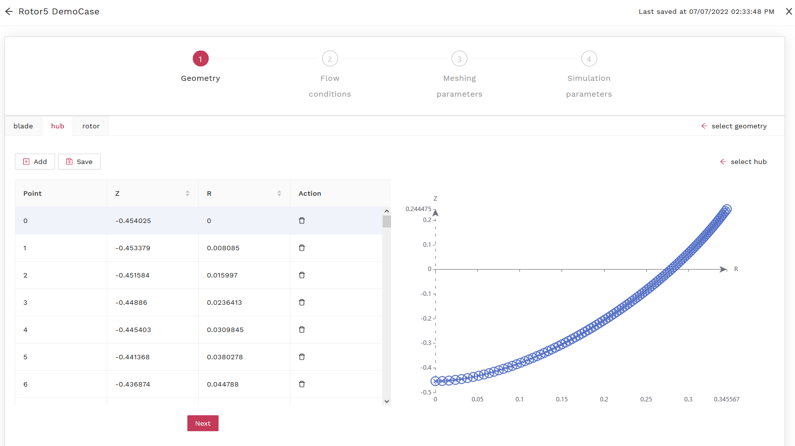
   
When finished, please click on the "Next" and move to the "rotor". Please fill in the number 3 for "Number of blades". For the current case, leave the defaults for the "Twist angle offset" and the "Union blades with hub" as them were, then click on the "Save" tag. Your page should look similar to the following figure.

.. _Fig10_Rotor:
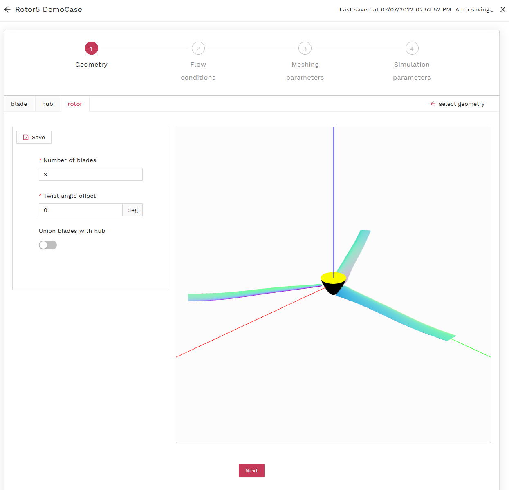
   
Now, we have completed the configuration for the propeller geometry and ready to define its operating conditions, as well as the meshing and simulation parameters, before submission. 

Flow Conditions
---------------

.. _Tab3_FlowConditions:
.. csv-table:: Flow conditions
   :file: ./csvTables/FlowConditions.csv
   :widths: 30, 10, 20
   :align: center
   :header-rows: 1
   :delim: @

After click on the "Next", please fill in the values for the flow conditions, according to :numref:`Tab3_FlowConditions`. Your page should look similar to the below.

.. _Fig11_FlowConditions:
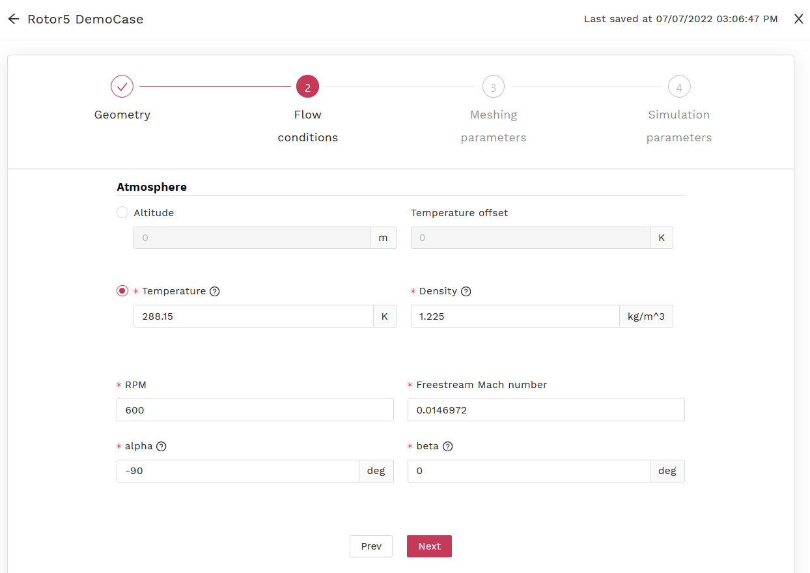
   
Meshing Parameters
------------------

.. _Tab4_SurfMeshPara:
.. csv-table:: Surface meshing parameters
   :file: ./csvTables/Msh_Surface.csv
   :widths: 60, 20
   :align: center
   :header-rows: 0
   :delim: @

Now, let's configure meshing parameters for automatic mesh generation. Click on the "Next", move to the page for surface meshing parameters and fill in all the required data as given in :numref:`Tab4_SurfMeshPara`. Your page should look similar to this following figure. Please check the value for each parameter. Some of them are different from the defaults.

.. _Fig12_SurfMeshPara:
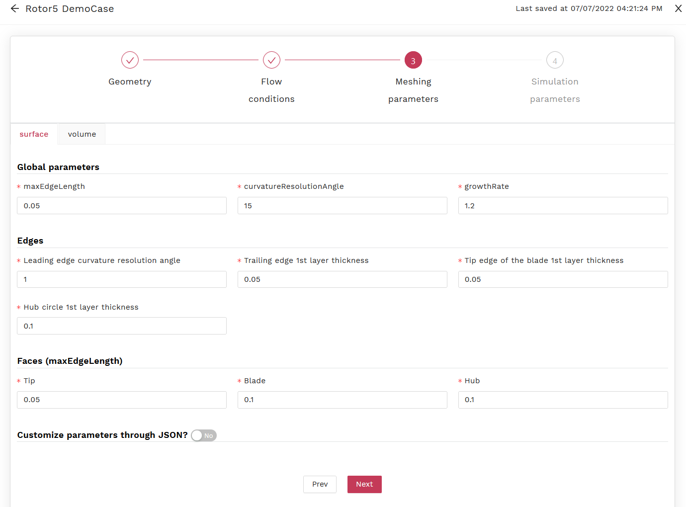
   
Similarly, please fill in all the required data for volume meshing parameters as given in :numref:`Tab5_VolmMeshPara`, and your page should look similar to the next figure. Notably, instead of the default, the value of :math:`1 \times 10^{-6}` is used for the 1st layer thickness above a viscous surface.
   
.. _Tab5_VolmMeshPara:
.. csv-table:: Volume meshing parameters
   :file: ./csvTables/Msh_Volume.csv
   :widths: 60, 20
   :align: center
   :header-rows: 0
   :delim: @
   
.. _Fig13_VolmMeshPara:
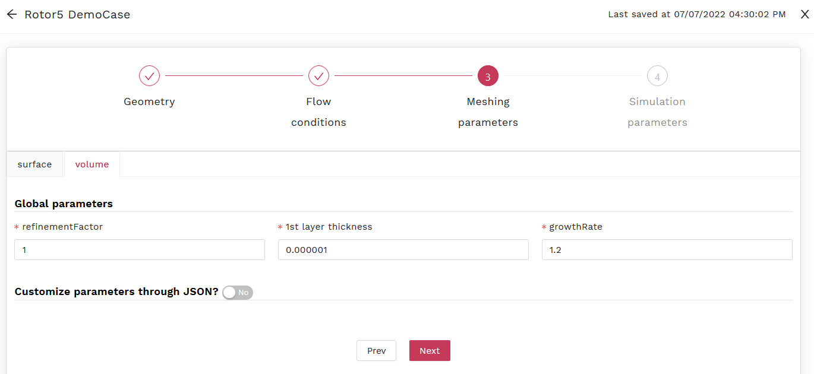
   
Simulation Parameters
---------------------

On the "Next" page, let's choose full unsteady simulation for this demo case and run this numerical model for the flow period equivalent to 2 propeller revolutions, for example, as shown in the following figure. Now, we are ready to submit this case to Flow360 solver.

.. _Fig14_SimParameters:
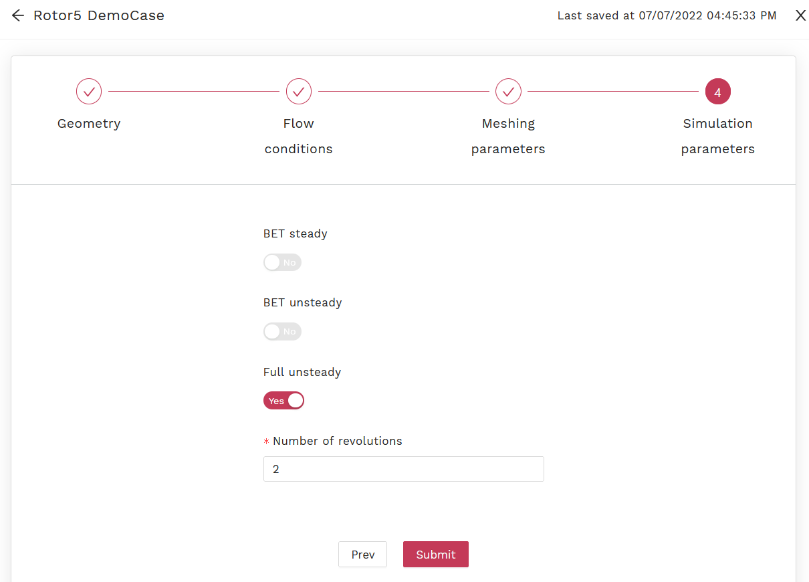
   
Post-processing
---------------
   
After submission, you can track the status of your case on the "Apps" page similar to this following figure.

.. _Fig15_Submission:
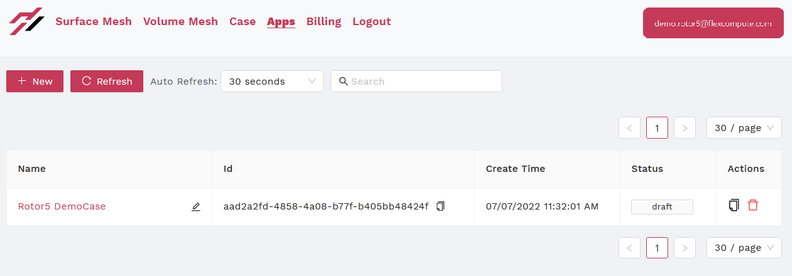

Once completed, you can examine your model and the results by clicking on the case name, then your page should look similar to the below. Your surface and volume meshes will also be available for check. These are recorded under the tags of "Surface Mesh" and "Volume Mesh" in the top menu. You can track them by name or mesh ID, and so on. Your CFD results are also available to download under the "Case" menu.  

.. _Fig16_PostProcess:
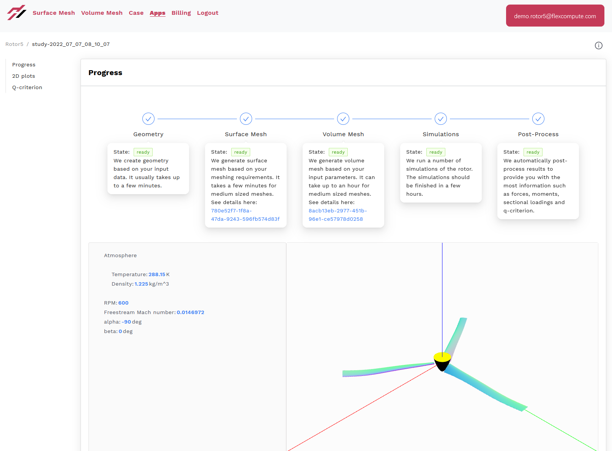
   
Congratulations on your first Rotor5 journey!