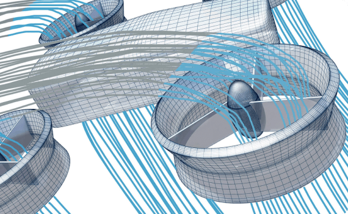

Rotor5
******

Rotor5 is a cloud computing based web application for aerodynamic design and high-fidelity performance analysis of aerial propellers equipped in helicopters, tiltrotors, and other subsonic flight vehicles. It is ......

.. toctree::
   :maxdepth: 3

   quickStart/quickStart
   examples/examples
   conventions/conventions
   tutorials/tutorials
   capabilities/capabilities
   pythonAPI/pythonAPI
   faq/faq
   publications/publications
   releaseNotes/releaseNotes
   
