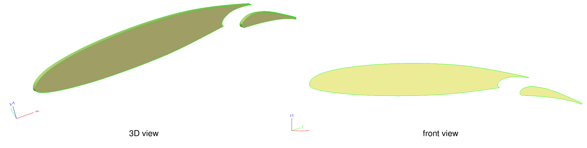
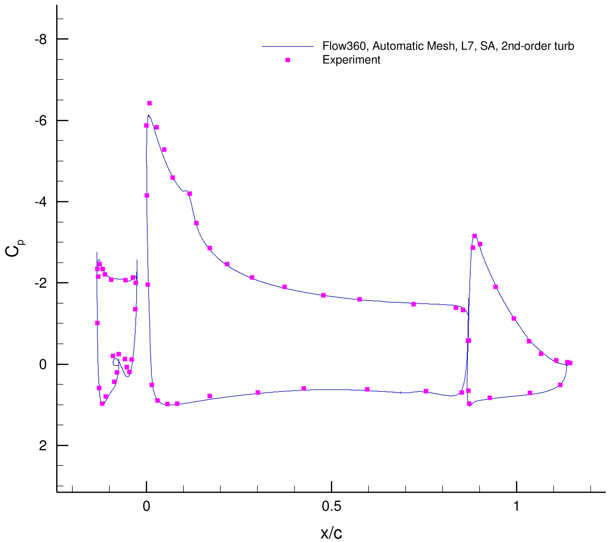

.. _multielement_airfoil:
.. |deg|    unicode:: U+000B0 .. DEGREE SIGN

CFD Simulation of 2D High-Lift System Configuration Using the Flow360 Python Client
===================================================================================

A multi-element configuration include a slat, wing and flap. In this tutorial, we demonstrate how to create a multi-element configuration model in ESP and 
use the Flow360 Python Client to run a RANS simulation.

Three standard cases are chosen. The first case is a 3-element airfoil that is a section of the NASA CRM-HL configuration and is used in a `Mesh Effects for CFD Solutions <http://www.gmgworkshop.com/gmgw25.shtml>`__ a special session at AIAA Aviation 2020. There is no experimental data for this case.
The second case is 30P30N High-Lift Configuration. For this case, experimental data are available for comparison. The third case is the GA(W)-2 airfoil with 30% fowler flap. For this case also experimental data are available.

Modeling multi-element configurations in ESP
~~~~~~~~~~~~~~~~~~~~~~~~~~~~~~~~~~~~~~~~~~~~

In order to build a general multi-element configuration model in ESP, we use a script written in ESP scripting language, then we use a python script that lets us add coordinates of different parts of the configuration into the CSM format.

The `generateModel.py <https://simcloud-public-1.s3.amazonaws.com/multielement/generateModel.py?content_disposition=attachment>`_ takes a JSON input file for the configuration, adds coordinates data points of the configuration to the preamble of the `multielement.model <https://simcloud-public-1.s3.amazonaws.com/multielement/multielement.model?content_disposition=attachment>`_
and saves a CSM file, which later also can be served to ESP to build the model. The "multielement.model" is written in general way with ESP's scripting language. Attributes for edges and faces are being set by the script. The preamble part of the script includes design parameters and spline sketch of different profiles of the multi-element configuration.

To execute the build process, make sure the "generateModel.py" and "multielement.model" are in the same directory, then:

.. code-block:: python

    python generateModel.py -json input_configuration.json -csm configuration.csm

The "input_configuration.json" includes indication of files holding configuration's coordinates data point and design parameters. For the wing, the concave line in the rear part of the wing, flap and slat,
data coordinates are entered in separate files. For example for 2D CRM configure, the input configuration JSON is:

.. literalinclude:: multielement_airfoil/configuration/2dcrmConfiguration.json
   :linenos:

The "configuration.csm" is the output of the "generateModel.py" and is a model in CSM format, which later also can be served with ESP in order to check the model.

When "slat" and "flap" options in the input configuration JSON set to false, only a quasi model for the wing profile is created. Therefore, when a single airfoil simulation is of interest, they can left false.

.. _defMeshJson:

   Quasi model generated in ESP 30p30n system configuration

   Quasi model generated in ESP for 2D CRM system configuration

   Quasi model generated in ESP GA(W)-2 system configuration

Mesh Setup
~~~~~~~~~~

In order to have control over density of the mesh in particular region of the model, we use attributes that are defined in the ESP. For a body, we have edge and face attributes.
The edge attribute is used to indicate how to treat the surface mesh at that particular edge. The face attribute is used to define maximum edge length for the unstructured surface mesh over that face. 
In addition, for the entire surface mesh, there are three global parameters: 'maxEdgeLength', 'curvatureResolutionAngle' and 'growthRate'. 
These parameters are used to generate the surface mesh where edge and face attributes are not specified. 
The 'curvatureResolutionAngle' defines how well curved region of the model is captured by unstructured mesh resolution. For example, for the 2D CRM configuration, the surface mesh JSON is:

.. literalinclude:: multielement_airfoil/jsons/crm/2dcrmSurfaceMesh.json
   :linenos:

For the volume mesh, we use 5 cylindrical volume-mesh constraints to let the unstructured mesh gradually grow out in space surrounding the high-lift configuration.
For the volume mesh over the wall, we specify the initial height of high-aspect-ratio anisotropic mesh and the growth ratio. For example, for the 2D CRM configuration, the volume mesh JSON is:

.. literalinclude:: multielement_airfoil/jsons/crm/2dcrmVolumeMesh.json
   :linenos:

Case Setup
~~~~~~~~~~

The case JSON file includes 8 sections:

-   "geometry"
-   "volumeOutput"
-   "surfaceOutput"
-   "navierStokesSolver"
-   "turbulenceModelSolver"
-   "freestream"
-   "boundaries"
-   "timeStepping"

The "geometry" indicates reference value used to report forces, "volumeOutput" and "surfaceOutput" used to export surface and volume solutions,
"navierStokesSolver" and "turbulenceModelSolver" set the solver parameters, "freestream" is the flow condition, "boundaries" is for clarifying types of boundaries marked in the mesh,
and "timeStepping" is for setting up the simulation parameters. A detailed description of these parameters can be found in the :ref:`Solver Configuration <Flow360Meshjson>` documentation page.

For example for the 2D CRM multi-element configuration the case JSON is:

.. literalinclude:: multielement_airfoil/jsons/crm/2dcrmCase.json
   :linenos:

Run a Case
~~~~~~~~~~

We show you how to leverage the Flow360 Python Client and ESP's scripting capabilities to conduct a parametric design and simulation study for a general high-lift system configuration with three standard examples.

All the files used to run in this tutorial are available for download in the `multielement_tutorials.tar.gz <https://simcloud-public-1.s3.amazonaws.com/multielement/multielement_tutorials.tar.gz?content_disposition=attachment>`_.

To start running the case, download and untar the file, then direct to the root: 

    1. To generate the CSM file:
        -   For the 2D CRM configuration:

            .. code-block:: python
                
                python generateModel.py -json configuration/2dcrmConfiguration.json -csm 2dcrm.csm
        
        -   For the 2D NASA 30p30n configuration:

            .. code-block:: python
                
                python generateModel.py -json configuration/30p30nConfiguration.json -csm 30p30n.csm
        
        -   For the 2D GA(W)-2 configuration:

            .. code-block:: python
                
                python generateModel.py -json configuration/gaw2Configuration.json -csm gaw2.csm

        -   For any other multi-element configuration:
            a. put data coordinate files in the "data" directory.
            b. copy a configuration JSON file and modify it according to your configuration of interest.
            c. generate the model by using the same python script:

            .. code-block:: python

                python generateModel.py -json configuration/my_configuration.json -csm MyConfigurationModel.csm

    2. To run the case:
        -   For the 2D CRM configuration:

            .. code-block:: python
                
                python runCase.py -json 2dCRMCase.json
        
        The 2dCRMCase.json for example here holds the path to csm, surface and volume, and Flow360 case json in order to submit the job.
        
        -   For the 2D NASA 30p30n configuration: 

            .. code-block:: python
                
                python runCase.py -json 30p30nCase.json
        
        -   For the 2D GA(W)-2 configuration:

            .. code-block:: python
                
                python runCase.py -json gaw2Case.json

        -   For a customized case:
            a. copy and modify the surface and volume JSON files according to your configuration.
            b. copy and modify the Flow360 case JSON file for your simulation.
            c. copy and modify the case JSON file according to the surface, volume and Flow360 case JSON files and run:

            .. code-block:: python

                python runCase.py -json my_simulation.json

Download the Results
~~~~~~~~~~~~~~~~~~~~

For postprocessing purpose, we use the Flow360 Python API client to download the surface and volume solutions.

The `downloadCase.py <https://simcloud-public-1.s3.amazonaws.com/s809/downlaodCase.py?content_disposition=attachment>`_ downloads the solution files for the 'caseId' in the input JSON file. 
The input JSON file has the following contents:

.. literalinclude:: multielement_airfoil/caseID.json
   :linenos:

To download the solutions, you can run the Python script:

.. code-block:: python

   python downloadCase.py -json caseID.json

Visualize the Result
~~~~~~~~~~~~~~~~~~~~

You can always find the convergence histogram on the Flow360 website, under your account, by clicking on your case name and select **Convergence** and **Forces** tabs.

For example for the 2D CRM multi-element configuration, convergence histogram for forces are:

Validate the Solution
~~~~~~~~~~~~~~~~~~~~~

1. 2D CRM High-Lift System Configuration:

The surface pressure coefficient and skin friction coefficient from FUN3D on their finest grids are shown compared to Flow360 on the finest grid that is automatically generated using the Flow360 Python Client.
The results agree well with each other.

   Surface pressure coefficient over the airfoil elements.

.. figure:: multielement_airfoil/figures/crm/automatic_cf.png
   :width: 700px
   :align: center
   :alt: cf comparison

   Skin friction coefficient over the airfoil elements.

2. 2D NASA 30p30n System Configuration:

The surface pressure coefficient from Flow360 on the finest grid that is automatically generated using the Flow360 Python Client are shown compared
to experiment. The results agree well with each other.

   Surface pressure coefficient over the airfoil elements.

3. 2D GA(W)-2 System Configuration with 30% Fowler Flap

   Surface pressure coefficient over the airfoil elements.