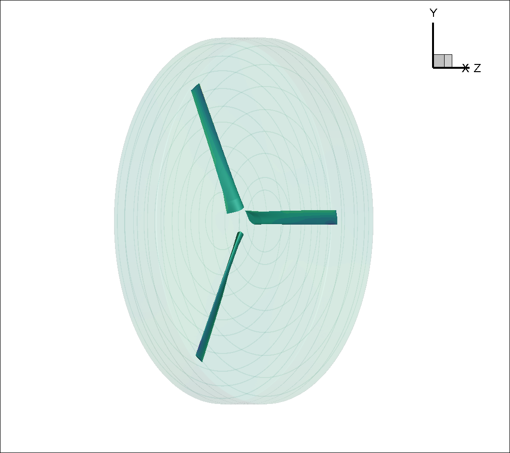
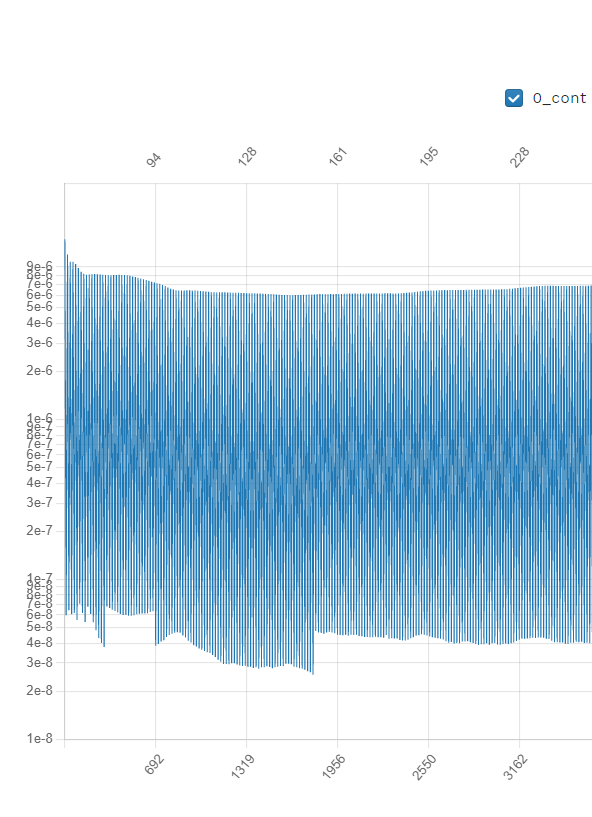
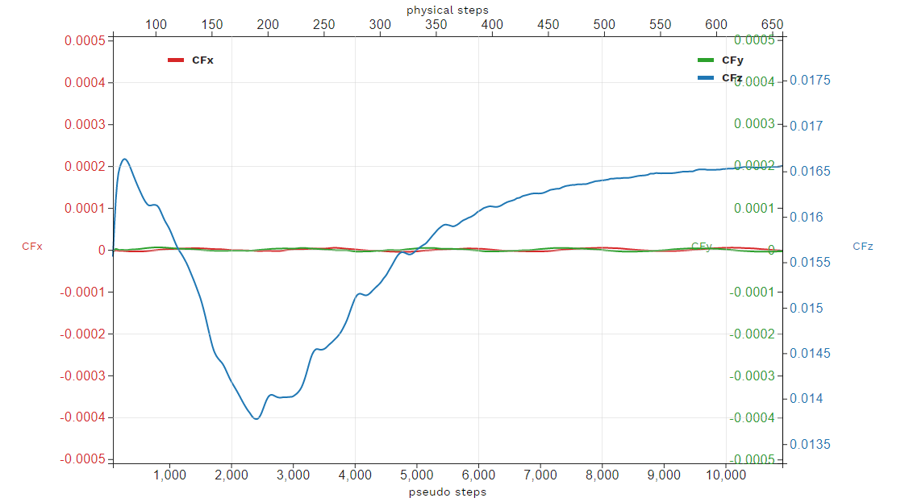

.. _rotation_interface:
.. |deg|    unicode:: U+000B0 .. DEGREE SIGN

Time Accurate RANS CFD on a propeller using a Rotation interface: the XV 15 geometry
=====================================================================================

The `XV15 tiltotor airplane <https://en.wikipedia.org/wiki/Bell_XV-15>`__ is a commonly used test bed for propeller validation work. As you can see from the following papers, we have done extensive validation work on that geometry. We will now use it to show you how to analyze a propeller-type geometry using a sliding mesh interface. :

* :ref:`Rotor5: Rotor analysis under 5 hours using ultra-fast and high-fidelity CFD simulation and automatic meshing<rotor5Paper>`
* :ref:`Assessment of Detached Eddy Simulation and Sliding Mesh Interface in Predicting Tiltrotor Performance in Helicopter and Airplane Modes<DESXV15>` 

This same geometry and case was already used in a :ref:`quickstart <rotation_interface_quickstart>` example. Here we will go more in depth into how to get a rotation interface case setup.

In order to run a rotating geometry we need to set up a mesh with two blocks, an inner “rotational volume” and an outer “stationary volume”. The interface between those two volumes needs to be a solid of revolution, ie sphere/cylinder/etc...

    Inner block enclosing the XV15 3 bladed prop

.. figure:: rotationInterfaceFigs/farfieldView.png
        :width: 600px
        :align: center
        :alt: Farfield volume enclosing Inner block

        Farfield volume enclosing Inner block

.. figure:: rotationInterfaceFigs/fig4.png
        :width: 600px
        :align: center
        :alt: body fitted cylinder blocks inside a larger nearfield domain

        body fitted cylinder blocks inside a larger nearfield domain

Please note that it is possible, just like in the figure above, to set up nested rotational interfaces to simulate, for example, a rotating propeller with blades that pitch as they rotate (i.e. a helicopter\'s cyclical ). We could also put many rotating blocks inside the stationary farfield block to simulate multiple rotors

Rotation interface requirements
~~~~~~~~~~~~~~~~~~~~~~~~~~~~~~~~

As explained in this :ref:`FAQ entry <meshErrorDistanceWrong>`, Flow360 has some pretty strict concentricity requirements when it comes to the rotation interface's meshes. We strongly recommend that you create those rotation interface meshes programmatically or download our pre-generated interfaces. Please see our dedicated :ref:`FAQ entry <creatinganinterfaceRegion>`

XV15 Example setup
------------------

We will now show you how to run an XV15 propeller

First, the rotor has a 150” (inches)  radius and the blades have a chord of roughly 11”. For simplicity's sake we will use the SI system and convert that to 3.81meters radius and 0.279meter chord.

A complete `CGNS mesh is available here <https://simcloud-public-1.s3.amazonaws.com/xv15/XV15_Hover_ascent_coarse.cgns>`__ along with its associated `Mesh.json file <https://simcloud-public-1.s3.amazonaws.com/xv15/XV15_quick_start_mesh.json>`__

if you are comfortable with the CGNS format you can run the "cgnslist" command which will show you that the **XV15_Hover_ascent_coarse.cgns** file contains the following blocks and boundaries

*farField*

    *farField/farField*

    *farField/rotationInterface*

*innerRotating*

    *innerRotating/blade*

    *innerRotating/rotationInterface*

This shows us that we have two mesh regions (*farField* and *innerRotating*). Inside *innerRotating* we have some *blades* and as a part or *farField* we have the *farField* boundary.

.. _defMeshJson:

Defining a Mesh.json file
~~~~~~~~~~~~~~~~~~~~~~~~~~~~

The Mesh.json file contains the information the mesh preprocessor needs
in order to perform its job.
We need to give it the information as to which domains are the
“noSlipWalls” and which are the “rotationInterfaces” along with some key
rotation interface geometry information, namely the rotation axis vector and the center of rotation.

You do NOT need to give it any “FarField”, “SlipWall” domain
informations. This will be done inside the Flow360.json file.

In our case our XV15_quick_start_mesh.json file looks like:

.. code-block:: javascript

  {
    "boundaries": {
        "noSlipWalls": [
            "innerRotating/blade"]
    },
    "slidingInterfaces" : [
        {
          "stationaryPatches" : ["farField/rotationInterface"],
          "rotatingPatches" : ["innerRotating/rotationInterface"],
            "axisOfRotation" : [0,0,-1],
            "centerOfRotation" : [0,0,0]
        }
    ]
    }

Uploading your mesh
~~~~~~~~~~~~~~~~~~~~~~~~~~~~~~~~~~~~

Now that you have the **XV15_Hover_ascent_coarse.cgns** mesh file and its associated **XV15_quick_start_mesh.json** mesh preprocessor input file you can upload
your mesh either by using the :ref:`webUI <om6_wing_webUI>` or the :ref:`Python API <om6_wing_pyAPI>`

Defining a Flow360.json file.
~~~~~~~~~~~~~~~~~~~~~~~~~~~~~~~~~~~~

Once your mesh has been uploaded, the last step before launching a run is to create a Flow360.json file with all the information
needed by Flow360 to run your case.

For this example we have provided you with two different Flow360 json input files. Please download the one for the `initial 1st order run <https://simcloud-public-1.s3.amazonaws.com/xv15/XV15_quick_start_flow360_1st.json>`__ and the other for the `final 2nd order runs <https://simcloud-public-1.s3.amazonaws.com/xv15/XV15_quick_start_flow360_2nd.json>`__. More information on 1st order vs 2nd order and on how to launch forked cases is available in the :ref:`FAQ <1st2ndorder>`

For this case, our Flow360 input json files have 11 sections

-   "geometry"
-   "runControl"
-   "volumeOutput"
-   "surfaceOutput"
-   "sliceOutput"
-   "navierStokesSolver"
-   "turbulenceModelSolver"
-   "freestream"
-   "boundaries"
-   "slidingInterfaces"
-   "timeStepping"

Most of those categories are self evident and won’t be discussed here,
just take a look at the downloaded json files or go to our documentation page on :ref:`solver configuration <Flow360Meshjson>`  to see what each sections does. Or for a more detailed description on how to setup your Flow360.json file for your configuration
please see our dedicated :ref:`Case Studies <examples>`

Case input conditions
~~~~~~~~~~~~~~~~~~~~~~

For our case we have the following input conditions:

-  5m/s inflow speed
-  600 RPM
-  speed of sound = 340.2 m/s
-  Rho = 1.225 kg/m\ :sup:`3`
-  Alpha = -90 |deg| which means the air coming down from above, i.e. an ascent case.

other key values are :

- The reference Mach value is arbitrarily set to the Tip mach number for the blades.
- For the 1st order run we will do 1 revolution at 6 |deg| per time step. Hence the "maxPhysicalSteps" : 60 value (60*6 |deg| =360 |deg| )
- for the 2nd order run we will do 5 revolutions at 3 |deg| per time step.

Using the Non-dimensionalization equations described in the  :ref:`conventions<nondimensionalization_Flow360>`  part of the documentation we get the following flow conditions and timeStepping values in our 1st order Flow360.json file.

.. code-block:: javascript

  {    "freestream" :
      {
          "muRef" : 4.29279e-08,
          "Mach" : 1.46972e-02,
          "MachRef" : 0.70,
          "Temperature" : 288.15,
          "alphaAngle" : -90.0,
          "betaAngle" : 0.0
      },
      "boundaries" : {
          "farField/farField" : { "type" : "Freestream" },
          "farField/rotationInterface" : { "type" : "SlidingInterface" },
          "innerRotating/rotationInterface" :   { "type" : "SlidingInterface" },
          "innerRotating/blade" :   { "type" : "NoSlipWall" }
      },
      "slidingInterfaces" : [
      {
          "stationaryPatches" : ["farField/rotationInterface"],
          "rotatingPatches" : ["innerRotating/rotationInterface"],
          "axisOfRotation" : [0,0,-1],
          "centerOfRotation" : [0,0,0],
          "omega" : 1.84691e-01,
          "volumeName" : ["innerRotating"]
      }
      ],
      "timeStepping" : {
  		"timeStepSize" : 5.67000e-01,
  		"maxPhysicalSteps" : 60,
  		"maxPseudoSteps" : 12,
          "CFL" : {
              "initial" : 1,
              "final" : 1000,
              "rampSteps" : 10
          }
      }
      }

Case running
~~~~~~~~~~~~~~~~~~~~~~
AS mentioned in the :ref:`quickstart <rotation_interface_quickstart>` example, using either the :ref:`webUI <om6_wing_webUI>` or the :ref:`Python API <om6_wing_pyAPI>` please launch a new case using the mesh you have uploaded :ref:`above <uploadXV15meshFile>` and the two Flow360.json files you have :ref:`just downloaded <xv15jsondownload>`. As outlined in the :ref:`FAQ <1st2ndorder>` you will need to launch the 1st order case first and then fork that case to a 2nd order case.

The first order case should finish in less then a minute on this fairly coarse 915K node mesh.

The second order run takes about 3.5 to 4 minutes to run its 5 revolutions. Please note that at the end of the 2nd order run you will have done 6 revolutions (1 for the 1st order run and 5 for the 2nd order run).

For a time accurate case to be considered well converged we like to have at least 2 orders of magnitude in the residuals within each time step.

    2nd order convergence plot showing more then 2 orders of magnitude decrease in the residuals for each subiterations.

The forces also seem to have stabilized after running for 6 revolutions

    2nd order run's force history plot showing good stabilization of the forces.

Congratulations. You have now run your first propeller using a rotational interface in Flow360.
