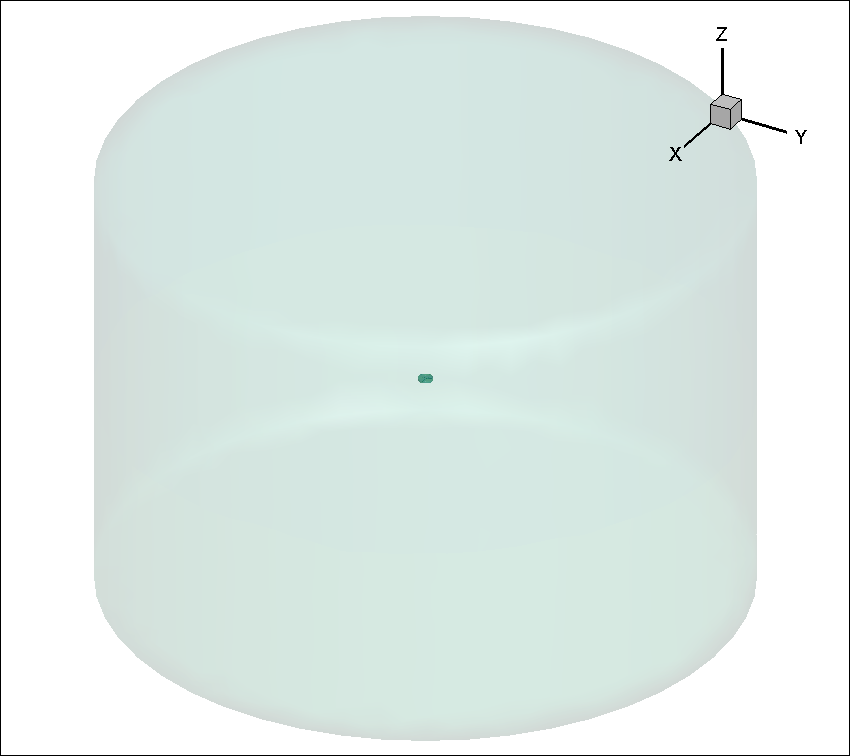
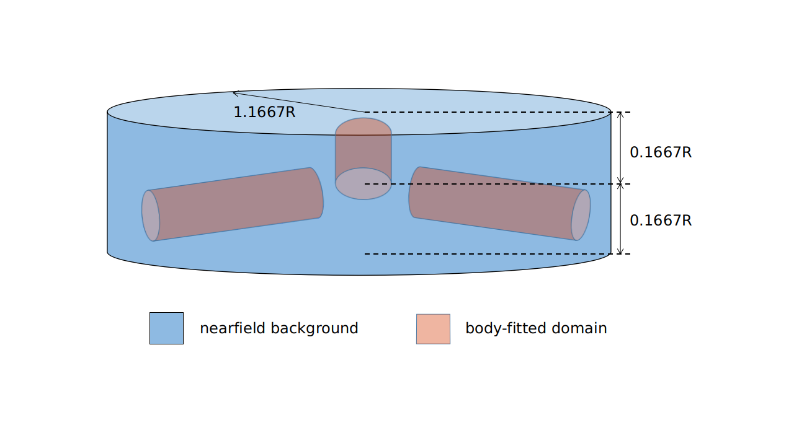

.. _rotation_interface:
.. |deg|    unicode:: U+000B0 .. DEGREE SIGN

Time-accurate RANS CFD on a propeller using a rotation interface: the XV-15 rotor geometry
==========================================================================================

The `XV-15 tiltotor aircraft <https://en.wikipedia.org/wiki/Bell_XV-15>`__ is a commonly used test bed for propeller validation work. As you can see from the following papers, we have done extensive validation work on this geometry. We will now use it to show you how to analyze a propeller-type geometry using a sliding mesh interface.

*   :ref:`Rotor5: Rotor analysis under 5 hours using ultra-fast and high-fidelity CFD simulation and automatic meshing<rotor5Paper>`
*   :ref:`Assessment of Detached Eddy Simulation and Sliding Mesh Interface in Predicting Tiltrotor Performance in Helicopter and Airplane Modes<DESXV15>`

This same geometry and case was already used in a :ref:`Quick Start <rotation_interface_quickstart>` example. Here we will go more in depth into how to get a rotation interface case setup.

Rotational and stationary volumes
~~~~~~~~~~~~~~~~~~~~~~~~~~~~~~~~~

In order to run a rotating geometry we need to set up a mesh with two blocks, an inner “rotational volume” and an outer “stationary volume”. The interface between those two volumes needs to be a solid of revolution (i.e., sphere, cylinder, etc.).

.. figure:: rotationInterfaceFigs/rotInterfaceView.png
    :width: 600px
    :align: center
    :alt: Inner block enclosing the XV-15 3-bladed prop

    Inner block enclosing the XV-15 3-bladed prop

        Farfield volume enclosing inner block

        Body-fitted cylinder blocks inside a larger nearfield domain

Please note that it is possible, just like in the figure above, to set up nested rotational interfaces to simulate, for example, a rotating propeller with blades that pitch as they rotate (i.e., a helicopter\'s cyclical). We could also put many rotating blocks inside the stationary farfield block to simulate multiple rotors.

Rotation interface requirements
~~~~~~~~~~~~~~~~~~~~~~~~~~~~~~~~

As explained in this :ref:`FAQ entry <meshErrorDistanceWrong>`, Flow360 has strict concentricity requirements when it comes to the rotation interface's mesh. We strongly recommend that you create rotation interface meshes programmatically or download pre-generated interfaces described :ref:`here <creatinganinterfaceRegion>`.

XV-15 setup
~~~~~~~~~~~

The rotor has a 150” (inches) radius and the blades have a chord of roughly 11”. For simplicity's sake we will use the SI system and convert these to 3.81 m radius and 0.279 m chord.

A complete `CGNS mesh is available here <https://simcloud-public-1.s3.amazonaws.com/xv15/XV15_Hover_ascent_coarse.cgns>`__ along with its associated `Mesh.json file <https://simcloud-public-1.s3.amazonaws.com/xv15/XV15_quick_start_mesh.json>`__.

The **XV15_Hover_ascent_coarse.cgns** mesh contains the following block and boundary structure. See `here <https://cgns.github.io/index.html>`__ for more details of the CGNS format.

.. code-block:: python

    farField
        farField/farField
        farField/rotationInterface
    innerRotating
        innerRotating/blade
        innerRotating/rotationInterface

This shows us that we have two mesh regions (*farField* and *innerRotating*). Inside *innerRotating* we have the *blade* NoSlipWall boundary and associated with *farField* region is the *farField* boundary. The *rotationInterface* boundary is associated with both *innerRotating* and *farField* regions as it is the SlidingInterface separating the two regions.

.. _defMeshJson:

Defining a Mesh.json file
~~~~~~~~~~~~~~~~~~~~~~~~~~~~

The Mesh.json file contains the information the mesh preprocessor needs in order to perform its job. We need to give it information as to which boundaries are “noSlipWalls” and which are “slidingInterfaces”. Additionally, rotation interface geometric information is required, namely the rotation axis vector and the center of rotation.

You do NOT need to give it any “FarField” or “SlipWall” boundary information. This will be done inside the Flow360.json file.

Here, the Mesh.json file (XV15_quick_start_mesh.json) looks like:

.. code-block:: javascript

  {
    "boundaries" : {
        "noSlipWalls" : [
            "innerRotating/blade"]
    },
    "slidingInterfaces" : [
        {
            "stationaryPatches" : ["farField/rotationInterface"],
            "rotatingPatches" : ["innerRotating/rotationInterface"],
            "axisOfRotation" : [0,0,-1],
            "centerOfRotation" : [0,0,0]
        }
    ]
  }

Uploading your mesh
~~~~~~~~~~~~~~~~~~~~~~~~~~~~~~~~~~~~

With the **XV15_Hover_ascent_coarse.cgns** mesh file and its associated **XV15_quick_start_mesh.json** mesh preprocessor input file you can upload the mesh either by using the :ref:`Web UI <om6_wing_webUI>` or the :ref:`Python API <om6_wing_pyAPI>`.

Defining a Flow360.json file.
~~~~~~~~~~~~~~~~~~~~~~~~~~~~~~~~~~~~

Once your mesh has been uploaded, the last step before launching a run is to create a Flow360.json file with all the information needed by Flow360 to run your case.

For this example we have provided you with two different Flow360 json input files. Please download the one for the `initial 1st order run <https://simcloud-public-1.s3.amazonaws.com/xv15/XV15_quick_start_flow360_1st.json>`__ and the other for the `final 2nd order runs <https://simcloud-public-1.s3.amazonaws.com/xv15/XV15_quick_start_flow360_2nd.json>`__. More information on 1st order vs 2nd order and on how to launch forked cases is available in the :ref:`FAQ <1st2ndorder>`.

For this case, our Flow360 input json files have 11 sections:

-   "geometry"
-   "volumeOutput"
-   "surfaceOutput"
-   "sliceOutput"
-   "navierStokesSolver"
-   "turbulenceModelSolver"
-   "freestream"
-   "boundaries"
-   "slidingInterfaces"
-   "timeStepping"

Most of those categories are self evident and won’t be discussed here, reference the :ref:`Solver Configuration <Flow360Meshjson>` documentation page for further details.

Case input conditions
~~~~~~~~~~~~~~~~~~~~~~

For our case we have the following operating conditions:

-   Airspeed = 5 m/s
-   Rotation rate = 600 RPM
-   Speed of sound = 340.2 m/s
-   Density = 1.225 kg/m\ :sup:`3`
-   Alpha = -90 |deg|, air coming down from above (i.e., an ascent case)

Other key considerations:

-   The reference Mach value is arbitrarily set to the tip Mach number for the blades
-   For the 1st order run we will do 1 revolution at 6 |deg| per time step

    -   hence "maxPhysicalSteps" : 60 (i.e., 360 |deg|/6 |deg|)

-   for the 2nd order run we will do 5 revolutions at 3 |deg| per time step

Non-dimensionalizing the above (see :ref:`Conventions<nondimensionalization_Flow360>`) and referencing the CFL guidelines (see :ref:`FAQ <1st2ndorder>`) we get the following flow conditions and timeStepping values in our 1st order Flow360.json file.

.. code-block:: javascript

  {
      "freestream" :
      {
          "muRef" : 4.29279e-08,
          "Mach" : 1.46972e-02,
          "MachRef" : 0.70,
          "Temperature" : 288.15,
          "alphaAngle" : -90.0,
          "betaAngle" : 0.0
      },
      "boundaries" : {
          "farField/farField" : { "type" : "Freestream" },
          "farField/rotationInterface" : { "type" : "SlidingInterface" },
          "innerRotating/rotationInterface" : { "type" : "SlidingInterface" },
          "innerRotating/blade" : { "type" : "NoSlipWall" }
      },
      "slidingInterfaces" : [
      {
          "stationaryPatches" : ["farField/rotationInterface"],
          "rotatingPatches" : ["innerRotating/rotationInterface"],
          "axisOfRotation" : [0,0,-1],
          "centerOfRotation" : [0,0,0],
          "omega" : 1.84691e-01,
          "volumeName" : ["innerRotating"]
      }
      ],
      "timeStepping" : {
          "timeStepSize" : 5.67000e-01,
          "maxPhysicalSteps" : 60,
          "maxPseudoSteps" : 12,
          "CFL" : {
              "initial" : 1,
              "final" : 1000,
              "rampSteps" : 10
          }
      }
  }

Case running
~~~~~~~~~~~~~~~~~~~~~~
As mentioned in the :ref:`Quick Start <rotation_interface_quickstart>` example, using either the :ref:`Web UI <om6_wing_webUI>` or the :ref:`Python API <om6_wing_pyAPI>` please launch a new case using the mesh you have uploaded :ref:`above <uploadXV15meshFile>` and the two Flow360.json files you have :ref:`just downloaded <xv15jsondownload>`. As outlined in the :ref:`FAQ <1st2ndorder>` you will need to launch the 1st order case first and then fork that case to a 2nd order case.

The first order case should finish in less then a minute on this fairly coarse 915k node mesh.

The second order run takes about 3.5 to 4 minutes to run its 5 revolutions. Please note that at the end of the 2nd order run you will have done 6 revolutions (1 for the 1st order run and 5 for the 2nd order run).

For a time accurate case to be considered well converged we like to have at least 2 orders of magnitude in the residuals within each time step.

.. figure:: rotationInterfaceFigs/residuals_convergence.png
    :width: 600px
    :align: center
    :alt: convergence of residuals

    2nd order convergence plot showing more then 2 orders of magnitude decrease in the residuals for each time step.

The forces also seem to have stabilized after running for 6 revolutions.

.. figure:: rotationInterfaceFigs/force_convergence.png
    :width: 600px
    :align: center
    :alt: convergence of forces

    2nd order run's force history plot showing good stabilization of the forces.

Congratulations. You have now run your first propeller using a rotational interface in Flow360.
