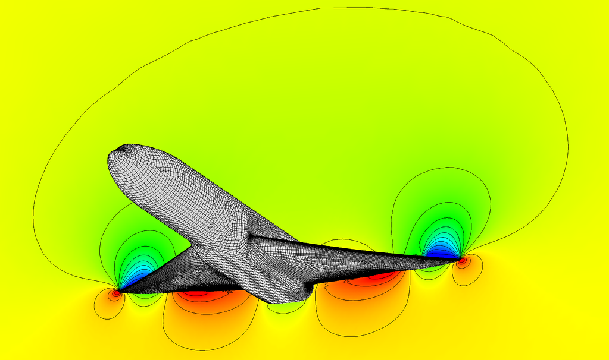

.. _webinar:

Webinar
=======

Mesh and Run a High-Fidelity Aircraft Simulation in Minutes
-----------------------------------------------------------

*17 November 2020 at 10AM CST (-6 UTC)*

**Intelligent automatic meshing meets super solver speed for unrivaled CFD efficiency.**

https://info.pointwise.com/mesh-run-a-high-fidelity-aircraft-simulation-in-minutes

Register today for a live webinar that will help boost productivity while simultaneously ensuring mesh consistency and reliability across your organization. Increasingly complex geometry, larger simulations, and design optimization are just a few characteristics of advanced simulation and design that emphasize the need for more automation and higher throughput. Yet, automation in the absence of control and expertise often has limited applicability, including the inability to maintain consistency throughout the design and simulation process. This can result in an inaccurate, and sometimes unreliable, understanding of a design or the design space, slowing the turn-around time and delaying time to market.

With this in mind, at Pointwise we have been developing a new suite of features called Flashpoint that take the control and expertise we are known for and combines them with deeper automation. Flashpoint, and in particular, the automatic surface meshing component, will help ensure consistency and reliability throughout the meshing process while also providing a framework for encapsulating your organization best practices. We recently collaborated with FlexCompute, the developers of Flow360, a new cloud-based CFD solver, and using the NASA Common Research model as our benchmark, we are demonstrating the ability to mesh and run a high-fidelity aircraft simulation in minutes.

**Discover how to:**

- Automatically generate a high-quality surface mesh for an aircraft geometry.
- Construct and populate a hybrid-viscous, hex-core volume mesh in minutes.
- Reduce turnaround time and setup, deploy, and simulate using Flow360.

   A quad-dominant surface mesh and hex-core volume were generated for NASA Common Research Model using Pointwise latest automatic surface meshing and voxel meshing capabilities. The solution was then computed using FlexCompute Flow360 CFD solver with a runtime of just 105 seconds.
